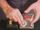

 Crystallization of Supersaturated Sodium Acetate
 

> 
> 
> 
> 
> 
> 
> 
> 
> 
> 
> ## Crystallization of Supersaturated Sodium Acetate
> 
> 
> 
> 
> 
> ## 
> 
> 
> 
> 
> 
>  A supersaturated solution of sodium acetate is poured onto one
small sodium acetate crystal. Crystals form from the liquid immediately
upon contact with the seed crystal. A thermometer shows that the
crystallization process is exothermic. A chemical hot pack is
shown as an example of a commercially available supersaturated
solution.
>  
> 
> 
> 
> 
> 
> 
>  (
>  [*104*](Cred104.HTM)
>  )
>  
> 
> 
> 
> 
> ### ---
> 
> 
>  Keywords
> 
> 
> 
> 
>  applications - practical/real-life, crystals/crystallization, enthalpy/heat, exothermic process, solutions/solubility, supersaturated
>  
> 
> 
> 
> 
> ### ---
> 
> 
>  Multimedia
> 
> 
> 
> 
> 
> #### The Reaction
> 
> 
> 
> 
> 
> [
>  Play movie](../../MVHTM/ACETATE/ACETAT1.HTM) 
> 
> 
> 
>  (QuickTime 3.0 Sorenson, duration 39 seconds, size 3.1 MB)
>  
> 
> 
> 
>  A solution of sodium acetate in water is in a flask. A few
small crystals of sodium acetate are placed on the top of the
laboratory bench. The solution from the flask is poured over the
crystals. As the solution contacts the crystals, its color changes
from clear to white very rapidly and it crystallizes into a solid
mound of material that builds up into a fairly tall vertical
structure.
>  
> 
> 
> 
> 
> 
> 
> 
> | Crystals of sodium acetate. | Pouring a solution of sodium acetate in water. |
> | --- | --- |
> 
> 
> 
> 
> 
> 
> [Additional still images
for this movie](../../STHTM/ACETATE/ACETAT1.HTM) 
> 
> 
> 
> 
> 
> ---
> 
> 
> 
> 
> 
> #### Measuring the Temperature
> 
> 
> 
> 
> 
> [
>  Play movie](../../MVHTM/ACETATE/ACETAT2.HTM) 
> 
> 
> 
>  (QuickTime 3.0 Sorenson, duration 19 seconds, size 1.5 MB)
>  
> 
> 
> 
>  The probe from a digital thermometer touches the solid
sodium acetate to test the temperature. It is seen that the
material is quite warm. The process of crystallization is an
exothermic process in which heat is given off to the surroundings.
The crystallization occurred rapidly once a seed crystal was
available. The seed crystal provides a structure around which the
ions of sodium acetate could form a solid crystal lattice.
>  
> 
> 
> 
> 
> 
> 
> 
> | The material is quite warm. |
> | --- |
> 
> 
> 
> 
> 
> 
> [Additional still images
for this movie](../../STHTM/ACETATE/ACETAT2.HTM) 
> 
> 
> 
> 
> 
> ---
> 
> 
> 
> 
> 
> #### Commercial Application
> 
> 
> 
> 
> 
> [
>  Play movie](../../MVHTM/ACETATE/ACETAT3.HTM) 
> 
> 
> 
>  (QuickTime 3.0 Sorenson, duration 46 seconds, size 3.5 MB)
>  
> 
> 
> 
>  Now a commercial application of this crystallization process is
shown. A metal disc is manipulated inside a sealed plastic bag
holding the sodium acetate solution. This causes the sodium
acetate to crystallize. The digital thermometer shows that the
temperature of the heating pack has gone up significantly from
room temperature. This heating pack provides an easily portable
method of having heat available whenever and wherever it is
needed.
>  
> 
> 
> 
> 
> 
> 
> 
> | The sodium acetate crystallizes... | ... and fills the container. | The material is quite warm. |
> | --- | --- | --- |
> 
> 
> 
> 
> 
> 
> [Additional still images
for this movie](../../STHTM/ACETATE/ACETAT3.HTM) 
> 
> 
> 
> 
> 
> ---
> 
> 
> 
> 
> ### Discussion
> 
> 
> 
> 
>  Without a seed crystal to act as a template for formation of a crystal lattice, crystallization is very slow
and a solution can be supersaturated for a long time. Because this crystallization process is exothermic
it has practical application as a heating pad.
>  
> 
> 
> 
> 
> 
> 
> [Demonstration Notes, Warnings, Safety Information, etc.](SAFETY.HTM) 
> 
> 
> 
> 
> 
> ### ---
> 
> 
>  Exam and Quiz Questions
> 
> 
> 
> 
>  1. Based upon the temperature reading observed, is
crystallization of sodium acetate an endothermic or an exothermic
process?
>  
> 
> 
> 
> 
> 
> 
> ---
> 
> 
> 
> 
> [Next sequential topic](../../MAIN/SH2OICE/PAGE1.HTM)

> ---
> 
> 
>  |
>  [Chemistry Comes Alive! (entry page)](../../INDEX.HTM) 
>  |
>  [Table of Contents](../../CONTENTS.HTM) 
>  |
>  [Matrix of Chapters and Topics](../../MATRIX.HTM) 
>  |
>  [Index](../../WORDS.HTM) 
>  |
>  [Alphabetical List of Topics](../../ALPHATOP.HTM) 
>  |
>  [Chemistry Textbooks](../../BOOKS.HTM) 
>  |
>  
>  © 1999 Division of Chemical Education, Inc.,
American Chemical Society. All rights reserved.

