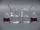

 Autocatalysis: Reaction of Permanganate with Oxalic Acid
 

> 
> 
> 
> 
> 
> 
> 
> 
> 
> 
> ## Autocatalysis: Reaction of Permanganate with Oxalic Acid
> 
> 
> 
> 
> 
> ## 
> 
> 
> 
> 
> 
>  Addition of a few crystals of MnSO
>  4 
>  greatly accelerates the reduction by oxalic acid of purple permanganate
 to the nearly colorless manganese(II). 
 When no manganese(II) ion is added, 
 the reaction initially proceeds slowly, 
 but the rate gradually increases because the product autocatalyzes the reaction.
>  
> 
> 
> 
> 
> 
> 
>  (
>  [*170*](CRED170.HTM)
>  )
>  
> 
> 
> 
> 
> ### ---
> 
> 
>  Keywords
> 
> 
> 
> 
>  redox reaction, evidence of chemical reaction, catalyst, reaction intermediate, reaction rates, kinetics, oxidation/reduction, reaction rates
>  
> 
> 
> 
> 
> ### ---
> 
> 
>  Multimedia
> 
> 
> 
> 
> 
> 
> 
> 
> [
>  Play movie](../../MVHTM/AUTOCAT/AUTOCAT.HTM) 
> 
> 
> 
>  (QuickTime 3.0 Sorenson, duration 69 seconds, size 4.2 MB)
>  
> 
> 
> 
>  A dilute purple solution of potassium permanganate is added to each of two beakers of acidified oxalate solution. A few crystals of manganese(II) sulfate added to the solution on the right catalyze the reduction of permanganate to colorless manganese(II) ion. Note the initial red color due to formation of a manganese(III) intermediate in the beaker on the right.
>  
> 
> 
> 
>  The other solution reacts more slowly, but its reaction rate eventually increases as it forms manganese(II) ion, which subsequently autocatalyzes its own formation.
>  
> 
> 
> 
> 
> 
> 
> 
> | Potassium permanganate is added. | Manganese(II) sulfate is added to the solution on the right. | It catalyzes the reduction of permanganate to colorless manganese(II) ion. | The other solution's reaction rate eventually increases as it forms manganese(II) ion, which subsequently autocatalyzes its own formation. |
> | --- | --- | --- | --- |
> 
> 
> 
> 
> 
> 
> [Additional still images
for this movie](../../STHTM/AUTOCAT/AUTOCAT.HTM) 
> 
> 
> 
> 
> 
> ---
> 
> 
> 
> 
> ### Discussion
> 
> 
> 
> 
>  Autocatalysis occurs when the product of a reaction serves as a catalyst for the reaction. 
The red intermediate observed in the beaker on the right is 
[Mn(C
>  2 
>  O
>  4 
>  )
>  3 
>  ]
>  3- 
>  .
>  
> 
> 
> 
>  The equation for the oxidation of oxalate by permanganate in acidic solution is
>  
> 
> 
> 
>  2 MnO
>  4 
> - 
>  (
>  *aq* 
>  ) + 5 H
>  2 
>  C
>  2 
>  O
>  4 
>  (
>  *aq* 
>  ) + 6 H
>  3 
>  O
>  + 
>  (
>  *aq* 
>  ) --> 
2Mn
>  2+ 
>  (
>  *aq* 
>  ) + 10 CO
>  2 
>  (
>  *aq* 
>  ) + 14 H
>  2 
>  O
>  
> 
> 
> 
> 
> 
> 
> [Demonstration Notes, Warnings, Safety Information, etc.](SAFETY.HTM) 
> 
> 
> 
> 
> 
> ### ---
> 
> 
>  Exam and Quiz Questions
> 
> 
> 
> 
>  1. Why does it take so much longer for the color of the solution in the beaker on the left to change?
>  
> 
> 
> 
>  2. Write a balanced chemical equation for the reaction of permanganate ion and oxalic acid to give Mn
>  2+ 
>  and carbon dioxide. The reaction takes place in an acidic solution.
>  
> 
> 
> 
>  3. The reaction in the beaker on the left eventually proceeded at a reasonably rapid rate. Explain how this observation supports a reaction mechanism involving autocatalysis.
>  
> 
> 
> 
> 
> 
> 
> ---
> 
> 
> 
> 
> [Next sequential topic](../../MAIN/CLOCKRX/PAGE1.HTM)

> ---
> 
> 
>  |
>  [Chemistry Comes Alive! (entry page)](../../INDEX.HTM) 
>  |
>  [Table of Contents](../../CONTENTS.HTM) 
>  |
>  [Matrix of Chapters and Topics](../../MATRIX.HTM) 
>  |
>  [Index](../../WORDS.HTM) 
>  |
>  [Alphabetical List of Topics](../../ALPHATOP.HTM) 
>  |
>  [Chemistry Textbooks](../../BOOKS.HTM) 
>  |
>  
>  © 1999 Division of Chemical Education, Inc.,
American Chemical Society. All rights reserved.

