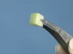

 Energy from Oxidation of Food
 

> 
> 
> 
> 
> 
> 
> 
> 
> 
> 
> ## Energy from Oxidation of Food
> 
> 
> 
> 
> 
> ## 
> 
> 
> 
> 
> 
>  A Cheeto is shown to undergo rapid oxidation when placed in a small quantity of molten potassium chlorate, as evidenced by smoke, flames, and noise. The nutrition information for the Cheeto is shown. When a piece of celery, similar in size to the Cheeto, is dropped into an equal quantity of potassium chlorate, gentle bubbling occurs, indicating slow oxidation, and less energy released.
>  
> 
> 
> 
> 
> 
> 
>  (
>  [*28*](CRED28.HTM)
>  )
>  
> 
> 
> 
> 
> ### ---
> 
> 
>  Keywords
> 
> 
> 
> 
>  applications - practical/real-life, descriptive chemistry, enthalpy/heat, evidence of chemical reaction, exothermic process, kinetics/rates /mechanisms, organic chemistry, redox reaction, strong oxidizing agent
>  
> 
> 
> 
> 
> ### ---
> 
> 
>  Multimedia
> 
> 
> 
> 
> 
> #### Energy from Oxidation of Food
> 
> 
> 
> 
> 
> [
>  Play movie](../../MVHTM/CHEETO/CHEETO1.HTM) 
> 
> 
> 
>  (QuickTime 3.0 Sorenson, duration 35 seconds, size 2.8 MB)
>  
> 
> 
> 
>  Items of food contain considerable energy. Under appropriate conditions this energy can be released much more rapidly than it is in your body. To release the energy rapidly, a sample of potassium chlorate is melted with a burner and a piece of food is dropped into the molten potassium chlorate. The food reacts fairly violently in an exothermic process that releases considerable energy.
>  
> 
> 
> 
> 
> 
> 
> 
> | A piece of food is dropped into the molten potassium chlorate. | The reaction releases considerable energy. |
> | --- | --- |
> 
> 
> 
> 
> 
> 
> [Additional still images
for this movie](../../STHTM/CHEETO/CHEETO1.HTM) 
> 
> 
> 
> 
> 
> ---
> 
> 
> 
> 
> 
> #### A Cheeto
> 
> 
> 
> 
> 
> [
>  Play movie](../../MVHTM/CHEETO/CHEETO2.HTM) 
> 
> 
> 
>  (QuickTime 3.0 Sorenson, duration 32 seconds, size 2.5 MB)
>  
> 
> 
> 
>  Here is a Cheeto. According to the nutrition information on the package, 21 Cheetos provide 150 nutritional Calories. One nutritional Calorie is one kilocalorie, so each Cheeto can release about seven kilocalories or 30 kJ of energy. When a Cheeto is placed into liquid potassium chlorate the vigorous, highly exothermic reaction releases about 30 kJ.
>  
> 
> 
> 
> 
> 
> 
> 
> | A Cheeto. | 21 Cheetos provide 150 nutritional Calories. | The vigorous, highly exothermic reaction releases about 30 kJ. |
> | --- | --- | --- |
> 
> 
> 
> 
> 
> 
> [Additional still images
for this movie](../../STHTM/CHEETO/CHEETO2.HTM) 
> 
> 
> 
> 
> 
> ---
> 
> 
> 
> 
> 
> #### A Piece of Celery
> 
> 
> 
> 
> 
> [
>  Play movie](../../MVHTM/CHEETO/CHEETO3.HTM) 
> 
> 
> 
>  (QuickTime 3.0 Sorenson, duration 36 seconds, size 2.8 MB)
>  
> 
> 
> 
>  When a piece of celery is placed into a test tube containing molten potassium chlorate the celery reacts vigorously, but much less than a Cheeto does because there are fewer Calories in a piece of celery than there are in a Cheeto. This demonstration indicates how much energy is available from oxidation of foods.
>  
> 
> 
> 
> 
> 
> 
> 
> | Celery is dropped into molten potassium chlorate. | The reaction is less vigorous. |
> | --- | --- |
> 
> 
> 
> 
> 
> 
> [Additional still images
for this movie](../../STHTM/CHEETO/CHEETO3.HTM) 
> 
> 
> 
> 
> 
> ---
> 
> 
> 
> 
> ### Discussion
> 
> 
> 
> 
>  This demonstration shows that carbohydrates can produce considerable energy when oxidized.
>  
> 
> 
> 
> 
> 
> 
> [Demonstration Notes, Warnings, Safety Information, etc.](SAFETY.HTM) 
> 
> 
> 
> 
> 
> ### ---
> 
> 
>  Exam and Quiz Questions
> 
> 
> 
> 
>  1. What observable evidence indicates that a chemical reaction is taking place?
>  
> 
> 
> 
>  2. Is this an endothermic or an exothermic reaction? Support your answer.
>  
> 
> 
> 
>  3. Based on the temperature increases of the two different foods tested, which food supplies more Calories when eaten?
>  
> 
> 
> 
>  4. How does the digestion of food in your body differ from what you observe in the test tube?
>  
> 
> 
> 
> 
> 
> 
> ---
> 
> 
> 
> 
> [Next sequential topic](../../MAIN/GLYCER/PAGE1.HTM)

> ---
> 
> 
>  |
>  [Chemistry Comes Alive! (entry page)](../../INDEX.HTM) 
>  |
>  [Table of Contents](../../CONTENTS.HTM) 
>  |
>  [Matrix of Chapters and Topics](../../MATRIX.HTM) 
>  |
>  [Index](../../WORDS.HTM) 
>  |
>  [Alphabetical List of Topics](../../ALPHATOP.HTM) 
>  |
>  [Chemistry Textbooks](../../BOOKS.HTM) 
>  |
>  
>  © 1999 Division of Chemical Education, Inc.,
American Chemical Society. All rights reserved.

