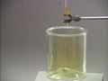

 Reaction of Chlorine with Acetylene
 

> 
> 
> 
> 
> 
> 
> 
> 
> 
> 
> ## Reaction of Chlorine with Acetylene
> 
> 
> 
> 
> 
> ## 
> 
> 
> 
> 
> 
>  Acetylene (ethyne) gas is generated by reacting calcium carbide with water. 
The reaction is carried out in an atmosphere of chlorine gas in a glass cylinder. 
The acetylene reacts vigorously with the chlorine, producing a yellow flame and black soot.
The products of the reaction include carbon and hydrogen chloride. 
The presence of hydrogen chloride is demonstrated by bringing the stopper 
from a bottle of aqueous ammonia above the glass cylinder. 
A smoke of ammonium chloride forms. 
The quantity of calcium carbide is large enough so that chlorine is the limiting reactant, 
and eventually it can be seen that calcium carbide continues to react with water 
to generate acetylene, but the flame and soot disappear.
>  
> 
> 
> 
> 
> 
> 
>  (
>  [*168*](CRED168.HTM)
>  )
>  
> 
> 
> 
> 
> ### ---
> 
> 
>  Keywords
> 
> 
> 
> 
>  descriptive chemistry, enthalpy/heat, evidence of chemical reaction, 
exothermic process, fire/flammability, halogens/halides/hydrohalic acids, 
limiting reactant, organic - hydrocarbons, redox reaction
>  
> 
> 
> 
> 
> ### ---
> 
> 
>  Multimedia
> 
> 
> 
> 
> 
> 
> 
> 
> [
>  Play movie](../../MVHTM/CLACET/CLACET.HTM) 
> 
> 
> 
>  (QuickTime 3.0 Sorenson, duration 36 seconds, size 2.2 MB)
>  
> 
> 
> 
>  Chips of calcium carbide are placed on a watch glass inside a cylinder of chlorine. Water is slowly dripped onto the calcium carbide generating acetylene gas. The acetylene reacts rapidly with the chlorine producing clouds of carbon. When a stopper from a bottle of aqueous ammonia is brought near the flame, white fumes of ammonium chloride are produced indicating the presence of hydrogen chloride. Although acetylene continues to be generated, the reaction with chlorine ceases when all of the chlorine has been consumed.
>  
> 
> 
> 
> 
> | Chips of calcium carbide inside a cylinder of chlorine. | Water is slowly dripped onto the calcium carbide generating acetylene gas which reacts rapidly with the chlorine. | The stopper from a bottle of aqueous ammonia is brought near the flame. | The reaction with chlorine ceases when all of the chlorine has been consumed. |
> | --- | --- | --- | --- |
> 
> 
> 
> 
> 
> 
> [Additional still images
for this movie](../../STHTM/CLACET/CLACET.HTM) 
> 
> 
> 
> 
> 
> ---
> 
> 
> 
> 
> ### Discussion
> 
> 
> 
> 
>  Acetylene (ethyne) gas is commonly generated by reacting calcium carbide with water. 
The equation is
>  
> 
> 
> 
>  CaC
>  2 
>  (
>  *s* 
>  ) + 2 H
>  2 
>  O(
>  *l* 
>  ) --> Ca(OH)
>  2 
>  (
>  *aq* 
>  ) + C
>  2 
>  H
>  2 
>  (
>  *g* 
>  )
>  
> 
> 
> 
>  Acetylene gas and chlorine react upon contact at room temperature, 
so when acetylene is generated in a chlorine atmosphere it immediately inflames. 
The equation for the principal reaction is
>  
> 
> 
> 
>  C
>  2 
>  H
>  2 
>  (
>  *g* 
>  ) + Cl
>  2 
>  (
>  *g* 
>  ) --> 2 HCl(
>  *g* 
>  ) + 2 C(
>  *s* 
>  )
>  
> 
> 
> 
>  The solid carbon (soot) produced imparts a bright yellow color to the flame 
when heated to a high temperature. When it cools it forms black smoke.
>  
> 
> 
> 
> 
> 
> 
> [Demonstration Notes, Warnings, Safety Information, etc.](SAFETY.HTM) 
> 
> 
> 
> 
> 
> ### ---
> 
> 
>  Exam and Quiz Questions
> 
> 
> 
> 
>  1. What observable evidence indicates that a chemical reaction is taking place?
>  
> 
> 
> 
>  2. Are the reactions shown exothermic or endothermic? Cite observations that justify your choice.
>  
> 
> 
> 
>  3. What experimental evidence can you cite to indicate that hydrogen chloride gas is one of the products of one of the reactions shown?
>  
> 
> 
> 
>  4. When all of the yellow color is gone from the glass container,
gas continues to bubble out of the water, but there is no longer any flame.
Explain why the flame goes out when the yellow color has disappeared.
>  
> 
> 
> 
> 
> 
> 
> ---
> 
> 
> 
> 
> [Next sequential topic](../../MAIN/CLI/PAGE1.HTM)

> ---
> 
> 
>  |
>  [Chemistry Comes Alive! (entry page)](../../INDEX.HTM) 
>  |
>  [Table of Contents](../../CONTENTS.HTM) 
>  |
>  [Matrix of Chapters and Topics](../../MATRIX.HTM) 
>  |
>  [Index](../../WORDS.HTM) 
>  |
>  [Alphabetical List of Topics](../../ALPHATOP.HTM) 
>  |
>  [Chemistry Textbooks](../../BOOKS.HTM) 
>  |
>  
>  © 1999 Division of Chemical Education, Inc.,
American Chemical Society. All rights reserved.

