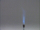

 Reaction of Chlorine with Aluminum
 

> 
> 
> 
> 
> 
> 
> 
> 
> 
> 
> ## Reaction of Chlorine with Aluminum
> 
> 
> 
> 
> 
> ## 
> 
> 
> 
> 
> 
>  Aluminum foil heated to glowing red reacts vigorously with chlorine gas in a flask. 
The product is white aluminum chloride, which solidifies and settles to the bottom of the flask.
>  
> 
> 
> 
> 
> 
> 
>  (
>  [*167*](CRED167.HTM)
>  )
>  
> 
> 
> 
> 
> ### ---
> 
> 
>  Keywords
> 
> 
> 
> 
>  aluminum, combination reaction, descriptive chemistry, enthalpy/heat, evidence of chemical reaction, exothermic process, halogens/halides/hydrohalic acids, redox reaction
>  
> 
> 
> 
> 
> ### ---
> 
> 
>  Multimedia
> 
> 
> 
> 
> 
> 
> 
> 
> [
>  Play movie](../../MVHTM/CLAL/CLAL.HTM) 
> 
> 
> 
>  (QuickTime 3.0 Sorenson, duration 31 seconds, size 2.1 MB)
>  
> 
> 
> 
>  Aluminum foil is heated and placed in a flask containing chlorine gas. The aluminum reacts vigorously with the chlorine to form a cloud of aluminum chloride.
>  
> 
> 
> 
> 
> | Aluminum foil is heated... | ...and placed in a flask containing chlorine gas. | The aluminum reacts vigorously with the chlorine... | ...to form a cloud of aluminum chloride. |
> | --- | --- | --- | --- |
> 
> 
> 
> 
> 
> 
> [Additional still images
for this movie](../../STHTM/CLAL/CLAL.HTM) 
> 
> 
> 
> 
> 
> ---
> 
> 
> 
> 
> ### Discussion
> 
> 
> 
> 
>  Aluminum and chlorine do not react rapidly at room temperature, 
but if the aluminum is heated, the reaction is vigorous. 
The product is aluminum chloride, a white powder that fumes in air, 
reacting with water to form HCl gas and aluminum oxide.
>  
> 
> 
> 
> 
> 
> 
> [Demonstration Notes, Warnings, Safety Information, etc.](SAFETY.HTM) 
> 
> 
> 
> 
> 
> ### ---
> 
> 
>  Exam and Quiz Questions
> 
> 
> 
> 
>  1. What observable evidence indicates that a chemical reaction has taken place?
>  
> 
> 
> 
>  2. Classify the reaction shown in the video as combination, decomposition, 
exchange, acid-base, or redox. (The reaction may fall within more than one of these categories.)
>  
> 
> 
> 
>  3. Is the reaction shown exothermic or endothermic? Cite observations that justify your choice.
>  
> 
> 
> 
>  4. When the natural gas flame is lowered from air into the container of chlorine, 
the color of the flame changes. 
Explain why the color of the flame changes.
Base your explanation on the theory of spectra of atoms and molecules.
>  
> 
> 
> 
> 
> 
> 
> ---
> 
> 
> 
> 
> [Next sequential topic](../../MAIN/CLPR/PAGE1.HTM)

> ---
> 
> 
>  |
>  [Chemistry Comes Alive! (entry page)](../../INDEX.HTM) 
>  |
>  [Table of Contents](../../CONTENTS.HTM) 
>  |
>  [Matrix of Chapters and Topics](../../MATRIX.HTM) 
>  |
>  [Index](../../WORDS.HTM) 
>  |
>  [Alphabetical List of Topics](../../ALPHATOP.HTM) 
>  |
>  [Chemistry Textbooks](../../BOOKS.HTM) 
>  |
>  
>  © 1999 Division of Chemical Education, Inc.,
American Chemical Society. All rights reserved.

