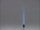

 Reaction of Chlorine with Copper
 

> 
> 
> 
> 
> 
> 
> 
> 
> 
> 
> ## Reaction of Chlorine with Copper
> 
> 
> 
> 
> 
> ## 
> 
> 
> 
> 
> 
>  Copper turnings heated to glowing red react vigorously with chlorine gas in a flask. 
The product is solid copper(II) chloride. 
Evidence for this product is the fact that when it is dissolved in water 
a blue-green solution results. 
This is characteristic of copper(II) ions in aqueous solution.
>  
> 
> 
> 
> 
> 
> 
>  (
>  [*167*](CRED167.HTM)
>  )
>  
> 
> 
> 
> 
> ### ---
> 
> 
>  Keywords
> 
> 
> 
> 
>  combination reaction, copper, descriptive chemistry, enthalpy/heat, evidence of chemical reaction, exothermic process, halogens/halides/hydrohalic acids, redox reaction
>  
> 
> 
> 
> 
> ### ---
> 
> 
>  Multimedia
> 
> 
> 
> 
> 
> 
> 
> 
> [
>  Play movie](../../MVHTM/CLCU/CLCU.HTM) 
> 
> 
> 
>  (QuickTime 3.0 Sorenson, duration 37 seconds, size 2.6 MB)
>  
> 
> 
> 
>  Copper turnings are heated and placed in a flask containing chlorine gas. The copper reacts vigorously with the chlorine to form a cloud of copper(II) chloride. When the flask is rinsed with water the copper(II) chloride dissolves forming a blue-green solution.
>  
> 
> 
> 
> 
> | Copper turnings are heated... | and placed in a flask containing chlorine gas. | The reaction forms a cloud of copper(II) chloride. |
> | --- | --- | --- |
> 
> 
> 
> 
> 
> 
> 
> | The flask is rinsed with water. | The copper(II) chloride dissolves. |
> | --- | --- |
> 
> 
> 
> 
> 
> 
> [Additional still images
for this movie](../../STHTM/CLCU/CLCU.HTM) 
> 
> 
> 
> 
> 
> ---
> 
> 
> 
> 
> ### Discussion
> 
> 
> 
> 
>  Copper and chlorine do not react rapidly at room temperature, 
but if the copper is heated, the reaction is vigorous. 
Two products are possible, copper(I) chloride and copper(II) chloride. 
The copper is seen to be oxidized all the way to copper(II) chloride because the product, 
when dissolved in water, has the blue-green color characteristic of aqueous copper(II) chloride. 
Copper(I) chloride is colorless.
>  
> 
> 
> 
> 
> 
> 
> [Demonstration Notes, Warnings, Safety Information, etc.](SAFETY.HTM) 
> 
> 
> 
> 
> 
> ### ---
> 
> 
>  Exam and Quiz Questions
> 
> 
> 
> 
>  1. What observable evidence indicates that a chemical reaction has taken place?
>  
> 
> 
> 
>  2. Classify the reaction shown in the video as combination, decomposition, exchange, 
acid-base, or redox. (The reaction may fall within more than one of these categories.)
>  
> 
> 
> 
>  3. Is the reaction shown exothermic or endothermic? Cite observations that justify your choice.
>  
> 
> 
> 
> 
> 
> 
> ---
> 
> 
> 
> 
> [Next sequential topic](../../MAIN/CLAL/PAGE1.HTM)

> ---
> 
> 
>  |
>  [Chemistry Comes Alive! (entry page)](../../INDEX.HTM) 
>  |
>  [Table of Contents](../../CONTENTS.HTM) 
>  |
>  [Matrix of Chapters and Topics](../../MATRIX.HTM) 
>  |
>  [Index](../../WORDS.HTM) 
>  |
>  [Alphabetical List of Topics](../../ALPHATOP.HTM) 
>  |
>  [Chemistry Textbooks](../../BOOKS.HTM) 
>  |
>  
>  © 1999 Division of Chemical Education, Inc.,
American Chemical Society. All rights reserved.

