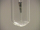

 Reaction of Chlorine with Iodine
 

> 
> 
> 
> 
> 
> 
> 
> 
> 
> 
> ## Reaction of Chlorine with Iodine
> 
> 
> 
> 
> 
> ## 
> 
> 
> 
> 
> 
>  Chlorine gas is passed over crystals of iodine in a capillary tube. 
Brown iodine monochloride is formed at first, followed by yellow iodine trichloride.
>  
> 
> 
> 
> 
> 
> 
>  (
>  [*167*](CRED167.HTM)
>  )
>  
> 
> 
> 
> 
> ### ---
> 
> 
>  Keywords
> 
> 
> 
> 
>  combination reaction, descriptive chemistry, evidence of chemical reaction, halogens/halides/hydrohalic acids, redox reaction
>  
> 
> 
> 
> 
> ### ---
> 
> 
>  Multimedia
> 
> 
> 
> 
> 
> 
> 
> 
> [
>  Play movie](../../MVHTM/CLI/CLI.HTM) 
> 
> 
> 
>  (QuickTime 3.0 Sorenson, duration 78 seconds, size 5.4 MB)
>  
> 
> 
> 
>  Iodine crystals are placed at the bottom of a capillary tube. Chlorine gas is passed through the iodine crystals. The initial reaction between the chlorine and iodine forms iodine monochloride. The brown vapor of iodine monochloride can be seen flowing from the capillary. Dark brown iodine monochloride liquid is collected at the bottom of the test tube. As more chlorine is added, the brown iodine monochloride forms crystals of yellow iodine trichloride.
>  
> 
> 
> 
> 
> | Chlorine gas is passed through the iodine crystals forming iodine monochloride. | Dark brown iodine monochloride liquid is collected at the bottom of the test tube. | As more chlorine is added... | ... the brown iodine monochloride forms crystals of yellow iodine trichloride. |
> | --- | --- | --- | --- |
> 
> 
> 
> 
> 
> 
> [Additional still images
for this movie](../../STHTM/CLI/CLI.HTM) 
> 
> 
> 
> 
> 
> ---
> 
> 
> 
> 
> ### Discussion
> 
> 
> 
> 
>  This video illustrates combination of chlorine with iodine to form two interhalogen compounds, 
iodine monochloride and diiodine hexachloride. 
(In the solid state iodine trichloride dimerizes and consists of molecules whose formula is 
I
>  2 
>  Cl
>  6 
>  ; the solid decomposes to ICl and Cl
>  2 
>  when heated.) 
Iodine monochloride melts at 27
>  o 
>  C, and its formation is exothermic, 
so no solid is formed, only liquid.
>  
> 
> 
> 
>  The equations for the reactions that occur during this video are
>  
> 
> 
> 
>  I
>  2 
>  (
>  *s* 
>  ) + Cl
>  2 
>  (
>  *g* 
>  ) --> 
 2 ICl(
>  *l* 
>  )
>  
> 
> 
> 
>  2 ICl(
>  *l* 
>  ) + 2 Cl
>  2 
>  (
>  *g* 
>  ) --> 
 I
>  2 
>  Cl
>  6 
>  (
>  *s* 
>  )
>  
> 
> 
> 
> 
> 
> 
> [Demonstration Notes, Warnings, Safety Information, etc.](SAFETY.HTM) 
> 
> 
> 
> 
> 
> ### ---
> 
> 
>  Exam and Quiz Questions
> 
> 
> 
> 
>  1. What observable evidence indicates that chemical reactions are taking place?
>  
> 
> 
> 
>  2. Why is chlorine a gas, iodine a solid, iodine monochloride a solid that 
melts just above room temperature, and diiodine hexachloride a solid? 
Explain in terms of intermolecular forces.
>  
> 
> 
> 
> 
> 
> 
> ---
> 
> 
> 
> 
> [Next sequential topic](../../MAIN/FEZNSUL/PAGE1.HTM)

> ---
> 
> 
>  |
>  [Chemistry Comes Alive! (entry page)](../../INDEX.HTM) 
>  |
>  [Table of Contents](../../CONTENTS.HTM) 
>  |
>  [Matrix of Chapters and Topics](../../MATRIX.HTM) 
>  |
>  [Index](../../WORDS.HTM) 
>  |
>  [Alphabetical List of Topics](../../ALPHATOP.HTM) 
>  |
>  [Chemistry Textbooks](../../BOOKS.HTM) 
>  |
>  
>  © 1999 Division of Chemical Education, Inc.,
American Chemical Society. All rights reserved.

