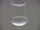

 Reaction of Chlorine with Potassium Bromide
 

> 
> 
> 
> 
> 
> 
> 
> 
> 
> 
> ## Reaction of Chlorine with Potassium Bromide
> 
> 
> 
> 
> 
> ## 
> 
> 
> 
> 
> 
>  When chlorine gas is bubbled into an aqueous solution of potassium bromide, 
some of the bromide ions are oxidized to bromine. 
Some of the bromine molecules combine with bromide ions to form tribromide ion, Br
>  3 
> - 
>  . 
In this demonstration, the aqueous solution is above a layer of carbon tetrachloride, 
in which bromine is quite soluble. 
The red-brown color of bromine can be seen as the bromine dissolves in the carbon tetrachloride layer.
>  
> 
> 
> 
>  When enough chlorine has bubbled through the solution, the bromine either dissolves in the carbon 
tetrachloride or is swept out of the liquid into the gas phase, causing the solution to decolorize.
>  
> 
> 
> 
> 
> 
> 
>  (
>  [*168*](CRED168.HTM)
>  )
>  
> 
> 
> 
> 
> ### ---
> 
> 
>  Keywords
> 
> 
> 
> 
>  combination reaction, descriptive chemistry, 
evidence of chemical reaction, 
halogens/halides/hydrohalic acids, 
redox reaction, 
single exchange/replacement reaction
>  
> 
> 
> 
> 
> ### ---
> 
> 
>  Multimedia
> 
> 
> 
> 
> 
> 
> 
> 
> [
>  Play movie](../../MVHTM/CLKBR/CLKBR.HTM) 
> 
> 
> 
>  (QuickTime 3.0 Sorenson, duration 71 seconds, size 4.9 MB)
>  
> 
> 
> 
>  A test tube contains a layer of potassium bromide solution over a denser layer of carbon tetrachloride. Chlorine is bubbled through the potassium bromide layer. The chlorine reacts with the bromide to form bromine. The aqueous layer contains a mixture of bromine, bromide ion and tribromide ion. Bromine is also dissolved in the carbon tetrachloride layer to form a reddish solution. The bromide and tribromide ions do not dissolve in the carbon tetrachloride and remain in the aqueous layer. Some bromine gas can be seen above the aqueous layer. 
After some time the stream of chlorine has swept all of the bromine from the aqueous solution into the gas phase.
Some bromine remains in the carbon tetrachloride layer.
>  
> 
> 
> 
> 
> | Chlorine is bubbled through potassium bromide. | The (upper) aqueous layer contains a mixture of bromine, bromide ion and tribromide ion. | Bromine is also dissolved in the carbon tetrachloride layer. | Eventually most of the bromine has dissolved in the carbon tetrachloride or been swept out of the aqueous layer. |
> | --- | --- | --- | --- |
> 
> 
> 
> 
> 
> 
> [Additional still images
for this movie](../../STHTM/CLKBR/CLKBR.HTM) 
> 
> 
> 
> 
> 
> ---
> 
> 
> 
> 
> ### Discussion
> 
> 
> 
> 
>  This demonstration illustrates that chlorine is a stronger oxidizing agent than bromine, 
since bromide is oxidized by chlorine to bromine. 
Only one interhalogen compound of bromine and chlorine can be formed, namely BrCl. 
It is a red-brown gas. 
Decolorization of the solution probably occurs when all of the bromine and 
bromine monochloride have been swept out of the solution by the steam of chlorine.
>  
> 
> 
> 
>  The equations for the reactions that occur during this video are
>  
> 
> 
> 
>  2 Br
>  - 
>  (
>  *aq* 
>  ) + Cl
>  2 
>  (
>  *aq* 
>  ) --> 
 Br
>  2 
>  (
>  *aq* 
>  ) + 2 Cl
>  - 
>  (
>  *aq* 
>  )
>  
> 
> 
> 
>  Br
>  - 
>  (
>  *aq* 
>  ) + Br
>  2 
>  (
>  *aq* 
>  ) --> 
 Br
>  3 
> - 
>  (
>  *aq* 
>  )
>  
> 
> 
> 
>  Br
>  2 
>  (
>  *aq* 
>  ) + Cl
>  2 
>  (
>  *aq* 
>  ) --> 
 2 BrCl(
>  *aq* 
>  )
>  
> 
> 
> 
> 
> 
> 
> [Demonstration Notes, Warnings, Safety Information, etc.](SAFETY.HTM) 
> 
> 
> 
> 
> 
> ### ---
> 
> 
>  Exam and Quiz Questions
> 
> 
> 
> 
>  1. What observable evidence indicates that chemical reactions are taking place?
>  
> 
> 
> 
>  2. Which is the stronger oxidizing agent, bromine or chlorine?
>  
> 
> 
> 
> 
> 
> 
> ---
> 
> 
> 
> 
> [Next sequential topic](../../MAIN/HALOGEN/PAGE1.HTM)

> ---
> 
> 
>  |
>  [Chemistry Comes Alive! (entry page)](../../INDEX.HTM) 
>  |
>  [Table of Contents](../../CONTENTS.HTM) 
>  |
>  [Matrix of Chapters and Topics](../../MATRIX.HTM) 
>  |
>  [Index](../../WORDS.HTM) 
>  |
>  [Alphabetical List of Topics](../../ALPHATOP.HTM) 
>  |
>  [Chemistry Textbooks](../../BOOKS.HTM) 
>  |
>  
>  © 1999 Division of Chemical Education, Inc.,
American Chemical Society. All rights reserved.

