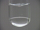

 Reaction of Chlorine with Potassium Iodide
 

> 
> 
> 
> 
> 
> 
> 
> 
> 
> 
> ## Reaction of Chlorine with Potassium Iodide
> 
> 
> 
> 
> 
> ## 
> 
> 
> 
> 
> 
>  When chlorine gas is bubbled into an aqueous solution of potassium iodide, 
some of the iodide ions are oxidized to iodine. 
The iodine molecules combine with iodide ions to form brown triiodide ion, 
I
>  3 
> - 
>  . 
In this demonstration, the aqueous solution is above a layer of carbon tetrachloride, 
in which iodine is quite soluble. 
The beautiful violet color of iodine can be seen as the iodine dissolves 
in the carbon tetrachloride layer.
>  
> 
> 
> 
>  With excess chlorine, iodine reacts to form iodine monochloride, 
ICl, which is ruby red. 
The iodine monochloride reacts further to form iodine trichloride, ICl
>  3 
>  , 
which is much lighter in color, causing the solution to be decolorized.
>  
> 
> 
> 
> 
> 
> 
>  (
>  [*167*](CRED167.HTM)
>  )
>  
> 
> 
> 
> 
> ### ---
> 
> 
>  Keywords
> 
> 
> 
> 
>  combination reaction, covalent bonding/structure/properties, 
descriptive chemistry, evidence of chemical reaction, halogens/halides/hydrohalic acids, 
redox reaction, single exchange/replacement reaction
>  
> 
> 
> 
> 
> ### ---
> 
> 
>  Multimedia
> 
> 
> 
> 
> 
> 
> 
> 
> [
>  Play movie](../../MVHTM/CLKI/CLKI.HTM) 
> 
> 
> 
>  (QuickTime 3.0 Sorenson, duration 84 seconds, size 5.7 MB)
>  
> 
> 
> 
>  A test tube contains a layer of potassium iodide solution over a denser layer of carbon tetrachloride. Chlorine is bubbled through the potassium iodide layer. The chlorine reacts with the iodide to form iodine. In the aqueous layer the brown triiodide ion is formed by the reaction of iodine with iodide. In the carbon tetrachloride layer, iodine forms a purple solution. The iodine in the aqueous layer reacts further with chlorine to form iodine monochloride. As more chlorine is added, the iodine reacts with the excess chlorine to form iodine trichloride and the solution decolorizes. Some iodine remains in the carbon tetrachloride layer.
>  
> 
> 
> 
> 
> | Chlorine is bubbled through the potassium iodide layer. | The chlorine reacts with the iodide to form iodine. | In the carbon tetrachloride layer, iodine forms a purple solution. |
> | --- | --- | --- |
> 
> 
> 
> 
> 
> 
> 
> | Iodine reacts with excess chlorine to form red iodine monochloride. | Iodine monochloride reacts with excess chlorine to form iodine trichloride... | ... and the solution decolorizes. |
> | --- | --- | --- |
> 
> 
> 
> 
> 
> 
> [Additional still images
for this movie](../../STHTM/CLKI/CLKI.HTM) 
> 
> 
> 
> 
> 
> ---
> 
> 
> 
> 
> ### Discussion
> 
> 
> 
> 
>  This demonstration illustrates that chlorine is a stronger oxidizing agent than iodine, 
since iodide is oxidized by chlorine to iodine. 
However, it also illustrates the properties of two interhalogen compounds, 
ICl and ICl
>  3 
>  . ICl is a ruby-red solid that melts at 27
>  o 
>  C. 
Its properties are intermediate between those of iodine and chlorine, 
which makes it similar to bromine. 
The color at the end of the video is probably due to ICl in the carbon tetrachloride layer, 
because it is redder than iodine's violet. 
ICl
>  3 
>  forms a bright yellow solid that consists of I
>  2 
>  Cl
>  6 
>  molecules. 
It decomposes readily to ICl and Cl
>  2 
>  , but this is not seen in the video. 
The color of ICl
>  3 
>  is much lighter than that of ICl or I
>  2 
>  , 
and when it forms the aqueous layer is decolorized.
>  
> 
> 
> 
>  The equations for the reactions that occur during this video are
>  
> 
> 
> 
>  2 I
>  - 
>  (
>  *aq* 
>  ) + Cl
>  2 
>  (
>  *aq* 
>  ) --> 
 I
>  2 
>  (
>  *aq* 
>  ) + 2 Cl
>  - 
>  (
>  *aq* 
>  )
>  
> 
> 
> 
>  I
>  - 
>  (
>  *aq* 
>  ) + I
>  2 
>  (
>  *aq* 
>  ) --> 
 I
>  3 
> - 
>  (
>  *aq* 
>  )
>  
> 
> 
> 
>  I
>  2 
>  (
>  *aq* 
>  ) + Cl
>  2 
>  (
>  *aq* 
>  ) --> 
 2 ICl(
>  *aq* 
>  )
>  
> 
> 
> 
>  ICl(
>  *aq* 
>  ) + Cl
>  2 
>  (
>  *aq* 
>  ) --> 
 ICl
>  3 
>  (
>  *aq* 
>  )
>  
> 
> 
> 
> 
> 
> 
> [Demonstration Notes, Warnings, Safety Information, etc.](SAFETY.HTM) 
> 
> 
> 
> 
> 
> ### ---
> 
> 
>  Exam and Quiz Questions
> 
> 
> 
> 
>  1. What observable evidence indicates that chemical reactions are taking place?
>  
> 
> 
> 
>  2. Why is the color of the iodine different in the carbon tetrachloride from the aqueous solution?
>  
> 
> 
> 
>  3. Which is the stronger oxidizing agent, iodine or chlorine?
>  
> 
> 
> 
> 
> 
> 
> ---
> 
> 
> 
> 
> [Next sequential topic](../../MAIN/CLKBR/PAGE1.HTM)

> ---
> 
> 
>  |
>  [Chemistry Comes Alive! (entry page)](../../INDEX.HTM) 
>  |
>  [Table of Contents](../../CONTENTS.HTM) 
>  |
>  [Matrix of Chapters and Topics](../../MATRIX.HTM) 
>  |
>  [Index](../../WORDS.HTM) 
>  |
>  [Alphabetical List of Topics](../../ALPHATOP.HTM) 
>  |
>  [Chemistry Textbooks](../../BOOKS.HTM) 
>  |
>  
>  © 1999 Division of Chemical Education, Inc.,
American Chemical Society. All rights reserved.

