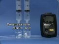

 Iodine Clock Reaction
 

> 
> 
> 
> 
> 
> 
> 
> 
> 
> 
> ## Iodine Clock Reaction
> 
> 
> 
> 
> 
> ## 
> 
> 
> 
> 
> 
>  A solution of hydrogen peroxide and sulfuric acid is added to a solution containing iodide ion, thiosulfate ion, and starch. After some time the dark blue color of a triiodide-starch complex is observed. The influences of initial reactant concentrations on the reaction time are examined, as are the influence of volume and temperature.
>  
> 
> 
> 
> 
> 
> 
>  (
>  [*86*](CRED86.HTM)
>  )
>  
> 
> 
> 
> 
> ### ---
> 
> 
>  Keywords
> 
> 
> 
> 
>  clock reaction, halogens/halides/hydrohalic acids, kinetics/rates /mechanisms, limiting reactant, redox reaction
>  
> 
> 
> 
> 
> ### ---
> 
> 
>  Multimedia
> 
> 
> 
> 
> **The Clock Reaction: Video** 
> 
> 
> 
> 
> 
> 
> 
> 
> [
>  Play movie](../../MVHTM/CLOCKRX/CLOCK1.HTM) 
> 
> 
> 
>  (QuickTime 3.0 Sorenson, duration 24 seconds, size 1.6 MB)
>  
> 
> 
> 
>  A solution of hydrogen peroxide and sulfuric acid is added to a solution of iodide ion, thiosulfate ion, and starch. A slow reaction forms triiodide, which reacts rapidly with thiosulfate, until the thiosulfate is consumed. The excess triiodide then reacts with the starch to form a blue complex.
>  
> 
> 
> 
> 
> 
> 
> 
> |  |  |  |  |
> | --- | --- | --- | --- |
> 
> 
> 
> 
> 
> 
> [Additional still images
for this movie](../../STHTM/CLOCKRX/CLOCK1.HTM) 
> 
> 
> 
> 
> 
> ---
> 
> 
> 
> 
> 
> #### Effect of Acidity
> 
> 
> 
> 
> 
> [
>  Play movie](../../MVHTM/CLOCKRX/CLOCK2.HTM) 
> 
> 
> 
>  (QuickTime 3.0 Sorenson, duration 23 seconds, size 1.5 MB)
>  
> 
> 
> 
>  This experiment tests the effect of different sulfuric acid concentrations on the rate of the iodine clock reaction. The initial concentrations and volumes of all other reactants are the same in all four vials. The greater the acid concentration, the faster the reaction.
>  
> 
> 
> 
>  H
>  2 
>  SO
>  4 
>  Concentration Ratios (1
>  **:** 
>  0.83
>  **:** 
>  0.67
>  **:** 
>  0.51)
>  
> 
> 
> 
> 
> 
> 
> 
> | Concentration Ratios | Start |  |
> | --- | --- | --- |
> 
> 
> 
> 
> 
> 
> | At 17 seconds | At 20 seconds | At 24 seconds | At 28 seconds |
> | --- | --- | --- | --- |
> 
> 
> 
> 
> 
> 
> [Additional still images
for this movie](../../STHTM/CLOCKRX/CLOCK2.HTM) 
> 
> 
> 
> 
> 
> ---
> 
> 
> 
> 
> 
> #### Effect of Iodide
> 
> 
> 
> 
> 
> [
>  Play movie](../../MVHTM/CLOCKRX/CLOCK3.HTM) 
> 
> 
> 
>  (QuickTime 3.0 Sorenson, duration 25 seconds, size 1.7 MB)
>  
> 
> 
> 
>  This experiment tests the effect of different iodide ion concentrations on the rate of the iodine clock reaction. The initial concentrations and volumes of all other reactants are the same in all four vials. The greater the iodide concentration, the shorter the reaction time.
>  
> 
> 
> 
>  Iodide Ion Concentration Ratios (1
>  **:** 
>  0.75
>  **:** 
>  0.50
>  **:** 
>  0.375)
>  
> 
> 
> 
> 
> 
> 
> 
> | Iodide Ion Concentration Ratios | Start |  |
> | --- | --- | --- |
> 
> 
> 
> 
> 
> 
> | At 24 seconds | At 32 seconds | At 46 seconds | At 59 seconds |
> | --- | --- | --- | --- |
> 
> 
> 
> 
> 
> 
> [Additional still images
for this movie](../../STHTM/CLOCKRX/CLOCK3.HTM) 
> 
> 
> 
> 
> 
> ---
> 
> 
> 
> 
> 
> #### Effect of Peroxide
> 
> 
> 
> 
> 
> [
>  Play movie](../../MVHTM/CLOCKRX/CLOCK4.HTM) 
> 
> 
> 
>  (QuickTime 3.0 Sorenson, duration 29 seconds, size 1.9 MB)
>  
> 
> 
> 
>  This experiment tests the effect of different hydrogen peroxide concentrations on the rate of the iodine clock reaction. The initial concentrations and volumes of all other reactants are the same in all four vials. The greater the peroxide concentration, the less time it takes for the solution to turn blue.
>  
> 
> 
> 
>  H
>  2 
>  O
>  2 
>  Concentration Ratios (1
>  **:** 
>  0.80
>  **:** 
>  0.60
>  **:** 
>  0.40)
>  
> 
> 
> 
> 
> 
> 
> 
> | Concentration Ratios | Start |  |
> | --- | --- | --- |
> 
> 
> 
> 
> 
> 
> | At 24 seconds | At 25 seconds | At 43 seconds | At 68 seconds |
> | --- | --- | --- | --- |
> 
> 
> 
> 
> 
> 
> [Additional still images
for this movie](../../STHTM/CLOCKRX/CLOCK4.HTM) 
> 
> 
> 
> 
> 
> ---
> 
> 
> 
> 
> 
> #### Effect of Volume, Same Concentrations
> 
> 
> 
> 
> 
> [
>  Play movie](../../MVHTM/CLOCKRX/CLOCK5.HTM) 
> 
> 
> 
>  (QuickTime 3.0 Sorenson, duration 11 seconds, size 820 K)
>  
> 
> 
> 
>  This experiment tests the effect of solution volume on the rate of the iodine clock reaction. All reactant concentrations are held constant. Total solution volume does not affect the rate of the iodine clock reaction.
>  
> 
> 
> 
>  Volumes (2 mL, 4 mL, 7 mL, 10 mL)
>  
> 
> 
> 
> 
> 
> 
> 
> | Volumes | Start |  |
> | --- | --- | --- |
> 
> 
> 
> 
> 
> 
> | At 25 seconds | At 27 seconds |
> | --- | --- |
> 
> 
> 
> 
> 
> 
> [Additional still images
for this movie](../../STHTM/CLOCKRX/CLOCK5.HTM) 
> 
> 
> 
> 
> 
> ---
> 
> 
> 
> 
> 
> #### Effect of Temperature
> 
> 
> 
> 
> 
> [
>  Play movie](../../MVHTM/CLOCKRX/CLOCK6.HTM) 
> 
> 
> 
>  (QuickTime 3.0 Sorenson, duration 15 seconds, size 1 MB)
>  
> 
> 
> 
>  This experiment tests the effect of temperature on the rate of the iodine clock reaction. The reaction rate is greater at higher temperatures.
>  
> 
> 
> 
>  Temperatures (20
>  o 
>  C, 8
>  o 
>  C)
>  
> 
> 
> 
> 
> 
> 
> 
> | Temperatures | Start |  |
> | --- | --- | --- |
> 
> 
> 
> 
> 
> 
> | At 25 seconds | At 52 seconds |
> | --- | --- |
> 
> 
> 
> 
> 
> 
> [Additional still images
for this movie](../../STHTM/CLOCKRX/CLOCK6.HTM) 
> 
> 
> 
> 
> 
> ---
> 
> 
> 
> 
> ### Discussion
> 
> 
> 
> 
> **Viewing Note** 
> 
> 
> 
> 
>  In the experiment testing the influence of volume on reaction rate, 
the color changes in the four vials do not occur at the same instant, 
because not all four solutions were mixed at exactly the same time. 
The important point is that the color changes were nearly simultaneous, 
especially compared to the overall time for the reaction. 
As long as the concentrations are the same, 
solution volume should not affect the rate of reaction.
>  
> 
> 
> 
>  The first step in this reaction is the formation of triiodide ion:
>  
> 
> 
> 
>  H
>  2 
>  O
>  2 
>  + 3 I
>  - 
>  + 2 H
>  + 
>  --> 
I
>  3 
> - 
>  + 2 H
>  2 
>  O
>  
> 
> 
> 
>  In the absence of thiosulfate ion the triiodide ion would form
 the characteristic blue complex with starch. 
 However, the triiodide ion is rapidly reduced back to iodide ion by thiosulfate:
>  
> 
> 
> 
>  I
>  3 
> - 
>  + 2 S
>  2 
>  O
>  3 
> 2- 
>  --> 
3 I
>  - 
>  + S
>  4 
>  O
>  6 
> 2- 
> 
> 
> 
> 
>  In this clock reaction thiosulfate ion is the limiting reactant. 
The blue starch-triiodide complex forms only when all the thiosulfate ion has been consumed.
>  
> 
> 
> 
>  The initial concentration of thiosulfate ion is the same in every reaction in this demonstration. 
Since the initial rate of every reaction is approximately
>  
> 
> 
> 
> 
>  [S
>  2 
>  O
>  3 
> 2- 
>  ] /
>  
>  t
>  
> 
> 
> 
>  and
>  
>  [S
>  2 
>  O
>  3 
> 2- 
>  ] 
is the same for every reaction,
 relative rates will be proportional to 1 /
>  
>  t.
The time between the start of the reaction and the color change 
can be determined from the timer readings. 
It should be possible to show that the reaction is first order in
[H
>  2 
>  O
>  2 
>  ],
[I
>  - 
>  ], and [H
>  + 
>  ] 
by showing that a plot of the initial concentration of the reactant 
whose concentration varies against 1/
>  
>  t is linear, 
or by plotting log concentration vs log (1/
>  
>  t) and observing that the slope is approximately 1.
>  
> 
> 
> 
> 
> 
> 
> [Demonstration Notes, Warnings, Safety Information, etc.](SAFETY.HTM) 
> 
> 
> 
> 
> 
> ### ---
> 
> 
>  Exam and Quiz Questions
> 
> 
> 
> 
>  1. How does increasing acidity affect the rate of the iodine clock reaction?
>  
> 
> 
> 
>  2. How does increasing the iodide ion concentration affect the rate of the iodine clock reaction?
>  
> 
> 
> 
>  3. How does increasing hydrogen peroxide concentration affect the rate of the iodine clock reaction?
>  
> 
> 
> 
>  4. How does increasing the total volume of the solution affect the rate of the iodine clock reaction?
>  
> 
> 
> 
>  5. How does increasing temperature affect the rate of the iodine clock reaction?
>  
> 
> 
> 
>  6. The first step in the iodine clock reaction is the formation of triiodide ion from iodide ion.
>  
> 
> 
> 
>  3 I
>  - 
>  + H
>  2 
>  O
>  2 
>  + 2 H
>  + 
>  --> I
>  3 
> - 
>  + 2 H
>  2 
>  O
>  
> 
> 
> 
>  Identify the oxidizing and reducing agents in the above reaction.
>  
> 
> 
> 
>  7. Once triiodide ion has formed, two competing reactions are possible. One is the formation of a blue complex of starch and triiodide.
>  
> 
> 
> 
>  I
>  3 
> - 
>  + starch --> blue starch-I
>  3 
> - 
>  complex
>  
> 
> 
> 
>  The other is the reaction of triiodide ion with thiosulfate ion.
>  
> 
> 
> 
> 
>  I
>  3 
> - 
>  + 2 S
>  2 
>  O
>  3 
> 2- 
>  --> 3 I
>  - 
>  + S
>  4 
>  O
>  6 
> 2- 
> 
> 
> 
> 
>  a. Which reaction is faster? Explain.
>  
> 
> 
> 
>  b. In this reaction, the initial concentration of thiosulfate ion was much smaller than the concentrations of the other reactants. What would have happened if the thiosulfate ion concentration had been more than double the concentration of hydrogen peroxide?
>  
> 
> 
> 
>  c. What would have happened if the thiosulfate ion concentration had been more than double the initial concentration of iodide ion, but less than the concentration of hydrogen peroxide?
>  
> 
> 
> 
>  d. What would have happened if no thiosulfate ion had been present?
>  
> 
> 
> 
> 
> 
> 
> ---
> 
> 
> 
> 
> [Next sequential topic](../../MAIN/OSCRXBR/PAGE1.HTM)

> ---
> 
> 
>  |
>  [Chemistry Comes Alive! (entry page)](../../INDEX.HTM) 
>  |
>  [Table of Contents](../../CONTENTS.HTM) 
>  |
>  [Matrix of Chapters and Topics](../../MATRIX.HTM) 
>  |
>  [Index](../../WORDS.HTM) 
>  |
>  [Alphabetical List of Topics](../../ALPHATOP.HTM) 
>  |
>  [Chemistry Textbooks](../../BOOKS.HTM) 
>  |
>  
>  © 1999 Division of Chemical Education, Inc.,
American Chemical Society. All rights reserved.

