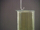

 Reaction of Chlorine with Natural Gas
 

> 
> 
> 
> 
> 
> 
> 
> 
> 
> 
> ## Reaction of Chlorine with Natural Gas
> 
> 
> 
> 
> 
> ## 
> 
> 
> 
> 
> 
>  Natural gas from a laboratory gas jet is ignited in air. 
Natural gas is primarily methane. 
When the methane flame is lowered into chlorine gas in a glass cylinder, 
the flame becomes darker yellow and smokier, 
indicating that the methane is now being oxidized by chlorine instead of oxygen. 
The products of the reaction of methane and chlorine are carbon, hydrogen chloride, 
and various chlorocarbons. The presence of hydrogen chloride is demonstrated 
by bringing the stopper from a bottle of aqueous ammonia above the glass cylinder. 
A smoke of ammonium chloride forms.
>  
> 
> 
> 
> 
> 
> 
>  (
>  [*168*](CRED168.HTM)
>  )
>  
> 
> 
> 
> 
> ### ---
> 
> 
>  Keywords
> 
> 
> 
> 
>  carbon, descriptive chemistry, enthalpy/heat, evidence of chemical reaction, exothermic process, fire/flammability, halogens/halides/hydrohalic acids, organic - hydrocarbons, redox reaction
>  
> 
> 
> 
> 
> ### ---
> 
> 
>  Multimedia
> 
> 
> 
> 
> 
> 
> 
> 
> [
>  Play movie](../../MVHTM/CLPR/CLPR.HTM) 
> 
> 
> 
>  (QuickTime 3.0 Sorenson, duration 40 seconds, size 2.8 MB)
>  
> 
> 
> 
>  Natural gas flowing from a capillary is ignited. The watch glass covering a glass cylinder of chlorine is removed and the methane flame lowered. The reaction between methane and air is replaced by the reaction between methane and chlorine, which produces carbon, hydrogen chloride and various chlorocarbons. As the flame burns the level of chlorine gas in the container decreases. When a stopper from a bottle of aqueous ammonia is brought near the flame, white fumes of ammonium chloride are produced indicating the presence of hydrogen chloride.
>  
> 
> 
> 
> 
> | Natural gas is ignited. | The reaction between methane and air is replaced by the reaction between methane and chlorine | As the flame burns the level of chlorine gas in the container decreases. | Fumes of ammonium chloride are produced indicating the presence of hydrogen chloride. |
> | --- | --- | --- | --- |
> 
> 
> 
> 
> 
> 
> [Additional still images
for this movie](../../STHTM/CLPR/CLPR.HTM) 
> 
> 
> 
> 
> 
> ---
> 
> 
> 
> 
> ### Discussion
> 
> 
> 
> 
>  Natural gas and chlorine do not react at room temperature, 
just as natural gas and air do not react. 
If the natural gas is ignited in air, 
the increase in temperature due to the exothermic reaction 
allows the reaction to proceed at a fast rate and a flame appears. 
Once ignited in air the methane flame can be moved to an atmosphere that 
consists of mainly chlorine and the chlorine takes over as the oxidizing agent. 
A chemical reaction continues, but the flame temperature and products change.
>  
> 
> 
> 
> 
> 
> 
> [Demonstration Notes, Warnings, Safety Information, etc.](SAFETY.HTM) 
> 
> 
> 
> 
> 
> ### ---
> 
> 
>  Exam and Quiz Questions
> 
> 
> 
> 
>  1. What observable evidence indicates that a chemical reaction is taking place?
>  
> 
> 
> 
>  2. Classify the reactions shown in the video as combination, decomposition, exchange, acid-base, combustion, or redox. (There is more than one reaction, and each reaction may fall within more than one of these categories.)
>  
> 
> 
> 
>  3. Are the reactions shown exothermic or endothermic? Cite observations that justify your choice.
>  
> 
> 
> 
> 
> 
> 
> ---
> 
> 
> 
> 
> [Next sequential topic](../../MAIN/CLH/PAGE1.HTM)

> ---
> 
> 
>  |
>  [Chemistry Comes Alive! (entry page)](../../INDEX.HTM) 
>  |
>  [Table of Contents](../../CONTENTS.HTM) 
>  |
>  [Matrix of Chapters and Topics](../../MATRIX.HTM) 
>  |
>  [Index](../../WORDS.HTM) 
>  |
>  [Alphabetical List of Topics](../../ALPHATOP.HTM) 
>  |
>  [Chemistry Textbooks](../../BOOKS.HTM) 
>  |
>  
>  © 1999 Division of Chemical Education, Inc.,
American Chemical Society. All rights reserved.

