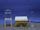

 Copper in Concentrated Sulfuric Acid
 

> 
> 
> 
> 
> 
> 
> 
> 
> 
> 
> ## Copper in Concentrated Sulfuric Acid
> 
> 
> 
> 
> 
> ## 
> 
> 
> 
> 
> 
>  Copper reacts with hot concentrated sulfuric acid in a flask. The copper dissolves and sulfur dioxide gas is formed. As the flask cools, atmospheric pressure forces water from a second flask into the first one, dissolving the sulfur dioxide(SO
>  2 
>  ). The solution is tested for the presence of aqueous copper(II) ions (Cu
>  2+ 
>  (
>  *aq* 
>  )) by adding aqueous ammonia (NH
>  3 
>  (
>  *aq* 
>  )).
>  
> 
> 
> 
> 
> 
> 
>  (
>  [*170*](CRED170.HTM)
>  )
>  
> 
> 
> 
> 
> ### ---
> 
> 
>  Keywords
> 
> 
> 
> 
>  acids/bases, ammonia, copper, descriptive chemistry, oxidizing acid, redox reaction, strong acid, sulfur/sulfur oxides/sulfuric acid
>  
> 
> 
> 
> 
> ### ---
> 
> 
>  Multimedia
> 
> 
> 
> 
> 
> 
> 
> 
> [
>  Play movie](../../MVHTM/CUNASID/CUNASID.HTM) 
> 
> 
> 
>  (QuickTime 3.0 Sorenson, duration 120 seconds, size 8.1 MB)
>  
> 
> 
> 
>  Copper turnings are dropped into a flask. Sulfuric acid is added, and the mixture is heated.
>  
> 
> 
> 
>  The heated air expands, and is pushed out of the flask. The copper reacts with the acid. One of the products is sulfur dioxide gas, which fills the flask.
>  
> 
> 
> 
>  After the heat is removed, the gas in the flask cools, and contracts, drawing water into the flask. Initially, the water vaporizes due to residual heat, and expands rapidly. Again it cools, and water is drawn again into the flask.
>  
> 
> 
> 
>  As water enters the flask, the sulfur dioxide gas evolved in the reaction dissolves. The pressure in the flask is reduced, which draws more water into the flask.
>  
> 
> 
> 
>  When a concentrated solution of ammonia is added, the copper(II) ion in solution reacts to form a complex ion, which is blue in color.
>  
> 
> 
> 
> 
> 
> 
> 
> | Copper in Concentrated Sulfuric Acid is heated. | The heated air is pushed out of the flask. | Sulfur dioxide gas fills the flask. |
> | --- | --- | --- |
> 
> 
> 
> 
> 
> 
> 
> | Water is drawn into the flask. | After a concentrated solution of ammonia is added. |
> | --- | --- |
> 
> 
> 
> 
> 
> 
> [Additional still images
for this movie](../../STHTM/CUNASID/CUNASID.HTM) 
> 
> 
> 
> 
> 
> ---
> 
> 
> 
> 
> ### Discussion
> 
> 
> 
> 
>  Though it is not a strongly oxidizing acid, concentrated sulfuric acid is 
a strong enough oxidizing agent to dissolve copper. 
Sulfur dioxide is produced by reduction of the sulfuric acid. 
That copper(II) ions are in the aqueous solution is shown 
by the formation of the deep blue copper-ammonia complex.
>  
> 
> 
> 
>  The equations for the reactions shown here are
>  
> 
> 
> 
>  Cu(
>  *s* 
>  ) + 4 H
>  + 
>  (
>  *aq* 
>  ) + SO
>  4 
> 2- 
>  (
>  *aq* 
>  ) --> 
 Cu
>  2+ 
>  (
>  *aq* 
>  ) + SO
>  2 
>  (
>  *g* 
>  ) + 2 H
>  2 
>  O(
>  *l* 
>  )
>  
> 
> 
> 
>  Cu
>  2+ 
>  (
>  *aq* 
>  ) + 4 NH
>  3 
>  (
>  *aq* 
>  ) --> 
 Cu(NH
>  3 
>  )
>  4 
> 2+ 
>  (
>  *aq* 
>  )
>  
> 
> 
> 
> 
> 
> 
> [Demonstration Notes, Warnings, Safety Information, etc.](SAFETY.HTM) 
> 
> 
> 
> 
> 
> ### ---
> 
> 
>  Exam and Quiz Questions
> 
> 
> 
> 
>  1. Write down as many different observations as you can make during 
the reaction of concentrated sulfuric acid with copper.
>  
> 
> 
> 
>  2. What experiments could you do to confirm that the gaseous 
product of the reaction is sulfur dioxide?
>  
> 
> 
> 
>  3. Write a balanced equation for the reaction of concentrated sulfuric acid with copper.
>  
> 
> 
> 
>  4. Explain why the water from the beaker siphons into the flask. 
Why do bubbles come out the end of the tube when water first enters the flask? 
Why does the water siphon faster after some water has already entered the flask?
>  
> 
> 
> 
> 
> 
> 
> ---
> 
> 
> 
> 
> [Next sequential topic](../../MAIN/TITREDO/PAGE1.HTM)

> ---
> 
> 
>  |
>  [Chemistry Comes Alive! (entry page)](../../INDEX.HTM) 
>  |
>  [Table of Contents](../../CONTENTS.HTM) 
>  |
>  [Matrix of Chapters and Topics](../../MATRIX.HTM) 
>  |
>  [Index](../../WORDS.HTM) 
>  |
>  [Alphabetical List of Topics](../../ALPHATOP.HTM) 
>  |
>  [Chemistry Textbooks](../../BOOKS.HTM) 
>  |
>  
>  © 1999 Division of Chemical Education, Inc.,
American Chemical Society. All rights reserved.

