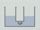

 Electrolysis of Water
 

> 
> 
> 
> 
> 
> 
> 
> 
> 
> 
> ## Electrolysis of Water
> 
> 
> 
> 
> 
> ## 
> 
> 
> 
> 
> 
>  An electric current is passed through two cells containing sodium sulfate solution. At one electrode, gas is generated and the indicator color changes from green to blue. At the other electrode gas is also generated, but in this case the indicator color changes from green to yellow.
>  
> 
> 
> 
>  When a current is passed through a sulfuric acid solution, gases are generated at each electrode. The volumes of gas are in a ratio of two to one. A lighted match causes the first gas to ignite with a loud "pop". A glowing splint inserted in the other gas burns brightly.
>  
> 
> 
> 
>  An animation simulates the flow of charge in a water electrolysis cell and 
shows the half-reactions that take place at each electrode.
>  
> 
> 
> 
> 
> 
> 
>  (
>  [*86*](CRED86.HTM)
>  )
>  
> 
> 
> 
> 
> ### ---
> 
> 
>  Keywords
> 
> 
> 
> 
>  decomposition reaction, descriptive chemistry, electrochemical (electrolysis) cells, fire/flammability, hydrogen, oxygen, redox reaction, stoichiometry
>  
> 
> 
> 
> 
> ### ---
> 
> 
>  Multimedia
> 
> 
> 
> 
> 
> 
> 
> 
> [
>  Play movie](../../MVHTM/ELECH20/ELECW01.HTM) 
> 
> 
> 
>  (QuickTime 3.0 Sorenson, duration 40 seconds, size 2.4 MB)
>  
> 
> 
> 
>  Two cylinders containing a sodium sulfate solution are connected with tubing. Each has a platinum electrode connected to a power supply. Bromthymol Blue indicator is in the sodium sulfate solution. The top vial shows the indicator color in the acid, the middle in neutral solution, and the bottom in base.
When electricity passes through the system, oxidation occurs at one electrode and reduction at the other. Gas is formed at each electrode, and the acidity increases at one electrode and decreases at the other.
>  
> 
> 
> 
> 
> 
> 
> 
> | The apparatus. | At the beginning. | After 7 minutes. |
> | --- | --- | --- |
> 
> 
> 
> 
> 
> 
> [Additional still images
for this movie](../../STHTM/ELECH20/ELECW01.HTM) 
> 
> 
> 
> 
> 
> ---
> 
> 
> 
> 
> 
> 
> 
> 
> [
>  Play movie](../../MVHTM/ELECH20/ELECW02.HTM) 
> 
> 
> 
>  (QuickTime 3.0 Sorenson, duration 68 seconds, size 4.8 MB)
>  
> 
> 
> 
>  Two cylinders containing sulfuric acid dissolved in water are connected with tubing. When electricity passes through the system, oxidation occurs at one electrode and reduction at the other. Electrolysis of the water generates hydrogen gas at one electrode and oxygen at the other. The role of the sulfuric acid is to allow transfer of charge from one platinum electrode to the other. As the time lapse shows the volume of gas collected at each electrode differs. The volume of gas generated at each electrode can be determined from the volume readings on the cylinders. When gas from the left cylinder is collected in a test tube and a lighted match is brought near it the gas ignites with a barking noise indicating hydrogen. When a glowing match is brought near gas from the right cylinder the match burns brightly indicating the presence of oxygen.
>  
> 
> 
> 
> 
> | The apparatus. | At the begining. | After 30 minutes. |
> | --- | --- | --- |
> 
> 
> 
> 
> 
> 
> 
> | The gas in the left cylinder... | ... is hydrogen. |
> | --- | --- |
> 
> 
> 
> 
> 
> 
> 
> | TThe gas in the right cylinder... | ... is oxygen. |
> | --- | --- |
> 
> 
> 
> 
> 
> 
> [Additional still images
for this movie](../../STHTM/ELECH20/ELECW02.HTM) 
> 
> 
> 
> 
> 
> ---
> 
> 
> 
> 
> 
> #### Animation
> 
> 
> 
> 
> 
> [
>  Play movie](../../MVHTM/ELECH20/ELECW03.HTM) 
> 
> 
> 
>  (QuickTime 3.0 Sorenson, duration 73 seconds, size 4.8 MB)
>  
> 
> 
> 
> 
>  This animation simulates the electrolysis of a neutral aqueous solution, such as sodium sulfate. At the anode, water molecules produce oxygen gas, hydrogen ions, and electrons. The electrons flow through the circuit to the cathode, where they react with water to produce hydrogen gas and hydroxide ions. If the solution is stirred, acid-base neutralization will occur.
>  
> 
> 
> 
> 
> 
> 
> 
> | The simulated apparatus. |
> | --- |
> 
> 
> 
> 
> 
> 
> [Additional still images
for this movie](../../STHTM/ELECH20/ELECW03.HTM) 
> 
> 
> 
> 
> 
> ---
> 
> 
> 
> 
> ### Discussion
> 
> 
> 
> 
>  See the table of contents for another set of experiments involving the electrolysis of aqueous solutions.
>  
> 
> 
> 
> 
> 
> 
> [Demonstration Notes, Warnings, Safety Information, etc.](SAFETY.HTM) 
> 
> 
> 
> 
> 
> ### ---
> 
> 
>  Exam and Quiz Questions
> 
> 
> 
> 
>  1. Based on the volumes of gases generated, in which cylinder is hydrogen being produced? Do the chemical tests of the two gases support this conclusion? Explain.
>  
> 
> 
> 
>  2. Write balanced equations for the half-reactions taking place during the electrolysis of aqueous sodium sulfate. Do these reactions account for the color changes at the two electrodes? Explain.
>  
> 
> 
> 
>  3. Why was it necessary to add sodium sulfate or sulfuric acid in order to electrolyze the water?
>  
> 
> 
> 
> 
> 
> 
> ---
> 
> 
> 
> 
> [Next sequential topic](../../MAIN/TREES/PAGE1.HTM)

> ---
> 
> 
>  |
>  [Chemistry Comes Alive! (entry page)](../../INDEX.HTM) 
>  |
>  [Table of Contents](../../CONTENTS.HTM) 
>  |
>  [Matrix of Chapters and Topics](../../MATRIX.HTM) 
>  |
>  [Index](../../WORDS.HTM) 
>  |
>  [Alphabetical List of Topics](../../ALPHATOP.HTM) 
>  |
>  [Chemistry Textbooks](../../BOOKS.HTM) 
>  |
>  
>  © 1999 Division of Chemical Education, Inc.,
American Chemical Society. All rights reserved.

