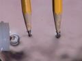

 Electrolysis of Aqueous Solutions - Part 2 of 3
 

> 
> 
> 
> 
> 
> 
> 
> 
> 
> 
> ## Electrolysis of Aqueous Solutions
> 
> 
> 
> 
> 
> ## Part 2 of 3
> 
> 
> 
> 
> 
> 
> ### ---
> 
> 
>  Multimedia
> 
> 
> 
> 
> 
> #### Electrolysis of Aqueous Tin(IV) Chloride
> 
> 
> 
> 
> 
> [
>  Play movie](../../MVHTM/ELECSOL/ELECAS12.HTM) 
> 
> 
> 
>  (QuickTime 3.0 Sorenson, duration 8 seconds, size 600 K)
>  
> 
> 
> 
>  Electrolysis of a tin(IV) chloride solution produces oxygen at the anode, 
hydrogen and tin(II) ion at the cathode.
>  
> 
> 
> 
>  SnCl
>  4 
> 
> 
> 
> 
> 
> 
> 
> 
> |  |  |
> | --- | --- |
> 
> 
> 
> 
> 
> ---
> 
> 
> 
> 
> #### Electrolysis of Aqueous Tin(II) Chloride
> 
> 
> 
> 
> 
> [
>  Play movie](../../MVHTM/ELECSOL/ELECAS13.HTM) 
> 
> 
> 
>  (QuickTime 3.0 Sorenson, duration 15 seconds, size 1 MB)
>  
> 
> 
> 
>  Electrolysis of a tin(II) chloride solution produces oxygen at the anode and 
tin metal at the cathode.
>  
> 
> 
> 
>  SnCl
>  2 
> 
> 
> 
> 
> 
> 
> 
> 
> |  |  |  |  |
> | --- | --- | --- | --- |
> 
> 
> 
> 
> 
> ---
> 
> 
> 
> 
> #### Electrolysis of Aqueous Tin(II) Chloride - Timelapse
> 
> 
> 
> 
> 
> [
>  Play movie](../../MVHTM/ELECSOL/ELECAS14.HTM) 
> 
> 
> 
>  (QuickTime 3.0 Sorenson, duration 10 seconds, size 720 K)
>  
> 
> 
> 
>  (Electrolysis of a tin(II) chloride solution produces oxygen at the anode and 
tin metal at the cathode.)
>  
> 
> 
> 
>  (Timelapse of the formation of tin metal at the catode.)
>  
> 
> 
> 
>  SnCl
>  2 
> 
> 
> 
> 
> 
> 
> 
> 
> |  |  |  |
> | --- | --- | --- |
> 
> 
> 
> 
> 
> 
> [Additional still images
for this movie](../../STHTM/ELECSOL/ELECAS14.HTM) 
> 
> 
> 
> 
> 
> ---
> 
> 
> 
> 
> 
> #### Electrolysis of Aqueous Sodium Nitrate
> 
> 
> 
> 
> 
> [
>  Play movie](../../MVHTM/ELECSOL/ELECAS15.HTM) 
> 
> 
> 
>  (QuickTime 3.0 Sorenson, duration 8 seconds, size 580 K)
>  
> 
> 
> 
>  Electrolysis of a sodium nitrate solution produces oxygen at the anode and 
hydrogen at the cathode.
>  
> 
> 
> 
>  NaNO
>  3 
> 
> 
> 
> 
> 
> 
> 
> 
> |  |  |
> | --- | --- |
> 
> 
> 
> 
> 
> ---
> 
> 
> 
> 
> #### Electrolysis of Aqueous Magnesium Nitrate
> 
> 
> 
> 
> 
> [
>  Play movie](../../MVHTM/ELECSOL/ELECAS16.HTM) 
> 
> 
> 
>  (QuickTime 3.0 Sorenson, duration 8 seconds, size 590 K)
>  
> 
> 
> 
>  Electrolysis of a magnesium nitrate solution produces oxygen at the anode 
and hydrogen at the cathode.
>  
> 
> 
> 
>  Mg(NO
>  3 
>  )
>  2 
> 
> 
> 
> 
> 
> 
> 
> 
> |  |  |
> | --- | --- |
> 
> 
> 
> 
> 
> ---
> 
> 
> 
> 
> #### Electrolysis of Aqueous Aluminum Nitrate
> 
> 
> 
> 
> 
> [
>  Play movie](../../MVHTM/ELECSOL/ELECAS17.HTM) 
> 
> 
> 
>  (QuickTime 3.0 Sorenson, duration 8 seconds, size 570 K)
>  
> 
> 
> 
>  Electrolysis of an aluminum nitrate solution produces oxygen at the anode 
and hydrogen at the cathode.
>  
> 
> 
> 
>  Al(NO
>  3 
>  )
>  3 
> 
> 
> 
> 
> 
> 
> 
> 
> |  |  |
> | --- | --- |
> 
> 
> 
> 
> 
> ---
> 
> 
> 
> 
> #### Electrolysis of Aqueous Potassium Nitrate
> 
> 
> 
> 
> 
> [
>  Play movie](../../MVHTM/ELECSOL/ELECAS18.HTM) 
> 
> 
> 
>  (QuickTime 3.0 Sorenson, duration 13 seconds, size 930 K)
>  
> 
> 
> 
>  Electrolysis of a potassium nitrate solution produces oxygen at the anode 
and hydrogen at the cathode.
>  
> 
> 
> 
>  KNO
>  3 
> 
> 
> 
> 
> 
> 
> 
> 
> |  |  |
> | --- | --- |
> 
> 
> 
> 
> 
> ---
> 
> 
> 
> 
> #### Electrolysis of Aqueous Calcium Nitrate
> 
> 
> 
> 
> 
> [
>  Play movie](../../MVHTM/ELECSOL/ELECAS19.HTM) 
> 
> 
> 
>  (QuickTime 3.0 Sorenson, duration 8 seconds, size 590 K)
>  
> 
> 
> 
>  Electrolysis of a calcium nitrate solution produces oxygen at the anode 
and hydrogen at the cathode.
>  
> 
> 
> 
>  Ca(NO
>  3 
>  )
>  2 
> 
> 
> 
> 
> 
> 
> 
> 
> |  |  |
> | --- | --- |
> 
> 
> 
> 
> 
> ---
> 
> 
> 
> 
> #### Electrolysis of Aqueous Cobalt(II) Nitrate
> 
> 
> 
> 
> 
> [
>  Play movie](../../MVHTM/ELECSOL/ELECAS20.HTM) 
> 
> 
> 
>  (QuickTime 3.0 Sorenson, duration 13 seconds, size 970 K)
>  
> 
> 
> 
>  Electrolysis of a cobalt(II) nitrate solution produces oxygen at the anode, 
and hydrogen and cobalt at the cathode.
>  
> 
> 
> 
>  Co(NO
>  3 
>  )
>  2 
> 
> 
> 
> 
> 
> 
> 
> 
> |  |  |  |  |
> | --- | --- | --- | --- |
> 
> 
> 
> 
> 
> ---
> 
> 
> 
> 
> 
> 
> 
> 
> [Next page for this topic](../../MAIN/ELECSOL/PAGE3.HTM) 
> 
> 
> 
> 
> 
> 
> [Next sequential topic](../../MAIN/VOLTAGE/PAGE1.HTM)

> ---
> 
> 
>  |
>  [Chemistry Comes Alive! (entry page)](../../INDEX.HTM) 
>  |
>  [Table of Contents](../../CONTENTS.HTM) 
>  |
>  [Matrix of Chapters and Topics](../../MATRIX.HTM) 
>  |
>  [Index](../../WORDS.HTM) 
>  |
>  [Alphabetical List of Topics](../../ALPHATOP.HTM) 
>  |
>  [Chemistry Textbooks](../../BOOKS.HTM) 
>  |
>  
>  © 1999 Division of Chemical Education, Inc.,
American Chemical Society. All rights reserved.

