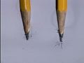

 Electrolysis of Aqueous Solutions - Part 3 of 3
 

> 
> 
> 
> 
> 
> 
> 
> 
> 
> 
> ## Electrolysis of Aqueous Solutions
> 
> 
> 
> 
> 
> ## Part 3 of 3
> 
> 
> 
> 
> 
> 
> ### ---
> 
> 
>  Multimedia
> 
> 
> 
> 
> 
> #### Electrolysis of Aqueous Nickel(II) Nitrate
> 
> 
> 
> 
> 
> [
>  Play movie](../../MVHTM/ELECSOL/ELECAS21.HTM) 
> 
> 
> 
>  (QuickTime 3.0 Sorenson, duration 13 seconds, size 970 K)
>  
> 
> 
> 
>  Electrolysis of a nickel(II) nitrate solution produces oxygen at the anode, 
and hydrogen and nickel at the cathode.
>  
> 
> 
> 
>  Ni(NO
>  3 
>  )
>  2 
> 
> 
> 
> 
> 
> 
> 
> 
> |  |  |  |  |
> | --- | --- | --- | --- |
> 
> 
> 
> 
> 
> ---
> 
> 
> 
> 
> #### Electrolysis of Aqueous Copper(II) Nitrate
> 
> 
> 
> 
> 
> [
>  Play movie](../../MVHTM/ELECSOL/ELECAS22.HTM) 
> 
> 
> 
>  (QuickTime 3.0 Sorenson, duration 13 seconds, size 960 K)
>  
> 
> 
> 
>  Electrolysis of a copper(II) nitrate solution produces oxygen at the anode 
and copper at the cathode.
>  
> 
> 
> 
>  Cu(NO
>  3 
>  )
>  2 
> 
> 
> 
> 
> 
> 
> 
> 
> |  |  |  |  |
> | --- | --- | --- | --- |
> 
> 
> 
> 
> 
> ---
> 
> 
> 
> 
> #### Electrolysis of Aqueous Zinc Nitrate
> 
> 
> 
> 
> 
> [
>  Play movie](../../MVHTM/ELECSOL/ELECAS23.HTM) 
> 
> 
> 
>  (QuickTime 3.0 Sorenson, duration 13 seconds, size 960 K)
>  
> 
> 
> 
>  Electrolysis of a zinc nitrate solution produces oxygen at the anode and zinc 
at the cathode.
>  
> 
> 
> 
>  Zn(NO
>  3 
>  )
>  2 
> 
> 
> 
> 
> 
> 
> 
> 
> |  |  |  |  |
> | --- | --- | --- | --- |
> 
> 
> 
> 
> 
> ---
> 
> 
> 
> 
> #### Electrolysis of Aqueous Strontium Nitrate
> 
> 
> 
> 
> 
> [
>  Play movie](../../MVHTM/ELECSOL/ELECAS24.HTM) 
> 
> 
> 
>  (QuickTime 3.0 Sorenson, duration 8 seconds, size 580 K)
>  
> 
> 
> 
>  Electrolysis of a strontium nitrate solution produces oxygen at the anode 
and hydrogen at the cathode.
>  
> 
> 
> 
>  Sr(NO
>  3 
>  )
>  2 
> 
> 
> 
> 
> 
> 
> 
> 
> |  |  |
> | --- | --- |
> 
> 
> 
> 
> 
> ---
> 
> 
> 
> 
> #### Electrolysis of Aqueous Silver Nitrate
> 
> 
> 
> 
> 
> [
>  Play movie](../../MVHTM/ELECSOL/ELECAS25.HTM) 
> 
> 
> 
>  (QuickTime 3.0 Sorenson, duration 8 seconds, size 590 K)
>  
> 
> 
> 
>  Electrolysis of a silver nitrate solution produces oxygen at the anode and 
silver at the cathode.
>  
> 
> 
> 
>  AgNO
>  3 
> 
> 
> 
> 
> 
> 
> 
> 
> |  |  |
> | --- | --- |
> 
> 
> 
> 
> 
> ---
> 
> 
> 
> 
> #### Electrolysis of Aqueous Silver Nitrate - Timelapse
> 
> 
> 
> 
> 
> [
>  Play movie](../../MVHTM/ELECSOL/ELECAS35.HTM) 
> 
> 
> 
>  (QuickTime 3.0 Sorenson, duration 14 seconds, size 990 K)
>  
> 
> 
> 
>  (Electrolysis of a silver nitrate solution produces oxygen at the anode and 
silver at the cathode.)
>  
> 
> 
> 
>  (Timelapse of silver being produced at the cathode.)
>  
> 
> 
> 
>  AgNO
>  3 
> 
> 
> 
> 
> 
> 
> 
> 
> |  |  |  |  |
> | --- | --- | --- | --- |
> 
> 
> 
> 
> 
> 
> [Additional still images
for this movie](../../STHTM/ELECSOL/ELECAS35.HTM) 
> 
> 
> 
> 
> 
> ---
> 
> 
> 
> 
> 
> #### Electrolysis of Aqueous Barium Nitrate
> 
> 
> 
> 
> 
> [
>  Play movie](../../MVHTM/ELECSOL/ELECAS26.HTM) 
> 
> 
> 
>  (QuickTime 3.0 Sorenson, duration 13 seconds, size 960 K)
>  
> 
> 
> 
>  Electrolysis of a barium nitrate solution produces oxygen at the anode and 
hydrogen at the cathode.
>  
> 
> 
> 
>  Ba(NO
>  3 
>  )
>  2 
> 
> 
> 
> 
> 
> 
> 
> 
> |  |  |  |  |
> | --- | --- | --- | --- |
> 
> 
> 
> 
> 
> ---
> 
> 
> 
> 
> #### Electrolysis of Aqueous Lead(II) Nitrate
> 
> 
> 
> 
> 
> [
>  Play movie](../../MVHTM/ELECSOL/ELECAS27.HTM) 
> 
> 
> 
>  (QuickTime 3.0 Sorenson, duration 13 seconds, size 940 K)
>  
> 
> 
> 
>  Electrolysis of a lead(II) nitrate solution produces oxygen at the anode and 
lead at the cathode.
>  
> 
> 
> 
>  Pb(NO
>  3 
>  )
>  2 
> 
> 
> 
> 
> 
> 
> 
> 
> |  |  |  |  |
> | --- | --- | --- | --- |
> 
> 
> 
> 
> 
> ---
> 
> 
> 
> 
> #### Electrolysis of Aqueous Aqueous Lead(II) Nitrate - Timelapse
> 
> 
> 
> 
> 
> [
>  Play movie](../../MVHTM/ELECSOL/ELECAS28.HTM) 
> 
> 
> 
>  (QuickTime 3.0 Sorenson, duration 5 seconds, size 360 K)
>  
> 
> 
> 
>  (Electrolysis of a lead(II) nitrate solution produces oxygen at the anode and 
lead at the cathode.)
>  
> 
> 
> 
>  (Timelapse of lead being deposited at the cathode.)
>  
> 
> 
> 
>  Pb(NO
>  3 
>  )
>  2 
> 
> 
> 
> 
> 
> 
> 
> 
> |  |  |  |
> | --- | --- | --- |
> 
> 
> 
> 
> 
> 
> [Additional still images
for this movie](../../STHTM/ELECSOL/ELECAS28.HTM) 
> 
> 
> 
> 
> 
> ---
> 
> 
> 
> 
> 
> 
> 
> 
> 
> [First page for this topic](../../MAIN/ELECSOL/PAGE1.HTM) 
> 
> 
> 
> 
> 
> 
> [Next sequential topic](../../MAIN/VOLTAGE/PAGE1.HTM)

> ---
> 
> 
>  |
>  [Chemistry Comes Alive! (entry page)](../../INDEX.HTM) 
>  |
>  [Table of Contents](../../CONTENTS.HTM) 
>  |
>  [Matrix of Chapters and Topics](../../MATRIX.HTM) 
>  |
>  [Index](../../WORDS.HTM) 
>  |
>  [Alphabetical List of Topics](../../ALPHATOP.HTM) 
>  |
>  [Chemistry Textbooks](../../BOOKS.HTM) 
>  |
>  
>  © 1999 Division of Chemical Education, Inc.,
American Chemical Society. All rights reserved.

