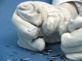

 ENTROPY
 

> 
> 
> 
> 
> 
> 
> 
> 
> 
> 
> ## Entropy
> 
> 
> 
> 
> 
> ## 
> 
> 
> 
> 
> 
>  Four processes have been selected in which disorder increases very
significantly. When nitrogen triodide
detonates, the products are explosively produced and distributed.
When a colored drop of liquid is stirred into another liquid, its molecules are dispersed
throughout the solution. When a silicon wafer is shattered, the
pieces are no longer connected. When an ice cube melts (and the water boils away) the
molecules are no longer as constrained.
>  
> 
> 
> 
>  Each of these processes is shown in reverse. The situations shown are so
>  **highly improbable** 
>  that we would not expect to observe them in
nature.
>  
> 
> 
> 
>  Disorder is defined in terms of probability and entropy is
intrepreted as being related to disorder.
>  
> 
> 
> 
> 
> 
> 
>  (
>  [*146*](CRED146.HTM)
>  )
>  
> 
> 
> 
> 
> ### ---
> 
> 
>  Keywords
> 
> 
> 
> 
>  entropy/disorder, spontaneous process, thermochemistry/thermodynamics
>  
> 
> 
> 
> 
> ### ---
> 
> 
>  Multimedia
> 
> 
> 
>  Note: there is no sound with any of these videos.
>  
> 
> 
> 
> 
> 
> #### 'Undetonate' (from Nitrogen Triiodide Detonation)
> 
> 
> 
> 
> 
> 
>  (
>  [*148*](CRED148.HTM)
>  )
>  
> 
> 
> 
> 
> 
> [
>  Play movie](../../MVHTM/ENTROPY/UNDETR.HTM) 
> 
> 
> 
>  (QuickTime 3.0 Sorenson, duration 2 seconds, size 120 K)
>  
> 
> 
> 
>  When nitrogen triodide detonates, 
the products are explosively produced and distributed.
The process is shown in reverse. 
The products of the explosion of
nitrogen triiodide "assemble themselves" to form the original system as
it was before the explosion. 
The situation shown is so
highly improbable that we would not expect to observe it in
nature.
>  
> 
> 
> 
> 
> 
> 
> 
> |  |  |  |  |
> | --- | --- | --- | --- |
> 
> 
> 
> 
> 
> 
> [Additional still images
for this movie](../../STHTM/ENTROPY/UNDETR.HTM) 
> 
> 
> 
> 
> 
> ---
> 
> 
> 
> 
> 
> #### 'Unmelt' (from Melting an Ice Cube and Boiling the Water)
> 
> 
> 
> 
> 
> 
>  (
>  [*147*](CRED147.HTM)
>  )
>  
> 
> 
> 
> 
> 
> [
>  Play movie](../../MVHTM/ENTROPY/UNMELT.HTM) 
> 
> 
> 
>  (QuickTime 3.0 Sorenson, duration 31 seconds, size 2.5 MB)
>  
> 
> 
> 
>  When an ice cube melts (and the water boils away) the
molecules are no longer constrained. The process is shown in reverse. 
Water vapor "condenses" into boiling water which
then "freezes" into an ice cube. 
The situation shown is so highly improbable that we would not expect to observe it in nature.
>  
> 
> 
> 
> 
> 
> 
> 
> |  |  |  |  |
> | --- | --- | --- | --- |
> 
> 
> 
> 
> 
> 
> [Additional still images
for this movie](../../STHTM/ENTROPY/UNMELT.HTM) 
> 
> 
> 
> 
> 
> ---
> 
> 
> 
> 
> 
> #### 'Unmix' (from Dissolving and Mixing a Colored Liquid)
> 
> 
> 
> 
> 
> 
>  (
>  [*147*](CRED147.HTM)
>  )
>  
> 
> 
> 
> 
> 
> [
>  Play movie](../../MVHTM/ENTROPY/UNMIX.HTM) 
> 
> 
> 
>  (QuickTime 3.0 Sorenson, duration 9 seconds, size 780 K)
>  
> 
> 
> 
>  When a colored drop of liquid is stirred, its molecules are dispersed
throughout the solution. The process is shown in reverse. 
Blue molecules in a partially mixed aqueous solution "reassemble" into drops of dye on the surface of the water. 
The situation shown is so highly improbable that we would not expect to observe it in nature.
>  
> 
> 
> 
> 
> 
> 
> 
> |  |  |  |  |
> | --- | --- | --- | --- |
> 
> 
> 
> 
> 
> 
> [Additional still images
for this movie](../../STHTM/ENTROPY/UNMIX.HTM) 
> 
> 
> 
> 
> 
> ---
> 
> 
> 
> 
> 
> #### 'Unshatter' (from Shattering a Silicon Wafer)
> 
> 
> 
> 
> 
> 
>  (
>  [*135*](CRED135.HTM)
>  )
>  
> 
> 
> 
> 
> 
> [
>  Play movie](../../MVHTM/ENTROPY/UNSHATR.HTM) 
> 
> 
> 
>  (QuickTime 3.0 Sorenson, duration 2 seconds, size 160 K)
>  
> 
> 
> 
>  When a silicon wafer is shattered, the pieces are no longer connected. The process is shown in reverse. 
The shattered pieces of a silicon wafer "assemble themselves" back into the original wafer.
The situation shown is so highly improbable that we would not expect to observe it in nature.
>  
> 
> 
> 
> 
> 
> 
> 
> |  |  |  |  |
> | --- | --- | --- | --- |
> 
> 
> 
> 
> 
> 
> [Additional still images
for this movie](../../STHTM/ENTROPY/UNSHATR.HTM) 
> 
> 
> 
> 
> 
> ---
> 
> 
> 
> 
> ### Discussion
> 
> 
> 
> 
>  Entropy is a measure of disorder, which is related to the number of arrangements that are possible for a system. A disordered system has many ways of being arranged and a high probability of existing. An ordered system has few ways of being arranged and a low probability of existing. For example, if you spill a glass of water it is highly improbable that the water will fall to the floor in the shape of the glass because many more arrangements of the water molecules are possible if the water spreads out over the floor. The water molecules are more disordered on the floor than in the glass.
>  
> 
> 
> 
>  A spontaneous change has a natural tendency to occur without outside intervention. The driving force for a spontaneous process is an increase in the entropy (and disorder) of the universe.
>  
> 
> 
> 
>  The four "processes" shown here have been constructed from videos of actual spontaneous changes by reversing the sequence of frames (running the movie backward).
>  
> 
> 
> 
>  "Unexploding" nitrogen triiodide: In this "process" the products of the explosion of nitrogen triiodide (and the surrounding material) reassemble into the original configuration before the explosion. The entropy change of the universe during this "process" is very negative. The nitrogen triiodide and surrounding material are more ordered when reassembled. The actual explosion transfers considerable heat to the surroundings which increases the disorder there as well. When the chemical is "unexploded," the surroundings also would grow more ordered.
>  
> 
> 
> 
>  "Unmelting" an ice cube: In this "process" water vapor condenses into boiling water and then freezes into a fully formed ice cube. Of course water vapor actually can change to the more ordered solid form if cooled below 0 degrees Celsius (we see this on a frosty morning) . The formation of frost is spontaneous because the heat transfered from the water causes an increase in disorder in the surroundings. The "process" we show here is not spontaneous, though,
because the temperature is clearly above 0 degrees Celsius (the water was boiling when the ice cube formed) and because
 of the shape of the ice formed. It is highly improbable that the water molecules would arrange themselves into the shape of an ice cube when the solid is formed.
>  
> 
> 
> 
>  "Unmixing" a dye: In this "process" a dye that has been partially mixed in an aqueous solution reassembles into a drop of dye on the surface of the water. "Unmixing" the dye would result in an increase in the order (and decrease in the entropy) of the dye and water. The change in the disorder of the rest of the universe (the surroundings) would be small so this "process" would result in a net increase in order.
>  
> 
> 
> 
>  "Unshattering" a silicon wafer: In this "process" pieces of a shattered silicon wafer reassemble into the more ordered single wafer.
>  
> 
> 
> 
> 
> 
> 
> [Demonstration Notes, Warnings, Safety Information, etc.](SAFETY.HTM) 
> 
> 
> 
> 
> 
> 
> 
> ---
> 
> 
> 
> 
> [Next sequential topic](../../MAIN/ENDO2/PAGE1.HTM)

> ---
> 
> 
>  |
>  [Chemistry Comes Alive! (entry page)](../../INDEX.HTM) 
>  |
>  [Table of Contents](../../CONTENTS.HTM) 
>  |
>  [Matrix of Chapters and Topics](../../MATRIX.HTM) 
>  |
>  [Index](../../WORDS.HTM) 
>  |
>  [Alphabetical List of Topics](../../ALPHATOP.HTM) 
>  |
>  [Chemistry Textbooks](../../BOOKS.HTM) 
>  |
>  
>  © 1999 Division of Chemical Education, Inc.,
American Chemical Society. All rights reserved.

