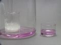

 Formation of Carbon from Carbohydrate
 

> 
> 
> 
> 
> 
> 
> 
> 
> 
> 
> ## Formation of Carbon from Carbohydrate
> 
> 
> 
> 
> 
> ## 
> 
> 
> 
> 
> 
>  Sulfuric acid has a very high affinity for water. 
It is shown to dehydrate a carbohydrate (sucrose) forming carbon. 
Sulfuric acid is reduced to sulfur dioxide, which bleaches a rose petal.
>  
> 
> 
> 
>  In a second experiment, 
the sulfur dioxide reduces purple permanganate to nearly colorless manganese(II).
>  
> 
> 
> 
> 
> 
> 
>  (
>  [*170*](CRED170.HTM)
>  )
>  
> 
> 
> 
> 
> ### ---
> 
> 
>  Keywords
> 
> 
> 
> 
>  acids/bases, bleaching, carbon, dehydration, oxidizing acid, redox reaction, strong acid, sulfur/sulfur oxides/sulfuric acid
>  
> 
> 
> 
> 
> ### ---
> 
> 
>  Multimedia
> 
> 
> 
> 
> 
> #### With a Rose Petal
> 
> 
> 
> 
> 
> [
>  Play movie](../../MVHTM/FORMC/FORMC1.HTM) 
> 
> 
> 
>  (QuickTime 3.0 Sorenson, duration 70 seconds, size 4.7 MB)
>  
> 
> 
> 
>  Concentrated sulfuric acid is added to table sugar, sucrose, which
had previously been mixed with water. The sulfuric acid dehydrates
the sugar, a carbohydrate. The sugar turns brown due to the removal
of water in this caramelization process. The remaining black solid
contains mostly carbon. Steam generated in this exothermic process
causes the solid mass to expand.
>  
> 
> 
> 
>  Sulfuric acid also acts as an oxidizing agent, and is reduced to
sulfur dioxide. A rose petal is bleached by the sulfur dioxide.
>  
> 
> 
> 
> 
> 
> 
> 
> | Concentrated sulfuric acid ... | ...is added to sucrose mixed with water. | The sugar turns brown due to the removal
of water. |
> | --- | --- | --- |
> 
> 
> 
> 
> 
> 
> 
> | The remaining black solid contains mostly carbon. | Steam generated in this exothermic process causes the solid mass to expand. | A rose petal is bleached by the sulfur dioxide. |
> | --- | --- | --- |
> 
> 
> 
> 
> 
> 
> [Additional still images
for this movie](../../STHTM/FORMC/FORMC1.HTM) 
> 
> 
> 
> 
> 
> ---
> 
> 
> 
> 
> 
> #### With Permanganate
> 
> 
> 
> 
> 
> [
>  Play movie](../../MVHTM/FORMC/FORMC2.HTM) 
> 
> 
> 
>  (QuickTime 3.0 Sorenson, duration 48 seconds, size 3.3 MB)
>  
> 
> 
> 
>  Concentrated sulfuric acid is added to table sugar, sucrose, which had previously been mixed with water. The sulfuric acid dehydrates the sugar, a carbohydrate. The sugar turns brown due to the removal of water in this caramelization process. The remaining black solid contains mostly carbon. Steam generated in this exothermic process causes the solid mass to expand.
>  
> 
> 
> 
>  Sulfuric acid also acts as an oxidizing agent, and is reduced to sulfur dioxide. The sulfur dioxide reduces dissolved purple permanganate to nearly colorless manganese(II).
>  
> 
> 
> 
> 
> 
> 
> 
> | Concentrated sulfuric acid is added to sucrose mixed with water. | The sugar turns brown due to the removal of water. | Steam generated in this exothermic process causes the solid mass to expand. | The sulfur dioxide reduces purple permanganate. |
> | --- | --- | --- | --- |
> 
> 
> 
> 
> 
> 
> [Additional still images
for this movie](../../STHTM/FORMC/FORMC2.HTM) 
> 
> 
> 
> 
> 
> ---
> 
> 
> 
> 
> ### Discussion
> 
> 
> 
> 
>  Sulfuric acid is a strong dehydrating agent and combines exothermically with water. 
In this video it is shown to remove water from sucrose (table sugar) a carbohydrate, 
leaving behind the carbon. 
Sulfuric acid is also a moderately strong oxidizing agent, being reduced 
to SO
>  2 
>  . 
The SO
>  2 
>  is shown to bleach a rose petal and react with permanganate solution.
>  
> 
> 
> 
> 
> 
> 
> [Demonstration Notes, Warnings, Safety Information, etc.](SAFETY.HTM) 
> 
> 
> 
> 
> 
> ### ---
> 
> 
>  Exam and Quiz Questions
> 
> 
> 
> 
>  1. What evidence is there that a redox reaction is taking place in this video?
>  
> 
> 
> 
>  2. What substance causes the rose petal (permanganate solution) to be decolorized?
>  
> 
> 
> 
> 
> 
> 
> ---
> 
> 
> 
> 
> [Next sequential topic](../../MAIN/MAGAIR/PAGE1.HTM)

> ---
> 
> 
>  |
>  [Chemistry Comes Alive! (entry page)](../../INDEX.HTM) 
>  |
>  [Table of Contents](../../CONTENTS.HTM) 
>  |
>  [Matrix of Chapters and Topics](../../MATRIX.HTM) 
>  |
>  [Index](../../WORDS.HTM) 
>  |
>  [Alphabetical List of Topics](../../ALPHATOP.HTM) 
>  |
>  [Chemistry Textbooks](../../BOOKS.HTM) 
>  |
>  
>  © 1999 Division of Chemical Education, Inc.,
American Chemical Society. All rights reserved.

