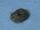

 Oxidation of Glycerin by Potassium Permanganate
 

> 
> 
> 
> 
> 
> 
> 
> 
> 
> 
> ## Oxidation of Glycerin by Potassium Permanganate
> 
> 
> 
> 
> 
> ## 
> 
> 
> 
> 
> 
>  Oxidation of glycerin (1,2,3-propanetriol) by potassium permanganate is demonstrated. 
(This reaction is used to initiate the thermite demonstration that is shown separately.)
>  
> 
> 
> 
> 
> 
> 
>  (
>  [*28*](CRED28.HTM)
>  )
>  
> 
> 
> 
> 
> ### ---
> 
> 
>  Keywords
> 
> 
> 
> 
>  descriptive chemistry, enthalpy/heat, evidence of chemical reaction, exothermic process, organic - alcohols , redox reaction, strong oxidizing agent
>  
> 
> 
> 
> 
> ### ---
> 
> 
>  Multimedia
> 
> 
> 
> 
> 
> 
> 
> 
> [
>  Play movie](../../MVHTM/GLYCER/GLYCER.HTM) 
> 
> 
> 
>  (QuickTime 3.0 Sorenson, duration 37 seconds, size 2.5 MB)
>  
> 
> 
> 
>  A few drops of glycerin are placed into a hollow in a pile of potassium permanganate. Potassium permanganate is a strong oxidizing agent and glycerin is an easily oxidized substance. Consequently a redox type reaction is expected between these two substances. An exothermic reaction does occur with the glycerin boiling giving off smoke and eventually producing a flame that spreads around the pile of potassium permanganate. Eventually all the glycerin is consumed by the permanganate.
>  
> 
> 
> 
> 
> | glycerin is placed on potassium permanganate. | The reaction is exothermic. |
> | --- | --- |
> 
> 
> 
> 
> 
> 
> [Additional still images
for this movie](../../STHTM/GLYCER/GLYCER.HTM) 
> 
> 
> 
> 
> 
> ---
> 
> 
> 
> 
> ### Discussion
> 
> 
> 
> 
> ### Equation
> 
> 
> 
>  14KMnO
>  4 
>  + 4C
>  3 
>  H
>  5 
>  (OH)
>  3 
>  --> 7K
>  2 
>  CO
>  3 
>  + 7Mn
>  2 
>  O
>  3 
>  + 5CO
>  2 
>  + 16H
>  2 
>  O
>  
> 
> 
> 
> 
> 
> 
> [Demonstration Notes, Warnings, Safety Information, etc.](SAFETY.HTM) 
> 
> 
> 
> 
> 
> ### ---
> 
> 
>  Exam and Quiz Questions
> 
> 
> 
> 
>  1. Is this an endothermic or an exothermic reaction? Support your answer.
>  
> 
> 
> 
>  2. What observable evidence indicates that a chemical reaction is taking place?
>  
> 
> 
> 
> 
> 
> 
> ---
> 
> 
> 
> 
> [Next sequential topic](../../MAIN/THERMIT/PAGE1.HTM)

> ---
> 
> 
>  |
>  [Chemistry Comes Alive! (entry page)](../../INDEX.HTM) 
>  |
>  [Table of Contents](../../CONTENTS.HTM) 
>  |
>  [Matrix of Chapters and Topics](../../MATRIX.HTM) 
>  |
>  [Index](../../WORDS.HTM) 
>  |
>  [Alphabetical List of Topics](../../ALPHATOP.HTM) 
>  |
>  [Chemistry Textbooks](../../BOOKS.HTM) 
>  |
>  
>  © 1999 Division of Chemical Education, Inc.,
American Chemical Society. All rights reserved.

