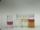

 Halogen/Halide Redox Reactions
 

> 
> 
> 
> 
> 
> 
> 
> 
> 
> 
> ## Halogen/Halide Redox Reactions
> 
> 
> 
> 
> 
> ## 
> 
> 
> 
> 
> 
>  An aqueous solution of a halogen (Cl
>  2 
>  , Br
>  2 
>  or I
>  2 
>  ) is poured into an aqueous halide solution
(Cl
>  - 
>  , Br
>  - 
>  or
I
>  - 
>  ) covered with a layer of hexane. After the liquid has been shaken,
the color of the hexane layer is compared to the color of hexane
solutions of chlorine, bromine and iodine. Six combinations of halide
with halogen are shown.
>  
> 
> 
> 
> 
> 
> 
>  (
>  [*86*](CRED86.HTM)
>  )
>  
> 
> 
> 
> 
> ### ---
> 
> 
>  Keywords
> 
> 
> 
> 
>  descriptive chemistry, halogens/halides/hydrohalic acids, periodic table/trends, redox reaction
>  
> 
> 
> 
> 
> ### ---
> 
> 
>  Multimedia
> 
> 
> 
>  A series of aqueous halide solutions 
(Cl
>  - 
>  (
>  *aq* 
>  ), Br
>  - 
>  (
>  *aq* 
>  ) or
I
>  - 
>  (
>  *aq* 
>  )) are poured into an aqueous solution of a halogen 
that is covered with a layer of hexane. 
Solutions of chlorine, bromine, and iodine are shown here for later reference.
>  
> 
> 
> 
> 
> 
> 
> |  |
> | --- |
> 
> 
> 
> 
> 
> 
> 
> 
> #### Bromide added to Chlorine
> 
> 
> 
> 
> 
> [
>  Play movie](../../MVHTM/HALOGEN/HALOGN2.HTM) 
> 
> 
> 
>  (QuickTime 3.0 Sorenson, duration 16 seconds, size 1 MB)
>  
> 
> 
> 
>  Bromide ion is added to chlorine water. By observing the color of
the hexane layer, we see that the reaction has produced bromine.
>  
> 
> 
> 
>  (Note that the hexane layer is above the aqueous layer.)
>  
> 
> 
> 
> 
>  2Br
>  - 
>  (
>  *aq* 
>  ) + Cl
>  2 
>  (
>  *aq* 
>  )
-->
2Cl
>  - 
>  (
>  *aq* 
>  ) + Br
>  2 
>  (
>  *aq* 
>  )
>  
> 
> 
> 
> 
> 
> 
> | Bromide ion is added to chlorine water | ... and is shaken. | The reaction has produced bromine. |
> | --- | --- | --- |
> 
> 
> 
> 
> 
> 
> [Additional still images
for this movie](../../STHTM/HALOGEN/HALOGN2.HTM) 
> 
> 
> 
> 
> 
> ---
> 
> 
> 
> 
> 
> 
> 
> 
> #### Iodide added to Chlorine
> 
> 
> 
> 
> 
> [
>  Play movie](../../MVHTM/HALOGEN/HALOGN3.HTM) 
> 
> 
> 
>  (QuickTime 3.0 Sorenson, duration 15 seconds, size 1020 K)
>  
> 
> 
> 
>  Iodide ion is added to chlorine water. By observing the color of
the hexane layer, we see that the reaction has produced iodine.
>  
> 
> 
> 
>  (Note that the hexane layer is above the aqueous layer.)
>  
> 
> 
> 
> 
>  2I
>  - 
>  (
>  *aq* 
>  ) + Cl
>  2 
>  (
>  *aq* 
>  )
-->
2Cl
>  - 
>  (
>  *aq* 
>  ) + I
>  2 
>  (
>  *aq* 
>  )
>  
> 
> 
> 
> 
> 
> 
> | Iodide ion is added to chlorine water | ... and is shaken. | The reaction has produced iodine. |
> | --- | --- | --- |
> 
> 
> 
> 
> 
> 
> [Additional still images
for this movie](../../STHTM/HALOGEN/HALOGN3.HTM) 
> 
> 
> 
> 
> 
> ---
> 
> 
> 
> 
> 
> 
> 
> 
> #### Chloride added to Bromine
> 
> 
> 
> 
> 
> [
>  Play movie](../../MVHTM/HALOGEN/HALOGN4.HTM) 
> 
> 
> 
>  (QuickTime 3.0 Sorenson, duration 13 seconds, size 870 K)
>  
> 
> 
> 
>  Chloride ion is added to bromine water. By observing the color of
the hexane layer, we see that no reaction has occurred.
>  
> 
> 
> 
>  (Note that the hexane layer is above the aqueous layer.)
>  
> 
> 
> 
> 
>  2Cl
>  - 
>  (
>  *aq* 
>  ) + Br
>  2 
>  (
>  *aq* 
>  )
-->
No reaction took place
>  
> 
> 
> 
> 
> 
> 
> | Chloride ion is added to bromine water | ... and is shaken. | No reaction took place. |
> | --- | --- | --- |
> 
> 
> 
> 
> 
> 
> [Additional still images
for this movie](../../STHTM/HALOGEN/HALOGN4.HTM) 
> 
> 
> 
> 
> 
> ---
> 
> 
> 
> 
> 
> 
> 
> 
> #### Iodide added to Bromine
> 
> 
> 
> 
> 
> [
>  Play movie](../../MVHTM/HALOGEN/HALOGN5.HTM) 
> 
> 
> 
>  (QuickTime 3.0 Sorenson, duration 15 seconds, size 1 MB)
>  
> 
> 
> 
>  Iodide ion is added to bromine water. By observing the color of
the hexane layer, we see that the reaction has produced iodine.
>  
> 
> 
> 
>  (Note that the hexane layer is above the aqueous layer.)
>  
> 
> 
> 
> 
>  2I
>  - 
>  (
>  *aq* 
>  ) + Br
>  2 
>  (
>  *aq* 
>  )
-->
2Br
>  - 
>  (
>  *aq* 
>  ) + I
>  2 
>  (
>  *aq* 
>  )
>  
> 
> 
> 
> 
> 
> 
> | Iodide ion is added to bromine water | ... and is shaken. | The reaction has produced iodine. |
> | --- | --- | --- |
> 
> 
> 
> 
> 
> 
> [Additional still images
for this movie](../../STHTM/HALOGEN/HALOGN5.HTM) 
> 
> 
> 
> 
> 
> ---
> 
> 
> 
> 
> 
> 
> 
> 
> #### Chloride added to Iodine
> 
> 
> 
> 
> 
> [
>  Play movie](../../MVHTM/HALOGEN/HALOGN6.HTM) 
> 
> 
> 
>  (QuickTime 3.0 Sorenson, duration 13 seconds, size 900 K)
>  
> 
> 
> 
>  Chloride ion is added to iodine water. By observing the color of
the hexane layer, we see that no reaction has occurred.
>  
> 
> 
> 
>  (Note that the hexane layer is above the aqueous layer.)
>  
> 
> 
> 
> 
>  2Cl
>  - 
>  (
>  *aq* 
>  ) + I
>  2 
>  (
>  *aq* 
>  )
-->
No chemical reaction took place
>  
> 
> 
> 
> 
> 
> 
> | Chloride ion is added to iodine water | ... and is shaken. | No chemical reaction took place. |
> | --- | --- | --- |
> 
> 
> 
> 
> 
> 
> [Additional still images
for this movie](../../STHTM/HALOGEN/HALOGN6.HTM) 
> 
> 
> 
> 
> 
> ---
> 
> 
> 
> 
> 
> 
> 
> 
> #### Bromide added to Iodine
> 
> 
> 
> 
> 
> [
>  Play movie](../../MVHTM/HALOGEN/HALOGN7.HTM) 
> 
> 
> 
>  (QuickTime 3.0 Sorenson, duration 13 seconds, size 900 K)
>  
> 
> 
> 
>  Bromide ion is added to iodine water. By observing the color of
the hexane layer, we see that no reaction has occurred.
>  
> 
> 
> 
>  (Note that the hexane layer is above the aqueous layer.)
>  
> 
> 
> 
> 
>  2Br
>  - 
>  (
>  *aq* 
>  ) + I
>  2 
>  -->
No chemical reaction took place
>  
> 
> 
> 
> 
> 
> 
> | Bromide ion is added to iodine water | ... and is shaken. | No chemical reaction took place. |
> | --- | --- | --- |
> 
> 
> 
> 
> 
> 
> [Additional still images
for this movie](../../STHTM/HALOGEN/HALOGN7.HTM) 
> 
> 
> 
> 
> 
> ---
> 
> 
> 
> 
> 
> 
> 
> ### Discussion
> 
> 
> 
> 
>  This series of movies can be used to allow students 
to discover the order of oxidizing ability of the halogens. 
Students could be asked to select a reaction and that reaction could be shown. 
Based on whether there is a color change, students could whether each 
of the possible reactions takes place, 
thereby showing that chlorine reacts with bromide and iodide, 
bromine reacts with iodide, and iodine does not react with either of the other halide ions.
>  
> 
> 
> 
> 
> 
> 
> [Demonstration Notes, Warnings, Safety Information, etc.](SAFETY.HTM) 
> 
> 
> 
> 
> 
> ### ---
> 
> 
>  Exam and Quiz Questions
> 
> 
> 
> 
>  1. How can you tell whether or not a reaction has occurred in a
vial?
>  
> 
> 
> 
>  2. Which halogen is most reactive, Br
>  2 
>  , Cl
>  2 
>  ,
or I
>  2 
>  ? Which halogen is least reactive? Explain.
>  
> 
> 
> 
>  3. Write balanced chemical equations for the reactions occurring
in each vial. Write NR if no reaction took place.
>  
> 
> 
> 
> 
> 
> 
> ---
> 
> 
> 
> 
> [Next sequential topic](../../MAIN/ELECH20/PAGE1.HTM)

> ---
> 
> 
>  |
>  [Chemistry Comes Alive! (entry page)](../../INDEX.HTM) 
>  |
>  [Table of Contents](../../CONTENTS.HTM) 
>  |
>  [Matrix of Chapters and Topics](../../MATRIX.HTM) 
>  |
>  [Index](../../WORDS.HTM) 
>  |
>  [Alphabetical List of Topics](../../ALPHATOP.HTM) 
>  |
>  [Chemistry Textbooks](../../BOOKS.HTM) 
>  |
>  
>  © 1999 Division of Chemical Education, Inc.,
American Chemical Society. All rights reserved.

