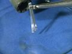

 Reaction of Magnesium with Oxygen
 

> 
> 
> 
> 
> 
> 
> 
> 
> 
> 
> ## Reaction of Magnesium with Oxygen
> 
> 
> 
> 
> 
> ## 
> 
> 
> 
> 
> 
>  Magnesium metal is burned in air forming magnesium oxide. This is an interesting oxidation/reduction reaction because it shows the burning of a metal, because the products of the reaction are visible afterwards, and because it produces a lot of light.
>  
> 
> 
> 
> 
> 
> 
>  (
>  [*147*](CRED147.HTM)
>  )
>  
> 
> 
> 
> 
> 
> 
>  (
>  [*166*](CRED166.HTM)
>  )
>  
> 
> 
> 
> 
> ### ---
> 
> 
>  Keywords
> 
> 
> 
> 
>  alkaline earths, combination reaction, combustion reaction, descriptive chemistry, 
fire/flammability, 
oxides, oxygen, redox reaction, strong reducing agent
>  
> 
> 
> 
> 
> ### ---
> 
> 
>  Multimedia
> 
> 
> 
> 
> 
> 
> 
> 
> [
>  Play movie](../../MVHTM/MAGAIR/MAGAIR.HTM) 
> 
> 
> 
>  (QuickTime 3.0 Sorenson, duration 14 seconds, size 990 K)
>  
> 
> 
> 
>  Magnesium metal is burned in air forming magnesium oxide.
>  
> 
> 
> 
> 
> 
> 
> 
> | Magnesium metal | ...is burned in air | ...forming magnesium oxide. |
> | --- | --- | --- |
> 
> 
> 
> 
> 
> 
> [Additional still images
for this movie](../../STHTM/MAGAIR/MAGAIR.HTM) 
> 
> 
> 
> 
> 
> ---
> 
> 
> 
> 
> ### Discussion
> 
> 
> 
> 
>  When magnesium burns in air the principal product is magnesium oxide, 
but some magnesium nitride is also formed.
>  
> 
> 
> 
>  The equations for the reactions are
>  
> 
> 
> 
>  2 Mg(
>  *s* 
>  ) + O
>  2 
>  (
>  *g* 
>  ) --> 2 MgO(
>  *s* 
>  )
>  
> 
> 
> 
>  3 Mg(
>  *s* 
>  ) + N
>  2 
>  (
>  *g* 
>  ) --> Mg
>  3 
>  N
>  2 
>  (
>  *s* 
>  )
>  
> 
> 
> 
> 
> 
> 
> [Demonstration Notes, Warnings, Safety Information, etc.](SAFETY.HTM) 
> 
> 
> 
> 
> 
> ### ---
> 
> 
>  Exam and Quiz Questions
> 
> 
> 
> 
>  1. What evidence can you cite that supports the hypothesis that a chemical reaction has occurred?
>  
> 
> 
> 
>  2. Write down all the observations you can make about what happens in the video.
>  
> 
> 
> 
> 
> 
> 
> ---
> 
> 
> 
> 
> [Next sequential topic](../../MAIN/MAGCO2/PAGE1.HTM)

> ---
> 
> 
>  |
>  [Chemistry Comes Alive! (entry page)](../../INDEX.HTM) 
>  |
>  [Table of Contents](../../CONTENTS.HTM) 
>  |
>  [Matrix of Chapters and Topics](../../MATRIX.HTM) 
>  |
>  [Index](../../WORDS.HTM) 
>  |
>  [Alphabetical List of Topics](../../ALPHATOP.HTM) 
>  |
>  [Chemistry Textbooks](../../BOOKS.HTM) 
>  |
>  
>  © 1999 Division of Chemical Education, Inc.,
American Chemical Society. All rights reserved.

