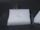

 Reaction of Magnesium with Carbon Dioxide
 

> 
> 
> 
> 
> 
> 
> 
> 
> 
> 
> ## Reaction of Magnesium with Carbon Dioxide
> 
> 
> 
> 
> 
> ## 
> 
> 
> 
> 
> 
>  The reaction of magnesium with carbon dioxide (dry ice) is demonstrated. Despite the absence of air, the magnesium continues to glow.
>  
> 
> 
> 
> 
> 
> 
>  (
>  [*170*](CRED170.HTM)
>  )
>  
> 
> 
> 
> 
> ### ---
> 
> 
>  Keywords
> 
> 
> 
> 
>  alkaline earths, applications - practical/real-life, carbon, 
carbon dioxide/dry ice/carbonates, descriptive chemistry, fire/flammability, 
ionic compounds - bonding/properties, 
redox reaction, single exchange/replacement reaction, strong reducing agent
>  
> 
> 
> 
> 
> ### ---
> 
> 
>  Multimedia
> 
> 
> 
> 
> 
> 
> 
> 
> [
>  Play movie](../../MVHTM/MAGCO2/MAGCO2.HTM) 
> 
> 
> 
>  (QuickTime 3.0 Sorenson, duration 79 seconds, size 5.1 MB)
>  
> 
> 
> 
>  Magnesium is placed in a cavity in a block of dry ice. The
magnesium is ignited and covered by another block of dry ice. 
Despite the absence of air, the magnesium continues to glow, due to
its reaction with carbon dioxide. Because of this reaction, carbon
dioxide cannot be used to extinguish magnesium fires.
>  
> 
> 
> 
>  The reaction products are white magnesium oxide and black carbon.
>  
> 
> 
> 
> 
> 
> 
> 
> | Poured | Ignited | Covered |
> | --- | --- | --- |
> 
> 
> 
> 
> 
> 
> 
> | The reaction is vigorous... |  |  | ...producing magnesium oxide and carbon. |
> | --- | --- | --- | --- |
> 
> 
> 
> 
> 
> 
> [Additional still images
for this movie](../../STHTM/MAGCO2/MAGCO2.HTM) 
> 
> 
> 
> 
> 
> ---
> 
> 
> 
> 
> ### Discussion
> 
> 
> 
> 
>  This is a very striking demonstration of the strong reducing strength of 
magnesium and the very great stability of magnesium oxide. 
One might expect that the low temperature of the dry ice 
would prevent reaction by slowing it down. 
The relative stability of carbon dioxide also would argue against reaction. 
But the reaction is exothermic and the temperature rapidly increases to where it goes quite rapidly.
>  
> 
> 
> 
> 
> 
> 
> [Demonstration Notes, Warnings, Safety Information, etc.](SAFETY.HTM) 
> 
> 
> 
> 
> 
> ### ---
> 
> 
>  Exam and Quiz Questions
> 
> 
> 
> 
>  1. Explain why using either water or a carbon-dioxide fire extinguisher is a bad way to try to extinguish a magnesium fire.
>  
> 
> 
> 
>  2. What observations can you make that support the assignment of magnesium oxide and carbon as products of the reaction of magnesium with carbon dioxide?
>  
> 
> 
> 
>  3. Write a balanced equation for the reaction of magnesium with carbon dioxide.
>  
> 
> 
> 
> 
> 
> 
> ---
> 
> 
> 
> 
> [Next sequential topic](../../MAIN/REDOXCU/PAGE1.HTM)

> ---
> 
> 
>  |
>  [Chemistry Comes Alive! (entry page)](../../INDEX.HTM) 
>  |
>  [Table of Contents](../../CONTENTS.HTM) 
>  |
>  [Matrix of Chapters and Topics](../../MATRIX.HTM) 
>  |
>  [Index](../../WORDS.HTM) 
>  |
>  [Alphabetical List of Topics](../../ALPHATOP.HTM) 
>  |
>  [Chemistry Textbooks](../../BOOKS.HTM) 
>  |
>  
>  © 1999 Division of Chemical Education, Inc.,
American Chemical Society. All rights reserved.

