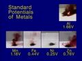

 Reactions of Metals with Iodine
 

> 
> 
> 
> 
> 
> 
> 
> 
> 
> 
> ## Reactions of Metals with Iodine
> 
> 
> 
> 
> 
> ## 
> 
> 
> 
> 
> 
>  When a small quantity of powdered aluminum is mixed with some iodine crystals and a few drops of water are added, a vigorous reaction ensues, producing purple iodine vapor and flame. Aluminum iodide is the product. Similar reactions occur when the aluminum is replaced by manganese, zinc, and iron, but nickel is shown not to react with iodine under the same conditions. A graphic shows each reaction and the electrode potential of each metal/metal-ion couple.
>  
> 
> 
> 
> 
> 
> 
>  (
>  [*30*](CRED30.HTM)
>  )
>  
> 
> 
> 
> 
> ### ---
> 
> 
>  Keywords
> 
> 
> 
> 
>  aluminum, combination reaction, descriptive chemistry, electrode potentials, enthalpy/heat, evidence of chemical reaction, exothermic process, halogens/halides/hydrohalic acids, iron, metals, periodic table/trends, phase change, redox reaction, spontaneous process
>  
> 
> 
> 
> 
> ### ---
> 
> 
>  Multimedia
> 
> 
> 
> 
> 
> #### Aluminum
> 
> 
> 
> 
> 
> [
>  Play movie](../../MVHTM/METALI1/METAL1AL.HTM) 
> 
> 
> 
>  (QuickTime 3.0 Sorenson, duration 77 seconds, size 5.4 MB)
>  
> 
> 
> 
>  Powdered aluminum and powdered iodine are mixed together and then one or two drops of water are added to the mixture. Shortly after the water is added, a vigorous reaction occurs. There is flame and lots of iodine vapor given off. Some of the iodine vapor can be seen to be reacting to form some other substance because the color is no longer violet but kind of a reddish brown. This vigorous reaction shows that aluminum metal is a fairly strong reducing agent and iodine solid is a fairly strong oxidizing agent.
>  
> 
> 
> 
> 
> 
> 
> 
> | Powdered aluminum and powdered iodine... | ... are mixed together. | Drops of water are added. | A vigorous reaction occurs. |
> | --- | --- | --- | --- |
> 
> 
> 
> 
> 
> 
> [Additional still images
for this movie](../../STHTM/METALI1/METAL1AL.HTM) 
> 
> 
> 
> 
> 
> ---
> 
> 
> 
> 
> 
> #### Manganese
> 
> 
> 
> 
> 
> [
>  Play movie](../../MVHTM/METALI1/METAL1MN.HTM) 
> 
> 
> 
>  (QuickTime 3.0 Sorenson, duration 70 seconds, size 4.8 MB)
>  
> 
> 
> 
>  Manganese is mixed with iodine. Notice that the powdered manganese
is black, and the iodine is also nearly black. Again there is no
reaction just upon mixing the solid materials but as soon as a few
drops of water are added, a reaction does take place. Again the
reaction is vigorous, but this time there is no flame. By comparison
with the aluminum reaction, the manganese reaction was not as
vigorous.
>  
> 
> 
> 
> 
> 
> 
> 
> | Powdered manganese is mixed with iodine. |  | Water is added. | The reaction is vigorous. |
> | --- | --- | --- | --- |
> 
> 
> 
> 
> 
> 
> [Additional still images
for this movie](../../STHTM/METALI1/METAL1MN.HTM) 
> 
> 
> 
> 
> 
> ---
> 
> 
> 
> 
> 
> #### Iron
> 
> 
> 
> 
> 
> [
>  Play movie](../../MVHTM/METALI1/METAL1FE.HTM) 
> 
> 
> 
>  (QuickTime 3.0 Sorenson, duration 66 seconds, size 4.6 MB)
>  
> 
> 
> 
>  Powdered iron is mixed with some iodine. There is no reaction when
the dry solids are mixed together. In this case, adding water
initiates a reaction but it is not as vigorous as the reaction of the
aluminum or the manganese. Apparently iron is not as strong a
reducing agent as these other metals relative to iodine.
>  
> 
> 
> 
> 
> 
> 
> 
> | Powdered iron is mixed with iodine. |  | Adding water .... | ... initiates a reaction. |
> | --- | --- | --- | --- |
> 
> 
> 
> 
> 
> 
> [Additional still images
for this movie](../../STHTM/METALI1/METAL1FE.HTM) 
> 
> 
> 
> 
> 
> ---
> 
> 
> 
> 
> 
> #### Nickel
> 
> 
> 
> 
> 
> [
>  Play movie](../../MVHTM/METALI1/METAL1NI.HTM) 
> 
> 
> 
>  (QuickTime 3.0 Sorenson, duration 60 seconds, size 4.1 MB)
>  
> 
> 
> 
>  Nickel is mixed with iodine. Even after water is added, there is
no reaction between the nickel and the iodine. Apparently, nickel is
not a very strong reducing agent compared to the other metals tested.
>  
> 
> 
> 
> 
> 
> 
> 
> | Powdered nickel is mixed with iodine. |  | Water is added. | No reaction is visible. |
> | --- | --- | --- | --- |
> 
> 
> 
> 
> 
> 
> [Additional still images
for this movie](../../STHTM/METALI1/METAL1NI.HTM) 
> 
> 
> 
> 
> 
> ---
> 
> 
> 
> 
> 
> #### Zinc
> 
> 
> 
> 
> 
> [
>  Play movie](../../MVHTM/METALI1/METAL1ZN.HTM) 
> 
> 
> 
>  (QuickTime 3.0 Sorenson, duration 63 seconds, size 4.3 MB)
>  
> 
> 
> 
>  Granular zinc is mixed with iodine and there is no reaction when
the two dry solids are mixed together. When water is added to this
mixture, there is a reaction approximately as vigorous as the
reaction of the manganese with the iodine, showing that zinc and
manganese are roughly equivalent in reducing strength, and are
stronger than iron and nickel, but not quite as strong as aluminum.
>  
> 
> 
> 
> 
> 
> 
> 
> | Powdered zinc is mixed with iodine. |  | Water is added. | A vigorous reaction occurs. |
> | --- | --- | --- | --- |
> 
> 
> 
> 
> 
> 
> [Additional still images
for this movie](../../STHTM/METALI1/METAL1ZN.HTM) 
> 
> 
> 
> 
> 
> ---
> 
> 
> 
> 
> #### Potentials of the Metals
> 
> 
>  Oxidation potentials of metals are arranged according to position in the periodic table. 
Note that these are
>  *oxidation* 
>  potentials rather than standard reduction potentials.
>  
> 
> 
> 
> | Oxidation potentials of metals. |
> | --- |
> 
> 
> 
> 
> 
> ---
> 
> 
> 
> ### Discussion
> 
> 
> 
> 
>  The role of water in initiating these reactions is not completely clear. 
Water may serve as a reaction medium, 
or it may remove soluble metal iodides from metal surfaces, 
serving to increase the rates of reactions.
>  
> 
> 
> 
>  Reduction potentials and oxidation potentials refer to reactions in aqueous solutions
at standard concentrations and therefore do not strictly apply to the reactions shown here.
Nevertheless, standard potentials give a rough indication of oxidizing and reducing power,
and they correlate reasonably well with reactivity as observed in the videos.
>  
> 
> 
> 
> 
> 
> 
> [Demonstration Notes, Warnings, Safety Information, etc.](SAFETY.HTM) 
> 
> 
> 
> 
> 
> ### ---
> 
> 
>  Exam and Quiz Questions
> 
> 
> 
> 
>  1. Based upon the extent of their reactions with iodine, 
rank the reactivity of the metals tested in the video. 
Make predictions about their standard reduction potentials based upon their reactions with iodine.
>  
> 
> 
> 
>  2. Which of the metals tested would you predict has the highest reduction potential? 
Support your answer with evidence from the video.
>  
> 
> 
> 
>  3. Which metal would you predict has the most negative
>  
>  H for formation of its iodide? 
Explain your reasoning.
>  
> 
> 
> 
>  4. Rank the metals Mn, Fe, Ni, and Zn in the order of
>  
>  H for the reaction.
>  
> 
> 
> 
> 
> 
> 
> ---
> 
> 
> 
> 
> [Next sequential topic](../../MAIN/METALI2/PAGE1.HTM)

> ---
> 
> 
>  |
>  [Chemistry Comes Alive! (entry page)](../../INDEX.HTM) 
>  |
>  [Table of Contents](../../CONTENTS.HTM) 
>  |
>  [Matrix of Chapters and Topics](../../MATRIX.HTM) 
>  |
>  [Index](../../WORDS.HTM) 
>  |
>  [Alphabetical List of Topics](../../ALPHATOP.HTM) 
>  |
>  [Chemistry Textbooks](../../BOOKS.HTM) 
>  |
>  
>  © 1999 Division of Chemical Education, Inc.,
American Chemical Society. All rights reserved.

