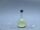

 Reaction of Chlorine with Sodium
 

> 
> 
> 
> 
> 
> 
> 
> 
> 
> 
> ## Reaction of Chlorine with Sodium
> 
> 
> 
> 
> 
> ## 
> 
> 
> 
> 
> 
>  A small chunk of sodium metal is placed in a flask containing chlorine gas. Initially, no reaction is observed, but addition of a drop of water to the sodium initiates a vigorous reaction.
>  
> 
> 
> 
> 
> 
> 
>  (
>  [*91*](CRED91.HTM)
>  )
>  
> 
> 
> 
> 
> ### ---
> 
> 
>  Keywords
> 
> 
> 
> 
>  alkali metals, combination reaction, descriptive chemistry, enthalpy/heat, evidence of chemical reaction, exothermic process, halogens/halides/hydrohalic acids, reactivity - kinetic/thermodynamic stability, redox reaction, strong reducing agent
>  
> 
> 
> 
> 
> ### ---
> 
> 
>  Multimedia
> 
> 
> 
> 
> 
> 
> 
> 
> [
>  Play movie](../../MVHTM/NACL/NACL1.HTM) 
> 
> 
> 
>  (QuickTime 3.0 Sorenson, duration 51 seconds, size 3.6 MB)
>  
> 
> 
> 
>  A small piece of sodium metal is placed in a flask containing yellow chlorine gas. The flask also contains sand to prevent the heat which will be generated by the reaction from cracking the glass. Initially, no reaction is observed between the sodium and the chlorine. The reaction will be initiated by adding a drop of water to the sodium.
>  
> 
> 
> 
> 
> 
> 
> 
> | A piece of sodium metal ... | ... is placed in a flask containing chlorine gas. | The reaction is initiated by a drop of water. | The reaction is vigorous. |
> | --- | --- | --- | --- |
> 
> 
> 
> 
> 
> 
> [Additional still images
for this movie](../../STHTM/NACL/NACL1.HTM) 
> 
> 
> 
> 
> 
> ---
> 
> 
> 
> 
> ### Discussion
> 
> 
> 
> 
>  When sodium is first placed in the flask full of chlorine, no reaction occurs. This is probably because the 
temperature is low and because there is a coating of sodium oxide, sodium peroxide, or sodium chloride on 
the surface of the metal. (Sodium does not inflame in air at room temperature, probably for the same 
reason, although spontaneous combustion often occurs after some minutes.) When a drop of water is added, 
the oxide, peroxide, or chloride coating on the surface is dissolved, and the water reacts exothermically 
with the sodium, raising the temperature. Probably both of these effects contribute to speeding up the 
reaction, which produces the bright yellow flame seen in the video.
>  
> 
> 
> 
> 
> 
> 
> [Demonstration Notes, Warnings, Safety Information, etc.](SAFETY.HTM) 
> 
> 
> 
> 
> 
> ### ---
> 
> 
>  Exam and Quiz Questions
> 
> 
> 
> 
>  1. Is the reaction between sodium and chlorine endo- or exothermic? Cite evidence from the video to support your answer.
>  
> 
> 
> 
>  2. Why did a drop of water need to be added to the sodium in order to initiate the reaction?
>  
> 
> 
> 
> 
> 
> 
> ---
> 
> 
> 
> 
> [Next sequential topic](../../MAIN/CLFE/PAGE1.HTM)

> ---
> 
> 
>  |
>  [Chemistry Comes Alive! (entry page)](../../INDEX.HTM) 
>  |
>  [Table of Contents](../../CONTENTS.HTM) 
>  |
>  [Matrix of Chapters and Topics](../../MATRIX.HTM) 
>  |
>  [Index](../../WORDS.HTM) 
>  |
>  [Alphabetical List of Topics](../../ALPHATOP.HTM) 
>  |
>  [Chemistry Textbooks](../../BOOKS.HTM) 
>  |
>  
>  © 1999 Division of Chemical Education, Inc.,
American Chemical Society. All rights reserved.

