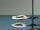

 Nitrogen Triiodide Detonation
 

> 
> 
> 
> 
> 
> 
> 
> 
> 
> 
> ## Nitrogen Triiodide Detonation
> 
> 
> 
> 
> 
> ## 
> 
> 
> 
> 
> 
>  A ringstand is set up with two rings, each holding a filter paper on which nitrogen triiodide has been spread. The bottom filter paper is touched with a feather, causing an explosion that detonates the other sample of nitrogen triiodide. The equation for the reaction is given.
>  
> 
> 
> 
> 
> 
> 
>  (
>  [*28*](CRED28.HTM)
>  )
>  
> 
> 
> 
> 
> ### ---
> 
> 
>  Keywords
> 
> 
> 
> 
>  bond energy/strength, decomposition reaction, enthalpy/heat, evidence of chemical reaction, exothermic process, explosive, halogens/halides/hydrohalic acids, nitrogen/nitrogen oxides/nitric acid, reactivity - kinetic/thermodynamic stability, redox reaction
>  
> 
> 
> 
> 
> ### ---
> 
> 
>  Multimedia
> 
> 
> 
> 
> 
> 
> 
> 
> [
>  Play movie](../../MVHTM/NITRO3I/NI3IOD.HTM) 
> 
> 
> 
>  (QuickTime 3.0 Sorenson, duration 47 seconds, size 1.6 MB)
>  
> 
> 
> 
>  When nitrogen triiodide, the dark colored solid, is dry, it is very sensitive to touch or any vibration. Simply touching it with a feather causes it to explode or detonate. One detonation causes another to occur. One product of the reaction is violet iodine vapor.
>  
> 
> 
> 
> 
> 
> 
> 
> | A mere touch of a feather ... | ... causes dry nitrogen triiodide to explode. |
> | --- | --- |
> 
> 
> 
> 
> 
> 
> [Additional still images
for this movie](../../STHTM/NITRO3I/NI3IOD.HTM) 
> 
> 
> 
> 
> 
> ---
> 
> 
> 
> 
> ### Discussion
> 
> 
> 
> 
>  Equation
>  
> 
> 
> 
>  2NI
>  3 
>  --> N
>  2 
>  + 3I
>  2 
> 
> 
> 
> 
> 
> 
> 
> [Demonstration Notes, Warnings, Safety Information, etc.](SAFETY.HTM) 
> 
> 
> 
> 
> 
> ### ---
> 
> 
>  Exam and Quiz Questions
> 
> 
> 
> 
>  1. What observable evidence indicates that a chemical reaction has taken place?
>  
> 
> 
> 
>  2. Classify the reaction shown on the video as combination, decomposition, exchange, or acid-base and give the reason for your choice.
>  
> 
> 
> 
> 
> 
> 
> ---
> 
> 
> 
> 
> [Next sequential topic](../../MAIN/MATCHES/PAGE1.HTM)

> ---
> 
> 
>  |
>  [Chemistry Comes Alive! (entry page)](../../INDEX.HTM) 
>  |
>  [Table of Contents](../../CONTENTS.HTM) 
>  |
>  [Matrix of Chapters and Topics](../../MATRIX.HTM) 
>  |
>  [Index](../../WORDS.HTM) 
>  |
>  [Alphabetical List of Topics](../../ALPHATOP.HTM) 
>  |
>  [Chemistry Textbooks](../../BOOKS.HTM) 
>  |
>  
>  © 1999 Division of Chemical Education, Inc.,
American Chemical Society. All rights reserved.

