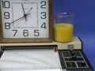

 Orange Juice Clock
 

> 
> 
> 
> 
> 
> 
> 
> 
> 
> 
> ## Orange Juice Clock
> 
> 
> 
> 
> 
> ## 
> 
> 
> 
> 
> 
>  In this demonstration a galvanic cell is made from the combination of a magnesium strip, a copper strip, and juice in a beaker. The current from this cell is used to drive a clock normally powered by a DC battery.
>  
> 
> 
> 
> 
> 
> 
>  (
>  [*154*](CRED154.HTM)
>  )
>  
> 
> 
> 
> 
> ### ---
> 
> 
>  Keywords
> 
> 
> 
> 
>  alkaline earths, copper, electrochemical (galvanic) cells, redox reaction
>  
> 
> 
> 
> 
> ### ---
> 
> 
>  Multimedia
> 
> 
> 
> 
> 
> 
> 
> 
> [
>  Play movie](../../MVHTM/OJCLOCK/OJCLK.HTM) 
> 
> 
> 
>  (QuickTime 3.0 Sorenson, duration 22 seconds, size 1.4 MB)
>  
> 
> 
> 
>  In this demonstration a galvanic cell is made from a combination of a magnesium strip, a copper strip, and juice in a beaker. The current from this cell is used to drive a clock normally powered by a DC battery.
>  
> 
> 
> 
> 
> 
> 
> 
> | The current from this cell is used to drive a clock. | The cell is made from a copper strip, a magnesium strip, and juice in a beaker. |
> | --- | --- |
> 
> 
> 
> 
> 
> 
> [Additional still images
for this movie](../../STHTM/OJCLOCK/OJCLK.HTM) 
> 
> 
> 
> 
> 
> ---
> 
> 
> 
> 
> 
> #### Connecting the Clock
> 
> 
> 
> 
> 
> [
>  Play movie](../../MVHTM/OJCLOCK/OJCLK1.HTM) 
> 
> 
> 
>  (QuickTime 3.0 Sorenson, duration 15 seconds, size 1.1 MB)
>  
> 
> 
> 
>  (Here we see the wires from the orange juice power source being connected to the terminals of the clock.)
>  
> 
> 
> 
> 
> 
> 
> 
> |  |
> | --- |
> 
> 
> 
> 
> 
> 
> [Additional still images
for this movie](../../STHTM/OJCLOCK/OJCLK1.HTM) 
> 
> 
> 
> 
> 
> ---
> 
> 
> 
> 
> 
> #### Recording Voltage as a Function of Time
> 
> 
> 
> 
> 
> [
>  Play movie](../../MVHTM/OJCLOCK/OJCLK2.HTM) 
> 
> 
> 
>  (QuickTime 3.0 Sorenson, duration 32 seconds, size 2.3 MB)
>  
> 
> 
> 
>  (Here we see a chart recorder making a record of the voltage generated by the cell as a function of time. The voltage drops each time the clock ticks.)
>  
> 
> 
> 
> 
> 
> 
> 
> |  |
> | --- |
> 
> 
> 
> 
> 
> 
> [Additional still images
for this movie](../../STHTM/OJCLOCK/OJCLK2.HTM) 
> 
> 
> 
> 
> 
> ---
> 
> 
> 
> 
> 
> ### Discussion
> 
> 
>  Further information about this demonstration is provided by the following article from the Journal of Chemical Education, November 1996, Volume 73-12:
>  
> [The Chemical and Educational Appeal of the Orange Juice Clock](../../MAIN/OJCLOCK/PAGE2.HTM) 
> 
>  by Paul B. Kelter, James D. Carr, Tanya Johnson, Carlos Mauricio Castro-Acu
>  
> 
> 
> [Demonstration Notes, Warnings, Safety Information, etc.](SAFETY.HTM) 
> 
> 
> 
> 
> 
> ### ---
> 
> 
>  Exam and Quiz Questions
> 
> 
> 
> 
>  1. Make a diagram of the galvanic cell that powers the orange juice clock. Label the anode, the cathode, 
and the electrolyte solution. Show the direction of electron travel in the circuit.
>  
> 
> 
> 
>  2. Speculate on what would happen to the clock if the connections at the back were reversed. That is, 
suppose the red and black wires were interchanged. How could you check this if you had a clock but 
no orange juice and magnesium?
>  
> 
> 
> 
>  3. What is the approximate voltage generated by the orange juice clock? (Assume that the reactions take 
place at standard concentrations of metal ions.)
>  
> 
> 
> 
>  4. From your observations of the orange juice clock hooked to a chart recorder, describe how the voltage 
varies over time. (High voltages drive the chart pen to the left side of the chart.)
>  
> 
> 
> 
>  5. When the voltage is measured as a function of time, the highest voltage occurs immediately after the 
electrodes are immersed in the orange juice. The voltage drops each time the clock ticks, and when the 
voltage builds up again, it does not reach as high a value as it did at first. Explain why the voltage 
drops each time the clock ticks and why it does not build up to as high a value after the electrodes have 
been immersed for a while.
>  
> 
> 
> 
> 
> 
> 
> ---
> 
> 
> 
> 
> [Next page for this topic](../../MAIN/OJCLOCK/PAGE2.HTM) 
> 
> 
> 
> 
> 
> 
> [Next sequential topic](../../MAIN/BATTERY/PAGE1.HTM)

> ---
> 
> 
>  |
>  [Chemistry Comes Alive! (entry page)](../../INDEX.HTM) 
>  |
>  [Table of Contents](../../CONTENTS.HTM) 
>  |
>  [Matrix of Chapters and Topics](../../MATRIX.HTM) 
>  |
>  [Index](../../WORDS.HTM) 
>  |
>  [Alphabetical List of Topics](../../ALPHATOP.HTM) 
>  |
>  [Chemistry Textbooks](../../BOOKS.HTM) 
>  |
>  
>  © 1999 Division of Chemical Education, Inc.,
American Chemical Society. All rights reserved.

