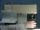

 Oscillating Reaction: Briggs-Rauscher
 

> 
> 
> 
> 
> 
> 
> 
> 
> 
> 
> ## Oscillating Reaction: Briggs-Rauscher
> 
> 
> 
> 
> 
> ## 
> 
> 
> 
> 
> 
>  When a solution of malonic acid, starch, and manganese(II) ion is added to a solution of hydrogen peroxide, iodate ion, and sulfuric acid, gas bubbles form and the color of the resulting mixture oscillates periodically from colorless to amber to blue. When the reaction mixture is not stirred, the color oscillations are not uniform throughout the solution.
>  
> 
> 
> 
>  Monitoring the reaction with electrodes shows that changes in electrochemical potential accompany the color changes. Eventually the period between oscillations lengthens and the fluctuations in potential become smaller, until at last no further changes are observed.
>  
> 
> 
> 
> 
> 
> 
>  (
>  [*86*](CRED86.HTM)
>  )
>  
> 
> 
> 
> 
> ### ---
> 
> 
>  Keywords
> 
> 
> 
> 
>  electrode potentials, kinetics/rates /mechanisms, oscillating reactions, redox reaction
>  
> 
> 
> 
> 
> ### ---
> 
> 
>  Multimedia
> 
> 
> 
> 
> 
> #### With Stirring
> 
> 
> 
> 
> 
> [
>  Play movie](../../MVHTM/OSCRXBR/BR1.HTM) 
> 
> 
> 
>  (QuickTime 3.0 Sorenson, duration 45 seconds, size 3.2 MB)
>  
> 
> 
> 
>  A solution of malonic acid, starch and manganese(II) catalyst is added to a solution of hydrogen peroxide, iodate, and sulfuric acid. A reaction involving many steps occurs. One step generates iodine, oxygen gas, and carbon dioxide gas. When the concentration of iodine gets large enough, triiodide is generated and forms a blue complex with starch. A second step uses up iodine, reversing the formation of the blue complex. As the iodine concentration oscillates, the color oscillates from colorless to amber to blue.
>  
> 
> 
> 
> 
> 
> 
> 
> |  |  |  |  |
> | --- | --- | --- | --- |
> 
> 
> 
> 
> 
> 
> [Additional still images
for this movie](../../STHTM/OSCRXBR/BR1.HTM) 
> 
> 
> 
> 
> 
> ---
> 
> 
> 
> 
> 
> #### Without Stirring
> 
> 
> 
> 
> 
> [
>  Play movie](../../MVHTM/OSCRXBR/BR2.HTM) 
> 
> 
> 
>  (QuickTime 3.0 Sorenson, duration 34 seconds, size 2.5 MB)
>  
> 
> 
> 
>  The reaction is repeated without stirring. As a result, the color oscillations are not uniform throughout the mixture. The color change appears to move through the mixture like a wave. The formation of gas bubbles also oscillates.
>  
> 
> 
> 
>  (Listen carefully for variation in the fizzing sound, which oscillates in concert with the color changes.)
>  
> 
> 
> 
> 
> 
> 
> 
> |  |  |  |  |
> | --- | --- | --- | --- |
> 
> 
> 
> 
> 
> 
> [Additional still images
for this movie](../../STHTM/OSCRXBR/BR2.HTM) 
> 
> 
> 
> 
> 
> ---
> 
> 
> 
> 
> 
> #### Reaction Monitored with Electrodes
> 
> 
> 
> 
> 
> [
>  Play movie](../../MVHTM/OSCRXBR/BR3.HTM) 
> 
> 
> 
>  (QuickTime 3.0 Sorenson, duration 47 seconds, size 3.3 MB)
>  
> 
> 
> 
>  A solution of malonic acid, starch indicator, and manganese(II) catalyst is added to a solution of hydrogen peroxide, iodate, and sulfuric acid. The electrical potential of the solution is monitored with a platinum electrode attached to a strip chart recorder. Each color change is accompanied by a change in voltage. As the reaction proceeds, the time between color and voltage changes increases. Eventually the color oscillations will no longer be observed, and the voltage oscillations will become very small. The generation of iodine, however, will continue until one of the reactants is used up.
>  
> 
> 
> 
> 
> 
> 
> 
> |  |  |  |  |
> | --- | --- | --- | --- |
> 
> 
> 
> 
> 
> 
> [Additional still images
for this movie](../../STHTM/OSCRXBR/BR3.HTM) 
> 
> 
> 
> 
> 
> ---
> 
> 
> 
> 
> ### Discussion
> 
> 
> 
> 
>  While viewing the reaction of the unstirred mixture, 
listen carefully for variation in the fizzing sound, 
which oscillates in concert with the color changes.
>  
> 
> 
> 
>  Several articles have appeared in JCE about oscillating reactions. Here are some references for more information about this one.
>  
> 
> 
> 
>  Franz, David A. Superoxide dismutase and the Briggs-Rauscher reaction (TD).
>  *J. Chem. Educ* 
>  .
>  **1991** 
> *68* 
>  57.
>  
> 
> 
> 
>  Briggs, Thomas S.; Rauscher, Warren C. An oscillating iodine clock.
>  *J. Chem. Educ.* 
> **1973** 
> *50* 
>  496.
>  
> 
> 
> 
>  Merino, J. M. A simple, continuous-flow stirred-tank reactor for the demonstration and investigation of oscillating reactions (IC).
>  *J. Chem. Educ.* 
> **1992** 
> *69* 
>  75.
>  
> 
> 
> 
> 
> 
> 
> [Demonstration Notes, Warnings, Safety Information, etc.](SAFETY.HTM) 
> 
> 
> 
> 
> 
> 
> 
> ---
> 
> 
> 
> 
> [Next sequential topic](../../MAIN/PENITRA/PAGE1.HTM)

> ---
> 
> 
>  |
>  [Chemistry Comes Alive! (entry page)](../../INDEX.HTM) 
>  |
>  [Table of Contents](../../CONTENTS.HTM) 
>  |
>  [Matrix of Chapters and Topics](../../MATRIX.HTM) 
>  |
>  [Index](../../WORDS.HTM) 
>  |
>  [Alphabetical List of Topics](../../ALPHATOP.HTM) 
>  |
>  [Chemistry Textbooks](../../BOOKS.HTM) 
>  |
>  
>  © 1999 Division of Chemical Education, Inc.,
American Chemical Society. All rights reserved.

