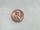

 Copper Penny with Concentrated Nitric Acid
 

> 
> 
> 
> 
> 
> 
> 
> 
> 
> 
> ## Copper Penny with Concentrated Nitric Acid
> 
> 
> 
> 
> 
> ## 
> 
> 
> 
> 
> 
>  The reaction of a copper penny and concentrated nitric acid is shown. 
Red-brown nitrogen dioxide is generated and some of the copper dissolves 
to form a blue solution of copper(II) nitrate.
>  
> 
> 
> 
> 
> 
> 
>  (
>  [*151*](CRED151.HTM)
>  )
>  
> 
> 
> 
> 
> ### ---
> 
> 
>  Keywords
> 
> 
> 
> 
>  acids/bases, copper, descriptive chemistry, nitrogen/nitrogen oxides/nitric acid, oxidizing acid, redox reaction, strong acid, strong oxidizing agent
>  
> 
> 
> 
> 
> ### ---
> 
> 
>  Multimedia
> 
> 
> 
> 
> 
> 
> 
> 
> [
>  Play movie](../../MVHTM/PENITRA/PENITRA.HTM) 
> 
> 
> 
>  (QuickTime 3.0 Sorenson, duration 58 seconds, size 4 MB)
>  
> 
> 
> 
>  A few drops of nitric acid are placed on an older copper penny (and the reaction is shown).
>  
> 
> 
> 
> 
> 
> 
> 
> | Nitric acid is placed on a copper penny. |  |  |  |
> | --- | --- | --- | --- |
> 
> 
> 
> 
> 
> 
> [Additional still images
for this movie](../../STHTM/PENITRA/PENITRA.HTM) 
> 
> 
> 
> 
> 
> ---
> 
> 
> 
> 
> ### Discussion
> 
> 
> 
> 
>  The following reminiscence by Ira Remsen may be of interest.
>  
> 
> 
> 
>  While reading a textbook of chemistry I came upon the statement, 
"nitric acid acts upon copper." 
I was getting tired of reading such absurd stuff and I was determined to see what this meant. 
Copper was more or less familiar to me, 
for copper cents were then in use. 
I had seen a bottle marked nitric acid on a table in the doctor's office where I was then "doing time." 
I did not know its peculiarities, but the spirit of adventure was upon me. 
Having nitric acid and copper, 
I had only to learn what the words "act upon" meant. 
The statement "nitric acid acts upon copper" would be something more than mere words. 
All was still. 
In the interest of knowledge I was even willing to sacrifice one of the few copper cents then in my possession. 
I put one of them on the table, opened the bottle marked nitric acid, poured some of the liquid on the copper 
and prepared to make an observation. 
But what was this wonderful thing which I beheld? 
The cent was already changed and it was no small change either. 
A green-blue liquid foamed and fumed over the cent and over the table. 
The air in the neighborhood of the performance became colored dark red. 
A great colored cloud arose. This was disagreeable and suffocating. 
How should I stop this? 
I tried to get rid of the objectionable mess by picking it up and throwing it out of the window. 
I learned another fact. 
Nitric acid not only acts upon copper, but it acts upon fingers. 
The pain led to another unpremeditated experiment. 
I drew my fingers across my trousers and another fact was discovered. 
Nitric acid acts upon trousers. 
Taking everything into consideration, 
that was the most impressive experiment and relatively probably the most costly experiment I have ever performed.... 
It was a revelation to me. 
It resulted in a desire on my part to learn more about that remarkable kind of action. 
Plainly, the only way to learn about it was to see its results, to experiment, to work in a laboratory.
>  
> 
> 
> 
> 
> 
>  (
>  [*152*](CRED152.HTM)
>  )
>  
> 
> 
> 
> 
> 
>  The equation for the reaction is
>  
> 
> 
> 
>  Cu(
>  *s* 
>  ) + 4 H
>  + 
>  (
>  *aq* 
>  ) + 2 NO
>  3 
> - 
>  (
>  *aq* 
>  ) -->
 Cu
>  2+ 
>  (
>  *aq* 
>  ) + 2 NO
>  2 
>  (
>  *g* 
>  ) + 2 H
>  2 
>  O(
>  *l* 
>  )
>  
> 
> 
> 
> 
> 
> 
> [Demonstration Notes, Warnings, Safety Information, etc.](SAFETY.HTM) 
> 
> 
> 
> 
> 
> ### ---
> 
> 
>  Exam and Quiz Questions
> 
> 
> 
> 
>  1. Write down as many different observations as you can make during the reaction 
of concentrated nitric acid with the copper penny.
>  
> 
> 
> 
>  2. Identify the gaseous product of the reaction.
>  
> 
> 
> 
>  3. Write a balanced equation for the reaction of concentrated nitric acid with copper.
>  
> 
> 
> 
> 
> 
> 
>  (
>  [*166*](CRED166.HTM)
>  )
>  
> 
> 
> 
> 
> 
> 
> ---
> 
> 
> 
> 
> [Next sequential topic](../../MAIN/CUNASID/PAGE1.HTM)

> ---
> 
> 
>  |
>  [Chemistry Comes Alive! (entry page)](../../INDEX.HTM) 
>  |
>  [Table of Contents](../../CONTENTS.HTM) 
>  |
>  [Matrix of Chapters and Topics](../../MATRIX.HTM) 
>  |
>  [Index](../../WORDS.HTM) 
>  |
>  [Alphabetical List of Topics](../../ALPHATOP.HTM) 
>  |
>  [Chemistry Textbooks](../../BOOKS.HTM) 
>  |
>  
>  © 1999 Division of Chemical Education, Inc.,
American Chemical Society. All rights reserved.

