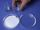

 Photochemistry: Silver
 

> 
> 
> 
> 
> 
> 
> 
> 
> 
> 
> ## Photochemistry: Silver
> 
> 
> 
> 
> 
> ## 
> 
> 
> 
> 
> 
>  The photodecomposition of the silver chloride produces silver metal. This demonstration shows a reaction that is important in photography.
>  
> 
> 
> 
> 
> 
> 
>  (
>  [*170*](CRED170.HTM)
>  )
>  
> 
> 
> 
> 
> ### ---
> 
> 
>  Keywords
> 
> 
> 
> 
>  applications - practical/real-life, descriptive chemistry, halogens/halides/hydrohalic acids, photochemistry, precipitation reaction, redox reaction, transition elements/metals
>  
> 
> 
> 
> 
> ### ---
> 
> 
>  Multimedia
> 
> 
> 
> 
> 
> 
> 
> 
> [
>  Play movie](../../MVHTM/PHOTOAG/PHOTOAG.HTM) 
> 
> 
> 
>  (QuickTime 3.0 Sorenson, duration 47 seconds, size 3.2 MB)
>  
> 
> 
> 
>  Silver nitrate solution is poured into a dish containing a piece
of filter paper. When sodium chloride solution is added, the paper
becomes coated with a layer of solid silver chloride. The paper is
moved to another dish, and a key is placed on top of it. When the
paper is exposed to the light from a burning magnesium ribbon, the
paper darkens due to photodecomposition of the silver chloride, which
produces silver metal. Removing the key reveals its image on the
paper.
>  
> 
> 
> 
> 
> 
> 
> 
> | Sodium chloride solution is added to silver nitrate solution. | The paper is moved to another dish and a key is placed on it. | The paper is exposed to the light from a burning magnesium ribbon. | Removing the key reveals its image on the paper. |
> | --- | --- | --- | --- |
> 
> 
> 
> 
> 
> 
> [Additional still images
for this movie](../../STHTM/PHOTOAG/PHOTOAG.HTM) 
> 
> 
> 
> 
> 
> ---
> 
> 
> 
> 
> ### Discussion
> 
> 
> 
> 
>  This video demonstrates how photographic film can capture an image. 
Silver halides can be reduced to metallic silver by light as shown here. 
When film is exposed to light, each exposed silver halide crystal has a few atoms of silver in it, 
while unexposed crystals have none. 
Photographic developer reduces the rest of the silver halide in the exposed crystals, 
because the reduction occurs faster when there are already silver atoms present. 
Then a fixer is used to dissolve away the rest of the (unexposed) silver halide. 
This leaves a negative image--dark where the film has been exposed to light 
and colorless where it has not been exposed. 
The processes involved are described in detail in 
Jacob, A. T., "The Chemistry of Black & White Photography,", 
Institute for Chemical Education, 
University of Wisconsin-Madison, 1101 University Avenue, Madison, WI 53706-1396.
>  
> 
> 
> 
> 
> 
> 
>  (
>  [*166*](CRED166.HTM)
>  )
>  
> 
> 
> 
> 
> 
> 
> [Demonstration Notes, Warnings, Safety Information, etc.](SAFETY.HTM) 
> 
> 
> 
> 
> 
> ### ---
> 
> 
>  Exam and Quiz Questions
> 
> 
> 
> 
>  1. What is the white solid formed on the filter paper when sodium chloride solution 
is poured into the silver nitrate solution?
>  
> 
> 
> 
>  2. Why is the image of the key not complete? (Part of the smaller end of the key is not visible.)
>  
> 
> 
> 
>  3. The image produced here is called a "negative" image. Why?
>  
> 
> 
> 
> 
> 
> 
> ---
> 
> 
> 
> 
> [Next sequential topic](../../MAIN/FORMC/PAGE1.HTM)

> ---
> 
> 
>  |
>  [Chemistry Comes Alive! (entry page)](../../INDEX.HTM) 
>  |
>  [Table of Contents](../../CONTENTS.HTM) 
>  |
>  [Matrix of Chapters and Topics](../../MATRIX.HTM) 
>  |
>  [Index](../../WORDS.HTM) 
>  |
>  [Alphabetical List of Topics](../../ALPHATOP.HTM) 
>  |
>  [Chemistry Textbooks](../../BOOKS.HTM) 
>  |
>  
>  © 1999 Division of Chemical Education, Inc.,
American Chemical Society. All rights reserved.

