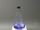

 Reaction of Nitrogen Monoxide with Oxygen, form Nitric Acid
 

> 
> 
> 
> 
> 
> 
> 
> 
> 
> 
> ## Reaction of Nitrogen Monoxide with Oxygen to form Nitric Acid
> 
> 
> 
> 
> 
> ## 
> 
> 
> 
> 
> 
>  Oxygen reacts with the nitrogen monoxide to form nitrogen dioxide, 
which reacts with water to form nitric acid.
>  
> 
> 
> 
> 
> 
> 
>  (
>  [*18*](CRED18.HTM)
>  )
>  
> 
> 
> 
> 
> ### ---
> 
> 
>  Keywords
> 
> 
> 
> 
>  acid rain, acids/bases, applications - practical/real-life, atmosphere, biochemistry, 
combination reaction, descriptive chemistry, environmental chemistry, 
evidence of chemical reaction, exothermic process, redox reaction, 
solutions/solubility, spontaneous process, strong acid, synthesis
>  
> 
> 
> 
> 
> ### ---
> 
> 
>  Multimedia
> 
> 
> 
> 
> 
> 
> 
> 
> [
>  Play movie](../../MVHTM/RAINN1O2/RAINN1O2.HTM) 
> 
> 
> 
>  (QuickTime 3.0 Sorenson, duration 72 seconds, size 5 MB)
>  
> 
> 
> 
>  A flask containing dissolved bromphenol blue indicator is filled with nitrogen monoxide, a colorless gas. When the stopper is loosened, air diffuses into the flask and oxygen reacts with the nitrogen monoxide to form nitrogen dioxide, a brown gas.
The nitrogen dioxide dissolves in the solution, creating a partial vacuum within the flask. The resulting pressure difference draws more oxygen into the flask when the stopper is loosened, forming more NO
>  2 
>  . Upon dissolving, the nitrogen dioxide reacts with water to form nitric acid, as indicated by the color change of the solution.
As more brown nitrogen dioxide forms, more of the gas dissolves, increasing the acidity of the solution.
>  
> 
> 
> 
> 
> | A flask containing dissolved bromphenol blue indicator is filled with nitrogen monoxide. | Oxygen reacts with the nitrogen monoxide to form brown nitrogen dioxide. | The nitrogen dioxide reacts with water to form nitric acid increasing the acidity of the solution. |
> | --- | --- | --- |
> 
> 
> 
> 
> 
> 
> [Additional still images
for this movie](../../STHTM/RAINN1O2/RAINN1O2.HTM) 
> 
> 
> 
> 
> 
> ---
> 
> 
> 
> 
> ### Discussion
> 
> 
> 
> 
>  Nitrogen monoxide, NO, is a pollutant formed by the reaction of nitrogen gas, N
>  2 
>  , 
and oxygen gas, O
>  2 
>  , at high temperatures in automobile engines
and other high-temperature combustion processes. 
Most of the waste NO from automotive engines is converted back to nitrogen gas,
N
>  2 
>  and O
>  2 
>  by the catalytic converter. 
However, a small amount still escapes into the atmosphere. 
Also, some automobiles have faulty converters and others have none at all. 
All of these contribute to the tremendous amount of NO dumped into the atmosphere every day, 
where it reacts with atmospheric oxygen as demonstrated in this experiment.
>  
> 
> 
> 
>  A flask, containing a solution colored blue by bromphenol blue indicator, 
is filled with nitrogen monoxide, a colorless gas, and tightly stoppered. 
When the stopper is loosened and the nitrogen monoxide is allowed to react 
with oxygen from the air, brown nitrogen dioxide gas is formed in a synthesis reaction.
>  
> 
> 
> 
>  The NO
>  2 
>  gas dissolves in the solution and reacts with water to form nitric acid. 
The reaction is indicated by the change of color of the solution from blue to yellow.
>  
> 
> 
> 
>  A more acidic solution is formed by repeatedly opening and closing the stopper 
to allow more oxygen into the flask.
>  
> 
> 
> 
>  The equations for the reactions are
>  
> 
> 
> 
>  2NO (
>  *g* 
>  ) + O
>  2 
>  (
>  *g* 
>  )---> 2NO
>  2 
>  (
>  *g* 
>  )
>  
> 
> 
> 
>  2NO
>  2 
>  (
>  *g* 
>  ) + H
>  2 
>  O(
>  *l* 
>  ) ---> 
H
>  + 
>  (
>  *aq* 
>  ) + NO
>  3 
> - 
>  (
>  *aq* 
>  ) + HNO
>  2 
>  (
>  *aq* 
>  )
>  
> 
> 
> 
> 
> 
> 
> [Demonstration Notes, Warnings, Safety Information, etc.](SAFETY.HTM) 
> 
> 
> 
> 
> 
> ### ---
> 
> 
>  Exam and Quiz Questions
> 
> 
> 
> 
>  1. What caused oxygen to flow into the flask when the stopper was loosened?
>  
> 
> 
> 
>  2. What evidence is there that a chemical reaction occurred between the nitrogen monoxide and oxygen?
>  
> 
> 
> 
>  3. Why did the solution change color?
>  
> 
> 
> 
>  4. What is smog? Research and report on the primary components of and the sources of the smog that affects large urban areas.
>  
> 
> 
> 
> 
> 
> 
> ---
> 
> 
> 
> 
> [Next sequential topic](../../MAIN/PHOTOAG/PAGE1.HTM)

> ---
> 
> 
>  |
>  [Chemistry Comes Alive! (entry page)](../../INDEX.HTM) 
>  |
>  [Table of Contents](../../CONTENTS.HTM) 
>  |
>  [Matrix of Chapters and Topics](../../MATRIX.HTM) 
>  |
>  [Index](../../WORDS.HTM) 
>  |
>  [Alphabetical List of Topics](../../ALPHATOP.HTM) 
>  |
>  [Chemistry Textbooks](../../BOOKS.HTM) 
>  |
>  
>  © 1999 Division of Chemical Education, Inc.,
American Chemical Society. All rights reserved.

