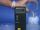

 Sulfuric Acid into Water and Ice
 

> 
> 
> 
> 
> 
> 
> 
> 
> 
> 
> ## Sulfuric Acid into Water and Ice
> 
> 
> 
> 
> 
> ## 
> 
> 
> 
> 
> 
>  When sulfuric acid is mixed with water the temperature rises. When sulfuric acid is added to ice, the temperature rises at first, but as the ice melts, the temperature falls.
>  
> 
> 
> 
> 
> 
> 
>  (
>  [*144*](CRED144.HTM)
>  )
>  
> 
> 
> 
> 
> ### ---
> 
> 
>  Keywords
> 
> 
> 
> 
>  acids/bases, colligative properties, descriptive chemistry, endothermic process, 
enthalpy/heat, exothermic process, phase change, 
solutions/solubility, sulfur/sulfur oxides/sulfuric acid, water
>  
> 
> 
> 
> 
> ### ---
> 
> 
>  Multimedia
> 
> 
> 
> 
> 
> #### Into Water
> 
> 
> 
> 
> 
> [
>  Play movie](../../MVHTM/SH2OICE/SO2ICE1.HTM) 
> 
> 
> 
>  (QuickTime 3.0 Sorenson, duration 18 seconds, size 1.4 MB)
>  
> 
> 
> 
>  Sulfuric acid and water both are near 0 degrees Celsius. The acid is poured into the water and the temperature rises.
>  
> 
> 
> 
> 
> 
> 
> 
> | Acid is poured into water... | ... and the temperature rises. |
> | --- | --- |
> 
> 
> 
> 
> 
> 
> [Additional still images
for this movie](../../STHTM/SH2OICE/SO2ICE1.HTM) 
> 
> 
> 
> 
> 
> ---
> 
> 
> 
> 
> 
> #### Into Ice
> 
> 
> 
> 
> 
> [
>  Play movie](../../MVHTM/SH2OICE/SO2ICE2.HTM) 
> 
> 
> 
>  (QuickTime 3.0 Sorenson, duration 44 seconds, size 3.5 MB)
>  
> 
> 
> 
>  Sulfuric acid and ice both are near 0 degrees Celsius. The acid is poured into the ice. Initially the temperature rises. Then it falls below 0 degrees Celsius.
>  
> 
> 
> 
> 
> 
> 
> 
> | Sulfuric acid and ice both are near 0 degrees Celsius. | The acid is poured into the ice. | Initially the temperature rises. | Then it falls below 0 degrees Celsius. |
> | --- | --- | --- | --- |
> 
> 
> 
> 
> 
> 
> [Additional still images
for this movie](../../STHTM/SH2OICE/SO2ICE2.HTM) 
> 
> 
> 
> 
> 
> ---
> 
> 
> 
> 
> ### Discussion
> 
> 
> 
>  Dissolving sulfuric acid in water is an exothermic process. When sulfuric acid is mixed with 
ice this exothermic process causes 
the temperature to rise at first, but as more of the ice melts, the temperature falls. Because a sulfuric acid solution has a lower freezing point than water, the temperature can fall below 0 degrees Celsius
if enough ice is present.
>  
> 
> 
> 
> 
>  The following are additional pictures relating to the first movie.
>  
> 
> 
> 
> 
> 
> 
> | Measuring the temperature of the sulfuric acid | Rinsing the probe between measurements |
> | --- | --- |
> 
> 
> 
> 
> 
> 
> [Demonstration Notes, Warnings, Safety Information, etc.](SAFETY.HTM) 
> 
> 
> 
> 
> 
> ### ---
> 
> 
>  Exam and Quiz Questions
> 
> 
> 
> 
>  1. Explain in your own words why the temperature first rises and then falls
 when sulfuric acid is added to ice.
>  
> 
> 
> 
>  2. Explain why the temperature eventually falls below 0 degrees Celsius in this experiment.
>  
> 
> 
> 
>  3. How could you change the conditions of the experiment 
so that the temperature would first rise and then fall, 
but would never fall below 0 degrees Celsius?
>  
> 
> 
> 
> 
> 
> 
> ---
> 
> 
> 
> 
> [Next sequential topic](../../MAIN/STEAM/PAGE1.HTM)

> ---
> 
> 
>  |
>  [Chemistry Comes Alive! (entry page)](../../INDEX.HTM) 
>  |
>  [Table of Contents](../../CONTENTS.HTM) 
>  |
>  [Matrix of Chapters and Topics](../../MATRIX.HTM) 
>  |
>  [Index](../../WORDS.HTM) 
>  |
>  [Alphabetical List of Topics](../../ALPHATOP.HTM) 
>  |
>  [Chemistry Textbooks](../../BOOKS.HTM) 
>  |
>  
>  © 1999 Division of Chemical Education, Inc.,
American Chemical Society. All rights reserved.

