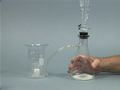

 Chemical Properties of Sulfur Dioxide
 

> 
> 
> 
> 
> 
> 
> 
> 
> 
> 
> ## Chemical Properties of Sulfur Dioxide
> 
> 
> 
> 
> 
> ## 
> 
> 
> 
> 
> 
>  Addition of hydrochloric acid to solid sodium sulfite produces sulfur dioxide gas, which is collected in a beaker.
>  
> 
> 
> 
>  When a red rose is placed in a beaker of SO
>  2 
>  gas, the color gradually fades. When a purple permanganate solution is poured into the gas, a nearly colorless Mn
>  2+ 
>  solution results. SO
>  2 
>  gas reduces yellow chromate ion to the green Cr
>  3+ 
>  .
>  
> 
> 
> 
>  Sulfur dioxide reacts with a soda lime mixture. As the gas is consumed, a rubber dam covering the top of the beaker is pushed inward by atmospheric pressure.
>  
> 
> 
> 
> 
> 
> 
>  (
>  [*170*](CRED170.HTM)
>  )
>  
> 
> 
> 
> 
> ### ---
> 
> 
>  Keywords
> 
> 
> 
> 
>  acid rain, acid-base reaction, atmosphere, bleaching, descriptive chemistry, environmental chemistry, evidence of chemical reaction, redox reaction, sulfur/sulfur oxides/sulfuric acid
>  
> 
> 
> 
> 
> ### ---
> 
> 
>  Multimedia
> 
> 
> 
> 
> 
> #### Production of Sulfur Dioxide
> 
> 
> 
> 
> 
> [
>  Play movie](../../MVHTM/SO2PROP/SO2PR1.HTM) 
> 
> 
> 
>  (QuickTime 3.0 Sorenson, duration 22 seconds, size 1.5 MB)
>  
> 
> 
> 
>  A tube from a filter flask is placed in an empty beaker. As hydrochloric acid is added to sodium sulfite, sulfur dioxide gas is generated, and the gas fills the beaker.
>  
> 
> 
> 
> 
> 
> 
> 
> | The apparatus. | Adding hydrochloric acid to sodium sulfite. | Sulfur dioxide gas is generated. |
> | --- | --- | --- |
> 
> 
> 
> 
> 
> 
> [Additional still images
for this movie](../../STHTM/SO2PROP/SO2PR1.HTM) 
> 
> 
> 
> 
> 
> ---
> 
> 
> 
> 
> 
> #### Bleaching a Rose with Sulfur Dioxide
> 
> 
> 
> 
> 
> [
>  Play movie](../../MVHTM/SO2PROP/SO2PR2.HTM) 
> 
> 
> 
>  (QuickTime 3.0 Sorenson, duration 24 seconds, size 1.6 MB)
>  
> 
> 
> 
>  When a red rose is inserted into a beaker of sulfur dioxide, eventually the rose becomes pink in color. The bleaching results from sulfur dioxide reducing a pigment in the rose petals.
>  
> 
> 
> 
> 
> 
> 
> 
> | Sulfur dioxide and a red rose. | The rose is inserted into the sulfur dioxide. | At first it is red. | Later, it is bleached. |
> | --- | --- | --- | --- |
> 
> 
> 
> 
> 
> 
> [Additional still images
for this movie](../../STHTM/SO2PROP/SO2PR2.HTM) 
> 
> 
> 
> 
> 
> ---
> 
> 
> 
> 
> 
> #### Reducing Permanganate and Dichromate with Sulfur Dioxide
> 
> 
> 
> 
> 
> [
>  Play movie](../../MVHTM/SO2PROP/SO2PR3.HTM) 
> 
> 
> 
>  (QuickTime 3.0 Sorenson, duration 28 seconds, size 2 MB)
>  
> 
> 
> 
>  When purple permanganate solution is poured into sulfur dioxide, the permanganate is reduced to nearly colorless manganese(II) ions, and the sulfur dioxide is oxidized to sulfate ion. When dichromate solution is added to this colorless solution, the sulfur dioxide reduces the yellow dichromate to green chromium(III) ion, while the sulfur dioxide is oxidized to sulfate ion.
>  
> 
> 
> 
> 
> 
> 
> 
> | Permanganate solution, sulfur dioxide, and dichromate solution. | Sulfur dioxide reduces purple MnO  4  -   (  *aq*   ) to nearly colorless Mn  2+   (  *aq*   ). | Sulfur dioxide reduces yellow CrO  4  2-   (  *aq*   ) to green Cr  2+   (  *aq*   ) | After pouring is complete. |
> | --- | --- | --- | --- |
> 
> 
> 
> 
> 
> 
> [Additional still images
for this movie](../../STHTM/SO2PROP/SO2PR3.HTM) 
> 
> 
> 
> 
> 
> ---
> 
> 
> 
> 
> 
> #### Soda Lime and Sulfur Dioxide
> 
> 
> 
> 
> 
> [
>  Play movie](../../MVHTM/SO2PROP/SO2PR4.HTM) 
> 
> 
> 
>  (QuickTime 3.0 Sorenson, duration 60 seconds, size 4.1 MB)
>  
> 
> 
> 
>  A large beaker contains a covered vial of soda lime, which is a damp mixture of sodium hydroxide and calcium oxide. Sulfur dioxide gas is added to the beaker and the top of the beaker is sealed with a rubber dam. The vial is tipped over, so the soda lime can mix with the sulfur dioxide. The reaction of the calcium oxide with sulfur dioxide creates solid calcium sulfite, decreasing the number of gas particles and thus the pressure within the beaker, so the dam is pushed inward by atmospheric pressure.
>  
> 
> 
> 
> 
> 
> 
> 
> | A large beaker contains a covered vial of soda lime. | Sulfur dioxide gas is added to the beaker. |
> | --- | --- |
> 
> 
> 
> 
> 
> 
> 
> | The top of the beaker is sealed with a rubber dam. | The vial is tipped and the soda lime mixes with the sulfur dioxide. | The dam is pushed inward by atmospheric pressure. |
> | --- | --- | --- |
> 
> 
> 
> 
> 
> 
> [Additional still images
for this movie](../../STHTM/SO2PROP/SO2PR4.HTM) 
> 
> 
> 
> 
> 
> ---
> 
> 
> 
> 
> ### Discussion
> 
> 
> 
> 
>  Sulfur dioxide is a good bleaching agent and is used for that purpose industrially. 
It is also a good reducing agent, which accounts for its decolorizing permanganate solutions 
and for changing the color of chromate solutions. 
Sulfur dioxide is generated on a large scale by combustion of sulfur in coal at electric power plants 
and other industrial sites. 
One way to remove sulfur dioxide from stack gases at such plants is to use calcium oxide, as demonstrated here.
>  
> 
> 
> 
>  Equations for reactions shown in this video are
>  
> 
> 
> 
>  Na
>  2 
>  SO
>  3 
>  (
>  *s* 
>  ) + 2 HCl(
>  *aq* 
>  ) --> 
2 NaCl(
>  *s* 
>  ) + SO
>  2 
>  (
>  *g* 
>  ) + H
>  2 
>  O(
>  *l* 
>  )
>  
> 
> 
> 
>  5 SO
>  2 
>  (
>  *g* 
>  ) + 2 MnO
>  4 
> - 
>  (
>  *aq* 
>  ) + 2 H
>  2 
>  O(
>  *l* 
>  ) --> 
5 SO
>  4 
> 2- 
>  (
>  *aq* 
>  ) + 2 Mn
>  2+ 
>  (
>  *aq* 
>  ) + 4 H
>  + 
>  (
>  *aq* 
>  )
>  
> 
> 
> 
>  3 SO
>  2 
>  (
>  *g* 
>  ) + 2 CrO
>  4 
> 2- 
>  (
>  *aq* 
>  ) + 2 H
>  2 
>  O(
>  *l* 
>  ) --> 
3 SO
>  4 
> 2- 
>  (
>  *aq* 
>  ) + 2 Cr
>  3+ 
>  (
>  *aq* 
>  ) + 4 OH
>  - 
>  (
>  *aq* 
>  )
>  
> 
> 
> 
>  CaO(
>  *s* 
>  ) + SO
>  2 
>  (
>  *g* 
>  ) --> 
CaSO
>  3 
>  (
>  *s* 
>  )
>  
> 
> 
> 
> 
> 
> 
>  (
>  [*166*](CRED166.HTM)
>  )
>  
> 
> 
> 
> 
> 
> 
> [Demonstration Notes, Warnings, Safety Information, etc.](SAFETY.HTM) 
> 
> 
> 
> 
> 
> ### ---
> 
> 
>  Exam and Quiz Questions
> 
> 
> 
> 
>  1. Write a balanced net ionic equation for the production of sulfur dioxide gas from hydrochloric acid and sodium sulfite.
>  
> 
> 
> 
>  2. Write balanced chemical equations for the reduction of permanganate ion and of chromate ion with sulfur dioxide.
>  
> 
> 
> 
>  3. In the last demonstration, why was the rubber dam pulled down into the beaker?
>  
> 
> 
> 
>  4. Write a balanced chemical equation for the reaction of calcium oxide with sulfur dioxide. Is this an oxidation-reduction reaction?
>  
> 
> 
> 
> 
> 
> 
> ---
> 
> 
> 
> 
> [Next sequential topic](../../MAIN/RAINN1O2/PAGE1.HTM)

> ---
> 
> 
>  |
>  [Chemistry Comes Alive! (entry page)](../../INDEX.HTM) 
>  |
>  [Table of Contents](../../CONTENTS.HTM) 
>  |
>  [Matrix of Chapters and Topics](../../MATRIX.HTM) 
>  |
>  [Index](../../WORDS.HTM) 
>  |
>  [Alphabetical List of Topics](../../ALPHATOP.HTM) 
>  |
>  [Chemistry Textbooks](../../BOOKS.HTM) 
>  |
>  
>  © 1999 Division of Chemical Education, Inc.,
American Chemical Society. All rights reserved.

