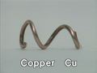

 Electrochemical Series: Metal Trees
 

> 
> 
> 
> 
> 
> 
> 
> 
> 
> 
> ## Electrochemical Series: Metal Trees
> 
> 
> 
> 
> 
> ## 
> 
> 
> 
> 
> 
>  A piece of metal (Cu, Zn, Ag, Cd, or Pb) is placed in an aqueous solution of a metal ion (Cu
>  2+ 
>  , Zn
>  2+ 
>  , Ag
>  + 
>  , Cd
>  2+ 
>  , or Pb
>  2+ 
>  ). In some cases the growth of metal crystals indicates that a chemical reaction has occurred. This set of experiments may be used to rank the metal ions in order of reduction potential.
>  
> 
> 
> 
> 
> 
> 
>  (
>  [*86*](CRED86.HTM)
>  )
>  
> 
> 
> 
> 
> ### ---
> 
> 
>  Keywords
> 
> 
> 
> 
>  copper, crystals/crystallization, descriptive chemistry, electrode potentials, metals, redox reaction, single exchange/replacement reaction, zinc
>  
> 
> 
> 
> 
> ### ---
> 
> 
>  Multimedia
> 
> 
> 
> 
>  The five metals
>  
> 
> 
> 
> 
> #### Metals in Silver Nitrate Solution, same time
> 
> 
> 
> 
> 
> [
>  Play movie](../../MVHTM/TREES/TREE01.HTM) 
> 
> 
> 
>  (QuickTime 3.0 Sorenson, duration 15 seconds, size 1.1 MB)
>  
> 
> 
> 
>  Five different metals have been placed in silver nitrate solutions. Note the formation of silver metallic crystals on the metals' surfaces and the eventual darkening of the crystals.
>  
> 
> 
> 
> 
> 
> 
> 
> |  |  |  |
> | --- | --- | --- |
> 
> 
> 
> 
> 
> 
> 
> | Copper metal | Zinc metal | Silver metal |
> | --- | --- | --- |
> 
> 
> 
> 
> 
> 
> 
> | Cadmium metal | Lead metal |
> | --- | --- |
> 
> 
> 
> 
> 
> 
> [Additional still images
for this movie](../../STHTM/TREES/TREE01.HTM) 
> 
> 
> 
> 
> 
> ---
> 
> 
> 
> 
> 
> **All Five Metals in all five Solutions** 
> 
> 
> 
> 
> 
> 
> |  |  | Silver Nitrate Solution | Copper(II) Nitrate Solution | Zinc(II) Nitrate Solution | Cadmium Nitrate Solution | Lead(II) Nitrate Solution |
> | --- | --- | --- | --- | --- | --- | --- |
> |  |  | **(Ag  +   ion)** | **(Cu  2+   ion)** | **(Zn  2+   ion)** | **(Cd  2+   ion)** | **(Pb  2+   ion)** |
> | **Copper    Metal    (Cu)** |  | [**Copper Metal in Silver
 Nitrate Solution**](PAGE2AG.HTM#COPPER) | [**Copper Metal in Copper(II)
 Nitrate Solution**](PAGE3CU.HTM#COPPER) | [**Copper Metal in Zinc(II)
 Nitrate Solution**](PAGE4ZN.HTM#COPPER) | [**Copper Metal in Cadmium
 Nitrate Solution**](PAGE5CD.HTM#COPPER) | [**Copper Metal in Lead(II)
 Nitrate Solution**](PAGE6PB.HTM#COPPER) |
> | **Zinc    Metal    (Zn)** |  | [**Zinc Metal in Silver Nitrate
 Solution**](PAGE2AG.HTM#ZINC) | [**Zinc Metal in Copper(II)
 Nitrate Solution**](PAGE3CU.HTM#ZINC) | [**Zinc Metal in Zinc(II)
 Nitrate Solution**](PAGE4ZN.HTM#ZINC) | [**Zinc Metal in Cadmium Nitrate
 Solution**](PAGE5CD.HTM#ZINC) | [**Zinc Metal in Lead(II)
 Nitrate Solution**](PAGE6PB.HTM#ZINC) |
> | **Silver    Metal    (Ag)** |  | [**Silver Metal in Silver
 Nitrate Solution**](PAGE2AG.HTM#SILVER) | [**Silver Metal in Copper(II)
 Nitrate Solution**](PAGE3CU.HTM#SILVER) | [**Silver Metal in Zinc(II)
 Nitrate Solution**](PAGE4ZN.HTM#SILVER) | [**Silver Metal in Cadmium
 Nitrate Solution**](PAGE5CD.HTM#SILVER) | [**Silver Metal in Lead(II)
 Nitrate Solution**](PAGE6PB.HTM#SILVER) |
> | **Cadmium    Metal    (Cd)** |  | [**Cadmium Metal in Silver
 Nitrate Solution**](PAGE2AG.HTM#CADMIUM) | [**Cadmium Metal in
 Copper(II) Nitrate Solution**](PAGE3CU.HTM#CADMIUM) | [**Cadmium Metal in Zinc(II)
 Nitrate Solution**](PAGE4ZN.HTM#CADMIUM) | [**Cadmium Metal in Cadmium
 Nitrate Solution**](PAGE5CD.HTM#CADMIUM) | [**Cadmium Metal in Lead(II)
 Nitrate Solution**](PAGE6PB.HTM#CADMIUM) |
> | **Lead    Metal    (Pb)** |  | [**Lead Metal in Silver Nitrate
 Solution**](PAGE2AG.HTM#LEAD) | [**Lead Metal in Copper(II)
 Nitrate Solution**](PAGE3CU.HTM#LEAD) | [**Lead Metal in Zinc(II)
 Nitrate Solution**](PAGE4ZN.HTM#LEAD) | [**Lead Metal in Cadmium Nitrate
 Solution**](PAGE5CD.HTM#LEAD) | [**Lead Metal in Lead(II)
 Nitrate Solution**](PAGE6PB.HTM#LEAD) |
> 
> 
> 
> 
> 
> 
> 
> ### Discussion
> 
> 
> 
> 
>  Each of the videos in this section shows the reaction (or absence of reaction) when a sample of a metal is 
placed into a solution containing a metal ion. By viewing the videos students can determine which metal 
ion is the strongest oxidizing agent and which metal is the strongest reducing agent. The videos could be 
used in homework or quiz questions that ask students to rank the metals in order of reducing strength or to 
rank the metal ions in order of oxidizing strength.
>  
> 
> 
> 
>  The reactions that occur are
>  
> 
> 
>   
> 
>  2 Ag
>  + 
>  (
>  *aq* 
>  ) + Cu(
>  *s* 
>  ) --> 2 Ag(
>  *s* 
>  ) + Cu
>  2+ 
>  (
>  *aq* 
>  )
>    
> 
>  2 Ag
>  + 
>  (
>  *aq* 
>  ) + Zn(
>  *s* 
>  ) --> 2 Ag(
>  *s* 
>  ) + Zn
>  2+ 
>  (
>  *aq* 
>  )
>    
> 
>  2 Ag
>  + 
>  (
>  *aq* 
>  ) + Cd(
>  *s* 
>  ) --> 2 Ag(
>  *s* 
>  ) + Cd
>  2+ 
>  (
>  *aq* 
>  )
>    
> 
>  2 Ag
>  + 
>  (
>  *aq* 
>  ) + Pb(
>  *s* 
>  ) --> 2 Ag(
>  *s* 
>  ) + Pb
>  2+ 
>  (
>  *aq* 
>  )
>    
> 
>  Cu
>  2+ 
>  (
>  *aq* 
>  ) + Zn(
>  *s* 
>  ) --> Cu(
>  *s* 
>  ) + Zn
>  2+ 
>  (
>  *aq* 
>  )
>    
> 
>  Cu
>  2+ 
>  (
>  *aq* 
>  ) + Cd(
>  *s* 
>  ) --> Cu(
>  *s* 
>  ) + Cd
>  2+ 
>  (
>  *aq* 
>  )
>    
> 
>  Cu
>  2+ 
>  (
>  *aq* 
>  ) + Pb(
>  *s* 
>  ) --> Cu(
>  *s* 
>  ) + Pb
>  2+ 
>  (
>  *aq* 
>  )
>    
> 
>  Cd
>  2+ 
>  (
>  *aq* 
>  ) + Zn(
>  *s* 
>  ) --> Cd(
>  *s* 
>  ) + Zn
>  2+ 
>  (
>  *aq* 
>  )
>    
> 
>  Pb
>  2+ 
>  (
>  *aq* 
>  ) + Zn(
>  *s* 
>  ) --> Pb(
>  *s* 
>  ) + Zn
>  2+ 
>  (
>  *aq* 
>  )
>    
> 
>  Pb
>  2+ 
>  (
>  *aq* 
>  ) + Cd(
>  *s* 
>  ) --> Pb(
>  *s* 
>  ) + Cd
>  2+ 
>  (
>  *aq* 
>  )
>  
> 
> 
> 
>  The other videos show that there is no reaction.
>  
> 
> 
> 
>  For consistency in the videos, nitrates were used for all reactions in this series. When metals react with 
copper(II) nitrate solutions, gas bubbles form on the surface of the metal (in addition to the layer of copper 
that forms) and the color of the solution changes from blue to green. If these solutions are allowed to stand 
overnight, the blue color returns to the liquid phase and a white or bluish-white precipitate forms. 
These observations are not made when a solution of copper(II) sulfate reacts with the same metals.
>  
> 
> 
> 
>  The gas that forms is colorless. It might be nitrogen monoxide or it might be hydrogen. Nitrogen monoxide 
could be formed by reduction of nitrate ions, and hydrogen could be formed by reaction of zinc with an 
acidic solution. (Electrode potentials do not predict that hydrogen should be formed by reaction of a neutral 
aqueous solution with any of the metals, but solutions of copper(II) ions are somewhat acidic.) The rather 
greenish-blue color formed after zinc, cadmium, and lead have reacted with copper(II) nitrate may be due 
to formation of nitro complexes of copper(II) from nitrite ions that result from reduction of nitrate. (The 
same color is formed when sodium nitrite is added to copper(II) sulfate solution.) Formation of nitrite ions 
argues for NO as the gas that is formed. NO can be formed by reduction of nitrate and is easily air oxidized 
to NO
>  2 
>  . The latter is water soluble and disproportionates to nitrous acid and nitrate when it dissolves. The 
equation for redissolving the copper is probably
>  
> 
> 
> 
>  NO
>  3 
> - 
>  (
>  *aq* 
>  ) + 3 Cu(
>  *s* 
>  ) + 7 H
>  + 
>  (
>  *aq* 
>  ) + O
>  2 
>  (
>  *g* 
>  ) -->
 3 Cu
>  2+ 
>  (
>  *aq* 
>  ) + 3 H
>  2 
>  O(
>  *l* 
>  ) + HNO
>  2 
>  (
>  *aq* 
>  )
>  
> 
> 
> 
>  As the copper redissolves the solution becomes more basic, which causes zinc hydroxide to precipitate. 
Finding out more definitively what happens in these reactions of metals with copper(II) nitrate would be a 
good mini research project for a student.
>  
> 
> 
> 
> 
> 
> 
> [Demonstration Notes, Warnings, Safety Information, etc.](SAFETY.HTM) 
> 
> 
> 
> 
> 
> ### ---
> 
> 
>  Exam and Quiz Questions
> 
> 
> 
> 
>  1. Based on the reactions observed in this demonstration, arrange 
in order from largest to smallest the reduction potentials of the five metal ions (Cu
>  2+ 
>  , Zn
>  2+ 
>  , Ag
>  + 
>  , Cd
>  2+ 
>  and Pb
>  2+ 
>  ) to the corresponding metals (Cu, Zn, Ag, Cd, and Pb).
>  
> 
> 
> 
>  2. When a piece of nickel metal is dipped in a lead(II) nitrate solution, no reaction is observed. When a piece of nickel is dipped in a copper(II) nitrate solution, copper crystals are deposited. From your observations and the information provided in this question, determine whether a reaction will occur when nickel is dipped in solutions of zinc nitrate, cadmium nitrate, or silver nitrate. [Possible answers: Crystals will form; no reaction will take place; it is impossible to determine whether a reaction will take place from the information provided.]
>  
> 
> 
> 
> 
> 
> 
> ---
> 
> 
> 
> 
> [Next page for this topic](../../MAIN/TREES/PAGE2AG.HTM) 
> 
> 
> 
> 
> 
> 
> [Next sequential topic](../../MAIN/ELECSOL/PAGE1.HTM)

> ---
> 
> 
>  |
>  [Chemistry Comes Alive! (entry page)](../../INDEX.HTM) 
>  |
>  [Table of Contents](../../CONTENTS.HTM) 
>  |
>  [Matrix of Chapters and Topics](../../MATRIX.HTM) 
>  |
>  [Index](../../WORDS.HTM) 
>  |
>  [Alphabetical List of Topics](../../ALPHATOP.HTM) 
>  |
>  [Chemistry Textbooks](../../BOOKS.HTM) 
>  |
>  
>  © 1999 Division of Chemical Education, Inc.,
American Chemical Society. All rights reserved.

