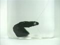

 Electrochemical Series: Metal Trees - Silver Nitrate
 

> 
> 
> 
> 
> 
> 
> 
> 
> 
> 
> ## Electrochemical Series: Metal Trees
> 
> 
> 
> 
> 
> ## Silver Nitrate
> 
> 
> 
> 
> 
> 
> ### ---
> 
> 
>  Multimedia
> 
> 
> 
> #### Copper Metal in Silver Nitrate Solution
> 
> 
> 
> 
> 
> [
>  Play movie](../../MVHTM/TREES/TREE02.HTM) 
> 
> 
> 
>  (QuickTime 3.0 Sorenson, duration 13 seconds, size 970 K)
>  
> 
> 
> 
>  Time lapse shows the reaction of copper metal with aqueous silver nitrate. 
Note the formation of crystals and the color change of the solution, which shows 
the reaction has produced copper(II) ions.
>  
> 
> 
> 
> 
> 
> 
> 
> |  |  |  |  |
> | --- | --- | --- | --- |
> 
> 
> 
> 
> 
> 
> [Additional still images
for this movie](../../STHTM/TREES/TREE02.HTM) 
> 
> 
> 
> 
> 
> ---
> 
> 
> 
> #### Zinc Metal in Silver Nitrate Solution
> 
> 
> 
> 
> 
> [
>  Play movie](../../MVHTM/TREES/TREE03.HTM) 
> 
> 
> 
>  (QuickTime 3.0 Sorenson, duration 10 seconds, size 730 K)
>  
> 
> 
> 
>  Time lapse shows the reaction of zinc metal with aqueous silver nitrate. 
Note the formation and eventual darkening of the silver crystals.
>  
> 
> 
> 
> 
> 
> 
> 
> |  |  |  |  |
> | --- | --- | --- | --- |
> 
> 
> 
> 
> 
> 
> [Additional still images
for this movie](../../STHTM/TREES/TREE03.HTM) 
> 
> 
> 
> 
> 
> ---
> 
> 
> 
> **Silver Metal in Silver Nitrate Solution** 
> 
> 
> 
> 
>  There is no reaction.
>  
> 
> 
> 
> 
> 
> 
> | In the beginning. | After five minutes. |
> | --- | --- |
> 
> 
> 
> 
> 
> ---
> 
> 
> #### Cadmium Metal in Silver Nitrate Solution
> 
> 
> 
> 
> 
> [
>  Play movie](../../MVHTM/TREES/TREE05.HTM) 
> 
> 
> 
>  (QuickTime 3.0 Sorenson, duration 10 seconds, size 730 K)
>  
> 
> 
> 
>  Time lapse shows the reaction of cadmium metal with aqueous silver 
nitrate. Note the formation and eventual growth of the silver crystals.
>  
> 
> 
> 
> 
> 
> 
> 
> |  |  |  |
> | --- | --- | --- |
> 
> 
> 
> 
> 
> 
> [Additional still images
for this movie](../../STHTM/TREES/TREE05.HTM) 
> 
> 
> 
> 
> 
> ---
> 
> 
> 
> #### Lead Metal in Silver Nitrate Solution
> 
> 
> 
> 
> 
> [
>  Play movie](../../MVHTM/TREES/TREE06.HTM) 
> 
> 
> 
>  (QuickTime 3.0 Sorenson, duration 10 seconds, size 750 K)
>  
> 
> 
> 
>  Time lapse shows the reaction of lead metal with aqueous silver nitrate. Note the formation and growth of silver crystals.
>  
> 
> 
> 
> 
> 
> 
> 
> |  |  |  |  |
> | --- | --- | --- | --- |
> 
> 
> 
> 
> 
> 
> [Additional still images
for this movie](../../STHTM/TREES/TREE06.HTM) 
> 
> 
> 
> 
> 
> ---
> 
> 
> 
> 
> 
> 
> 
> 
> 
> [Next page for this topic](../../MAIN/TREES/PAGE3CU.HTM) 
> 
> 
> 
> 
> 
> 
> [Next sequential topic](../../MAIN/ELECSOL/PAGE1.HTM)

> ---
> 
> 
>  |
>  [Chemistry Comes Alive! (entry page)](../../INDEX.HTM) 
>  |
>  [Table of Contents](../../CONTENTS.HTM) 
>  |
>  [Matrix of Chapters and Topics](../../MATRIX.HTM) 
>  |
>  [Index](../../WORDS.HTM) 
>  |
>  [Alphabetical List of Topics](../../ALPHATOP.HTM) 
>  |
>  [Chemistry Textbooks](../../BOOKS.HTM) 
>  |
>  
>  © 1999 Division of Chemical Education, Inc.,
American Chemical Society. All rights reserved.

