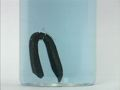

 Electrochemical Series: Metal Trees - Copper(II) Nitrate
 

> 
> 
> 
> 
> 
> 
> 
> 
> 
> 
> ## Electrochemical Series: Metal Trees
> 
> 
> 
> 
> 
> ## Copper(II) Nitrate
> 
> 
> 
> 
> 
> 
> ### ---
> 
> 
>  Multimedia
> 
> 
> 
> **Copper Metal in Copper(II) Nitrate Solution** 
> 
> 
> 
> 
> 
> 
> 
> | In the beginning. | After eleven minutes. |
> | --- | --- |
> 
> 
> 
> 
> 
> ---
> 
> 
> #### Zinc Metal in Copper(II) Nitrate Solution
> 
> 
> 
> 
> 
> [
>  Play movie](../../MVHTM/TREES/TREE08.HTM) 
> 
> 
> 
>  (QuickTime 3.0 Sorenson, duration 10 seconds, size 740 K)
>  
> 
> 
> 
>  Time lapse shows the reaction of zinc metal with aqueous copper(II) nitrate. Note the formation and darkening of crystals and the generation of gas bubbles.
>  
> 
> 
> 
> 
> 
> 
> 
> |  |  |  |
> | --- | --- | --- |
> 
> 
> 
> 
> 
> 
> [Additional still images
for this movie](../../STHTM/TREES/TREE08.HTM) 
> 
> 
> 
> 
> 
> ---
> 
> 
> 
> **Silver Metal in Copper(II) Nitrate Solution** 
> 
> 
> 
> 
> 
> 
> 
> | In the beginning. | After six minutes. |
> | --- | --- |
> 
> 
> 
> 
> 
> ---
> 
> 
> #### Cadmium Metal in Copper(II) Nitrate Solution
> 
> 
> 
> 
> 
> [
>  Play movie](../../MVHTM/TREES/TREE10.HTM) 
> 
> 
> 
>  (QuickTime 3.0 Sorenson, duration 13 seconds, size 900 K)
>  
> 
> 
> 
>  Time lapse shows the reaction of cadmium metal with aqueous copper(II) nitrate. Note the darkening and crystal formation and the generation of gas bubbles.
>  
> 
> 
> 
> 
> 
> 
> 
> |  |  |  |  |
> | --- | --- | --- | --- |
> 
> 
> 
> 
> 
> 
> [Additional still images
for this movie](../../STHTM/TREES/TREE10.HTM) 
> 
> 
> 
> 
> 
> ---
> 
> 
> 
> #### Lead Metal in Copper(II) Nitrate Solution
> 
> 
> 
> 
> 
> [
>  Play movie](../../MVHTM/TREES/TREE11.HTM) 
> 
> 
> 
>  (QuickTime 3.0 Sorenson, duration 15 seconds, size 1 MB)
>  
> 
> 
> 
>  Time lapse shows the reaction of lead metal with aqueous copper(II) nitrate. Note the darkening of the metal surface and the generation of gas bubbles.
>  
> 
> 
> 
> 
> 
> 
> 
> |  |  |  |  |
> | --- | --- | --- | --- |
> 
> 
> 
> 
> 
> 
> [Additional still images
for this movie](../../STHTM/TREES/TREE11.HTM) 
> 
> 
> 
> 
> 
> ---
> 
> 
> 
> 
> 
> 
> 
> 
> 
> [Next page for this topic](../../MAIN/TREES/PAGE4ZN.HTM) 
> 
> 
> 
> 
> 
> 
> [Next sequential topic](../../MAIN/ELECSOL/PAGE1.HTM)

> ---
> 
> 
>  |
>  [Chemistry Comes Alive! (entry page)](../../INDEX.HTM) 
>  |
>  [Table of Contents](../../CONTENTS.HTM) 
>  |
>  [Matrix of Chapters and Topics](../../MATRIX.HTM) 
>  |
>  [Index](../../WORDS.HTM) 
>  |
>  [Alphabetical List of Topics](../../ALPHATOP.HTM) 
>  |
>  [Chemistry Textbooks](../../BOOKS.HTM) 
>  |
>  
>  © 1999 Division of Chemical Education, Inc.,
American Chemical Society. All rights reserved.

