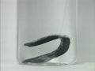

 Electrochemical Series: Metal Trees - Cadmium Nitrate
 

> 
> 
> 
> 
> 
> 
> 
> 
> 
> 
> ## Electrochemical Series: Metal Trees
> 
> 
> 
> 
> 
> ## Cadmium Nitrate
> 
> 
> 
> 
> 
> 
> ### ---
> 
> 
>  Multimedia
> 
> 
> 
> **Copper Metal in Cadmium Nitrate Solution** 
> 
> 
> 
> 
> 
> 
> 
> | In the beginning. | After twenty minutes. |
> | --- | --- |
> 
> 
> 
> 
> 
> ---
> 
> 
> #### Zinc Metal in Cadmium Nitrate Solution
> 
> 
> 
> 
> 
> [
>  Play movie](../../MVHTM/TREES/TREE13.HTM) 
> 
> 
> 
>  (QuickTime 3.0 Sorenson, duration 18 seconds, size 1.3 MB)
>  
> 
> 
> 
>  Time lapse shows the reaction of zinc metal with aqueous cadmium nitrate. Note the formation of cadmium crystals on the surface of the zinc.
>  
> 
> 
> 
> 
> 
> 
> 
> |  |  |  |  |
> | --- | --- | --- | --- |
> 
> 
> 
> 
> 
> 
> [Additional still images
for this movie](../../STHTM/TREES/TREE13.HTM) 
> 
> 
> 
> 
> 
> ---
> 
> 
> 
> **Silver Metal in Cadmium Nitrate Solution** 
> 
> 
> 
> 
> 
> 
> 
> | In the beginning. | After twenty minutes. |
> | --- | --- |
> 
> 
> 
> 
> 
> ---
> 
> 
> **Cadmium Metal in Cadmium Nitrate Solution** 
> 
> 
> 
> 
> 
> 
> 
> | In the beginning. | After twenty minutes. |
> | --- | --- |
> 
> 
> 
> 
> 
> ---
> 
> 
> **Lead Metal in Cadmium Nitrate Solution** 
> 
> 
> 
> 
> 
> 
> 
> | In the beginning. | After twenty minutes. |
> | --- | --- |
> 
> 
> 
> 
> 
> ---
> 
> 
> 
> 
> 
> 
> 
> 
> [Next page for this topic](../../MAIN/TREES/PAGE6PB.HTM) 
> 
> 
> 
> 
> 
> 
> [Next sequential topic](../../MAIN/ELECSOL/PAGE1.HTM)

> ---
> 
> 
>  |
>  [Chemistry Comes Alive! (entry page)](../../INDEX.HTM) 
>  |
>  [Table of Contents](../../CONTENTS.HTM) 
>  |
>  [Matrix of Chapters and Topics](../../MATRIX.HTM) 
>  |
>  [Index](../../WORDS.HTM) 
>  |
>  [Alphabetical List of Topics](../../ALPHATOP.HTM) 
>  |
>  [Chemistry Textbooks](../../BOOKS.HTM) 
>  |
>  
>  © 1999 Division of Chemical Education, Inc.,
American Chemical Society. All rights reserved.

