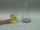

 Oxidation States of Vanadium
 

> 
> 
> 
> 
> 
> 
> 
> 
> 
> 
> ## Oxidation States of Vanadium
> 
> 
> 
> 
> 
> ## 
> 
> 
> 
> 
> 
>  A yellow vanadium(V) solution is poured over zinc amalgam. Swirling the mixture produces, in succession, blue vanadium(IV), green vanadium(III) and purple vanadium(II) solutions.
>  
> 
> 
> 
> 
> 
> 
>  (
>  [*170*](CRED170.HTM)
>  )
>  
> 
> 
> 
> 
> ### ---
> 
> 
>  Keywords
> 
> 
> 
> 
>  descriptive chemistry, electrode potentials, oxidation state/number, redox reaction, transition elements/metals
>  
> 
> 
> 
> 
> ### ---
> 
> 
>  Multimedia
> 
> 
> 
> 
> 
> 
> 
> 
> [
>  Play movie](../../MVHTM/VANADOX/VANADOX.HTM) 
> 
> 
> 
>  (QuickTime 3.0 Sorenson, duration 73 seconds, size 5.1 MB)
>  
> 
> 
> 
>  A yellow solution of vanadium in its plus five oxidation state is poured into a large flask containing a zinc amalgam. The zinc serves as a reducing agent for the vanadium species. In the process, the zinc is oxidized to zinc(II) ion. When the flask is swirled, the vanadium changes to a light blue, indicating a plus four oxidation state. Swirling increases the contact between the zinc amalgam and the aqueous vanadium solution. Further reduction produces a deep green vanadium plus three solution. With even more swirling in the amalgam, the vanadium is ultimately transformed to purple vanadium plus two.
>  
> 
> 
> 
> 
> 
> 
> 
> | Vanadium in its plus five oxidation state. | ... in a plus four oxidation state. | ... in a plus three oxidation state. | ... in a plus two oxidation state. |
> | --- | --- | --- | --- |
> 
> 
> 
> 
> 
> 
> 
> | A comparison of the four oxidation states. |
> | --- |
> 
> 
> 
> 
> 
> 
> [Additional still images
for this movie](../../STHTM/VANADOX/VANADOX.HTM) 
> 
> 
> 
> 
> 
> ---
> 
> 
> 
> 
> ### Discussion
> 
> 
> 
> 
>  Because each successive reduction potential is smaller, 
it is possible to attain a stepwise reduction from VO
>  2 
> - 
>  to VO
>  2- 
>  to V
>  3+ 
>  and finally to V
>  2+ 
>  . 
The reduction potentials in 1M H
>  + 
>  are 1.000V, 0.337V, and 0.255 V. 
The V
>  2+ 
>  species is unstable in acid solution, 
since it will reduce H
>  + 
>  to H
>  2 
>  .
>  
> 
> 
> 
>  The green V
>  3+ 
>  species is particularly difficult to obtain. 
Over stirring with the zinc amalgam can lead to the premature formation of the purple V
>  2+ 
>  .
>  
> 
> 
> 
> 
> 
> 
> [Demonstration Notes, Warnings, Safety Information, etc.](SAFETY.HTM) 
> 
> 
> 
> 
> 
> ### ---
> 
> 
>  Exam and Quiz Questions
> 
> 
> 
> 
>  1. What is the role of the zinc amalgam in this demonstration? Why was the flask swirled?
>  
> 
> 
> 
>  2. Is the vanadium being oxidized or reduced as the flask is swirled?
>  
> 
> 
> 
>  3. In this demonstration, the reduction of the vanadium occurs stepwise (one electron at a time). What does this tell about the relative values of the reduction potentials? Do they increase or decrease in the series VO
>  2 
> - 
>  --> VO
>  - 
>  , VO
>  - 
>  --> V
>  3+ 
>  , V
>  3+ 
>  --> V
>  2+ 
>  ? What color changes would you expect if the order of the reduction potentials was reversed?
>  
> 
> 
> 
> 
> 
> 
> ---
> 
> 
> 
> 
> [Next sequential topic](../../MAIN/BOTL/PAGE1.HTM)

> ---
> 
> 
>  |
>  [Chemistry Comes Alive! (entry page)](../../INDEX.HTM) 
>  |
>  [Table of Contents](../../CONTENTS.HTM) 
>  |
>  [Matrix of Chapters and Topics](../../MATRIX.HTM) 
>  |
>  [Index](../../WORDS.HTM) 
>  |
>  [Alphabetical List of Topics](../../ALPHATOP.HTM) 
>  |
>  [Chemistry Textbooks](../../BOOKS.HTM) 
>  |
>  
>  © 1999 Division of Chemical Education, Inc.,
American Chemical Society. All rights reserved.

