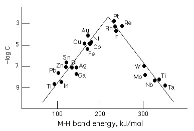

 VOLTAGE
 

> 
> 
> 
> 
> 
> 
> 
> 
> 
> 
> ## Overvoltage
> 
> 
> 
> 
> 
> ## 
> 
> 
> 
> 
> 
>  Zinc metal reacts with hydrochloric acid, generating hydrogen gas.
However, when a strip of nickel, copper, platinum or lead is placed
in hydrochloric acid, no reaction is observed. When nickel dipped in
hydrochloric acid is brought in contact with zinc, bubbles form on
the surface of the nickel metal. Hydrogen also forms on the surfaces of
copper and platinum when those metals touch the zinc. When nickel,
copper or platinum is connected electrically
 to the zinc externally (through a wire), bubbles again
form on the surface of each of these metals. However, when a piece of
lead is brought in contact with the zinc, no bubbles are observed on
the surface of the lead.
>  
> 
> 
> 
> 
> 
> 
>  (
>  [*131*](CRED131.HTM)
>  )
>  
> 
> 
> 
> 
> ### ---
> 
> 
>  Keywords
> 
> 
> 
> 
>  descriptive chemistry, electrochemical (galvanic) cells, halogens/halides/hydrohalic acids, metals, reactivity - kinetic/thermodynamic stability, redox reaction, zinc
>  
> 
> 
> 
> 
> ### ---
> 
> 
>  Multimedia
> 
> 
> 
> 
> 
> 
> 
> |  |
> | --- |
> 
> 
> 
>  The following variations are presented below.
>  
> 
> 
> | [**Zinc in HCl**](../../MVHTM/VOLTAGE/VOLTAGE3.HTM) |  |
> | --- | --- |
> | [**Nickel in HCl**](../../MVHTM/VOLTAGE/VOLTAGE1.HTM) | [**Nickel and Zinc in HCl**](../../MVHTM/VOLTAGE/VOLTAGE6.HTM) |
> | [**Copper in HCl**](../../MVHTM/VOLTAGE/VOLTAGE2.HTM) | [**Copper and Zinc in HCl**](../../MVHTM/VOLTAGE/VOLTAGE7.HTM) |
> | [**Platinum in HCl**](../../MVHTM/VOLTAGE/VOLTAGE4.HTM) | [**Platinum and Zinc in HCl**](../../MVHTM/VOLTAGE/VOLTAGE8.HTM) |
> | [**Lead in HCl**](../../MVHTM/VOLTAGE/VOLTAGE5.HTM) | [**Lead and Zinc in HCl**](../../MVHTM/VOLTAGE/VOLTAGE9.HTM) |
> 
> 
> 
> 
> 
> 
> 
> ---
> 
> 
> #### Zinc in HCl
> 
> 
> 
> 
> 
> [
>  Play movie](../../MVHTM/VOLTAGE/VOLTAGE3.HTM) 
> 
> 
> 
>  (QuickTime 3.0 Sorenson, duration 9 seconds, size 751.2 K)
>  
> 
> 
> 
>  When a zinc strip is placed in hydrochloric acid, a reaction
occurs, generating hydrogen gas bubbles.
>  
> 
> 
> 
> 
> 
> 
> 
> |  |
> | --- |
> 
> 
> 
> 
> 
> ---
> 
> 
> #### Nickel in HCl
> 
> 
> 
> 
> 
> [
>  Play movie](../../MVHTM/VOLTAGE/VOLTAGE1.HTM) 
> 
> 
> 
>  (QuickTime 3.0 Sorenson, duration 7 seconds, size 520 K)
>  
> 
> 
> 
>  When a nickel strip is placed in hydrochloric acid, no reaction
occurs.
>  
> 
> 
> 
> 
> 
> 
> 
> |  |
> | --- |
> 
> 
> 
> 
> 
> 
> [Additional still images
for this movie](../../STHTM/VOLTAGE/VOLTAGE1.HTM) 
> 
> 
> 
> 
> 
> ---
> 
> 
> 
> #### Nickel and Zinc in HCl
> 
> 
> 
> 
> 
> [
>  Play movie](../../MVHTM/VOLTAGE/VOLTAGE6.HTM) 
> 
> 
> 
>  (QuickTime 3.0 Sorenson, duration 33 seconds, size 2.3 MB)
>  
> 
> 
> 
>  A zinc strip placed in hydrochloric acid generates gas bubbles,
but a nickel strip in the same solution does not. When the two metals
touch, gas is also generated at the nickel strip. When a wire is
placed across the two metal strips outside the solution, with the
strips not touching inside the solution, again gas is generated at
the nickel strip.
>  
> 
> 
> 
> 
> 
> 
> 
> | When nickel and zinc touch... | ...gas occurs on the nickel. | When nickel and zinc are connected... | ...gas occurs on the nickel. |
> | --- | --- | --- | --- |
> 
> 
> 
> 
> 
> 
> [Additional still images
for this movie](../../STHTM/VOLTAGE/VOLTAGE6.HTM) 
> 
> 
> 
> 
> 
> ---
> 
> 
> 
> #### Copper in HCl
> 
> 
> 
> 
> 
> [
>  Play movie](../../MVHTM/VOLTAGE/VOLTAGE2.HTM) 
> 
> 
> 
>  (QuickTime 3.0 Sorenson, duration 9 seconds, size 660 K)
>  
> 
> 
> 
>  When a copper strip is placed in hydrochloric acid, no reaction
occurs.
>  
> 
> 
> 
> 
> 
> 
> 
> |  |
> | --- |
> 
> 
> 
> 
> 
> 
> [Additional still images
for this movie](../../STHTM/VOLTAGE/VOLTAGE2.HTM) 
> 
> 
> 
> 
> 
> ---
> 
> 
> 
> #### Copper and Zinc in HCl
> 
> 
> 
> 
> 
> [
>  Play movie](../../MVHTM/VOLTAGE/VOLTAGE7.HTM) 
> 
> 
> 
>  (QuickTime 3.0 Sorenson, duration 36 seconds, size 2.5 MB)
>  
> 
> 
> 
>  A zinc strip placed in hydrochloric acid generates gas bubbles,
but a copper strip in the same solution does not. When the two metals
touch, gas is also generated at the copper strip. When a wire is
placed across the two metal strips outside the solution, with the
strips not touching inside the solution, again gas is generated at
the copper strip.
>  
> 
> 
> 
> 
> 
> 
> 
> | When copper and zinc touch... | ...gas occurs on the copper. | When copper and zinc are connected... | ...gas occurs on the copper. |
> | --- | --- | --- | --- |
> 
> 
> 
> 
> 
> 
> [Additional still images
for this movie](../../STHTM/VOLTAGE/VOLTAGE7.HTM) 
> 
> 
> 
> 
> 
> ---
> 
> 
> 
> #### Platinum in HCl
> 
> 
> 
> 
> 
> [
>  Play movie](../../MVHTM/VOLTAGE/VOLTAGE4.HTM) 
> 
> 
> 
>  (QuickTime 3.0 Sorenson, duration 6 seconds, size 450 K)
>  
> 
> 
> 
>  When a platinum strip is placed in hydrochloric acid, no reaction
occurs.
>  
> 
> 
> 
> 
> 
> 
> 
> |  |
> | --- |
> 
> 
> 
> 
> 
> 
> [Additional still images
for this movie](../../STHTM/VOLTAGE/VOLTAGE4.HTM) 
> 
> 
> 
> 
> 
> ---
> 
> 
> 
> #### Platinum and Zinc in HCl
> 
> 
> 
> 
> 
> [
>  Play movie](../../MVHTM/VOLTAGE/VOLTAGE8.HTM) 
> 
> 
> 
>  (QuickTime 3.0 Sorenson, duration 29 seconds, size 2 MB)
>  
> 
> 
> 
>  A zinc strip placed in hydrochloric acid generates bubbles, but a
platinum strip in the same solution does not. When the two metals
touch, gas is also generated at the platinum strip. When a wire is
placed across the two metal strips outside the solution, with the
strips not touching inside the solution, again gas is generated at
the platinum strip.
>  
> 
> 
> 
> 
> 
> 
> 
> | When platinum and zinc touch... | ...gas occurs on the platinum. | When platinum and zinc are connected... | ...gas occurs on the platinum. |
> | --- | --- | --- | --- |
> 
> 
> 
> 
> 
> 
> [Additional still images
for this movie](../../STHTM/VOLTAGE/VOLTAGE8.HTM) 
> 
> 
> 
> 
> 
> ---
> 
> 
> 
> #### Lead in HCl
> 
> 
> 
> 
> 
> [
>  Play movie](../../MVHTM/VOLTAGE/VOLTAGE5.HTM) 
> 
> 
> 
>  (QuickTime 3.0 Sorenson, duration 6 seconds, size 430 K)
>  
> 
> 
> 
>  When a lead strip is placed in hydrochloric acid, no reaction
occurs.
>  
> 
> 
> 
> 
> 
> 
> 
> |  |
> | --- |
> 
> 
> 
> 
> 
> 
> [Additional still images
for this movie](../../STHTM/VOLTAGE/VOLTAGE5.HTM) 
> 
> 
> 
> 
> 
> ---
> 
> 
> 
> #### Lead and Zinc in HCl
> 
> 
> 
> 
> 
> [
>  Play movie](../../MVHTM/VOLTAGE/VOLTAGE9.HTM) 
> 
> 
> 
>  (QuickTime 3.0 Sorenson, duration 28 seconds, size 2 MB)
>  
> 
> 
> 
>  A zinc strip placed in hydrochloric acid generates gas bubbles,
but a lead strip in the same solution does not. When the two metals
touch, still no bubbles are generated at the lead strip. No gas is
generated at the lead strip when the metals are separated in the
solution but connected by an external wire, since lead's overvoltage
is higher than zinc's overvoltage.
>  
> 
> 
> 
> 
> 
> 
> 
> | When lead and zinc touch... | ...  **no**   gas occurs on the lead. | When lead and zinc are connected... | ...  **no**   gas occurs on the lead. |
> | --- | --- | --- | --- |
> 
> 
> 
> 
> 
> 
> [Additional still images
for this movie](../../STHTM/VOLTAGE/VOLTAGE9.HTM) 
> 
> 
> 
> 
> 
> ---
> 
> 
> 
> 
> ### Discussion
> 
> 
> 
> 
>  The first set of observations is easily explained. Examination of a table of standard reduction potentials indicates that copper and platinum should not reduce H
>  + 
>  to H
>  2 
>  . Although the E
>  o 
>  's for the reduction of Ni
>  2+ 
>  and Pb
>  2+ 
>  to the metals are slightly negative (-0.257 and -0.125 V), experience demonstrates that the reduction potential must be less than -0.6 V before reduction of H
>  + 
>  will take place. Only zinc (E
>  o 
> red 
>  of Zn
>  2+ 
>  = -0.762 V) meets this standard.
>  
> 
> 
> 
>  More puzzling is the fact that when nickel, 
copper or platinum is placed in contact with zinc, bubbles form on the other metal's surface. 
Zinc is still being oxidized to Zn
>  2+ 
>  , 
but now some of the electrons produced in the process are transferred to the other metal, 
where they combine with H
>  + 
>  to form hydrogen gas. 
Reduction of hydrogen ions at the metal surface is most favored 
when metal-hydrogen bonds are of intermediate strength so that the hydrogen will be weakly bound to the metal during electron transfer, but not so strongly bound as to prevent the formation and escape of H
>  2 
>  (see Figure 1). This model accounts for the vigorous bubbling on platinum (the least reactive of the metals in this demonstration), moderate bubbling on nickel and copper, and for the absence of bubble formation on lead.
>  
> 
> 
> 
> 
>  Figure 1. This is a plot of the negative logarithm 
of the exchange current (C) versus M-H bond energy. 
Hydrogen gas is evolved most rapidly for metals at 
the top of the peak.
>  
> 
> 
> 
> 
> 
> 
> [Demonstration Notes, Warnings, Safety Information, etc.](SAFETY.HTM) 
> 
> 
> 
> 
> 
> ### ---
> 
> 
>  Exam and Quiz Questions
> 
> 
> 
> 
>  1. Metal surfaces that promote the tendency of H
>  + 
>  to
be reduced to H
>  2 
>  are said to lower the "overvoltage" or
"overpotential" of the reaction. Based on your observations, which
metal is best at reducing the overpotential for the reduction of
H
>  + 
>  , compared to a zinc surface? Which is worst?
>  
> 
> 
> 
>  2. In the experiments where nickel is brought in contact with
zinc, would you expect nickel to be oxidized to Ni
>  2+ 
>  ?
Explain.
>  
> 
> 
> 
>  3. If nickel is not oxidized to Ni
>  2+ 
>  , where does
oxidation take place? Explain how it is possible for hydrogen bubbles
to form on the surface of the nickel.
>  
> 
> 
> 
> 
> 
> 
> ---
> 
> 
> 
> 
> [Next sequential topic](../../MAIN/AQREGIA/PAGE1.HTM)

> ---
> 
> 
>  |
>  [Chemistry Comes Alive! (entry page)](../../INDEX.HTM) 
>  |
>  [Table of Contents](../../CONTENTS.HTM) 
>  |
>  [Matrix of Chapters and Topics](../../MATRIX.HTM) 
>  |
>  [Index](../../WORDS.HTM) 
>  |
>  [Alphabetical List of Topics](../../ALPHATOP.HTM) 
>  |
>  [Chemistry Textbooks](../../BOOKS.HTM) 
>  |
>  
>  © 1999 Division of Chemical Education, Inc.,
American Chemical Society. All rights reserved.

