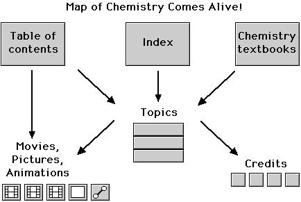

 Chemistry Comes Alive! Volume 3
 

> 
> 
> 
> 
> 
> 
> 
> 
> 
> ## Volume 3
> 
> 
> 
> ## 
> 
> 
> 
> 
> 
> 
> | [Table of Contents](CONTENTS.HTM) | Chemistry Comes Alive! topics are listed by
 chapter. |
> | --- | --- |
> | [Matrix of Chapters and
 Topics](MATRIX.HTM) | Chemistry Comes Alive! topics are listed in a matrix
 which includes direct paths to the movies. |
> | [Glossary/Index](WORDS.HTM) | Chemical terms are linked to Chemistry
 Comes Alive! topics. |
> | [Alphabetical List of Topics](ALPHATOP.HTM) | Chemistry Comes Alive! topics are listed in alphabetical order. |
> | [Chemistry Textbooks](BOOKS.HTM) | A number of popular textbooks are cross-referenced by chapter
 to Chemistry Comes Alive! topics. Keywords assigned to the topics were matched
 with keywords assigned to the textbook chapters.
 (  [*165*](CREDITS/CRED165.HTM)  ) |
> | Examples | Chemistry comes alive with movies, pictures, and
 animations. |
> |  | 1. [Movie: Reaction of Chlorine with Acetylene](MVHTM/CLACET/CLACET.HTM) 2. [Movie: Nitrogen Triiodide Detonation](MVHTM/NITRO3I/NI3IOD.HTM) 3. [Movie: Entropy - Nitrogen Triiodide 'Undetonation'](MVHTM/ENTROPY/UNDETR.HTM) 4. [Pictures: Overvoltage - Platinum and Zinc in HCl](STHTM/VOLTAGE/VOLTAGE8.HTM) 5. [Animation: Redox Titration](MVHTM/TITREDO/TITR2.HTM) |
> | Topic Examples | Chemical behavior is shown with series of movies
 organized into topics. |
> |  | 1. [Iodine Clock Reaction](MAIN/CLOCKRX/PAGE1.HTM) 2. [Chemical Properties of Sulfur Dioxide](MAIN/SO2PROP/PAGE1.HTM) |
> | [First Topic](MAIN/ACETATE/PAGE1.HTM) | You can browse through all the topics sequentially. 
 At the bottom of each page you will find a link 
 to the "next sequential topic". |
> | Additional information | [Chemistry Comes Alive! Web
 Site](WEB.HTM)   [Frequently Asked Questions
 (FAQ)](FAQ.HTM)   [Documentation](Docs/index.htm)   [License](license.htm) |
> | Acknowledgements | Many people contributed to this project and are
 credited throughout. A few important general credits can be
 accessed here: (  [*45*](CREDITS/CRED45.HTM)  ) (  [*171*](CREDITS/CRED171.HTM)  )
 (  [*163*](CREDITS/CRED163.HTM)  ) (  [*164*](CREDITS/CRED164.HTM)  ) . |
> 
> 
>   
> 
>   
> 
> 
> 
> ---
> 
> 
>   
> 
> 
> 
> 
> 
> 
> 
> 
> 
> 
> 
> 
> 
> 
> 
> 
> 
> 
> 
> 
> 
> 
> 

> ---
> 
> 
>  |
>  [Chemistry Comes Alive! (entry page)](INDEX.HTM) 
>  |
>  [Table of Contents](CONTENTS.HTM) 
>  |
>  [Matrix of Chapters and Topics](MATRIX.HTM) 
>  |
>  [Index](WORDS.HTM) 
>  |
>  [Alphabetical List of Topics](ALPHATOP.HTM) 
>  |
>  [Chemistry Textbooks](BOOKS.HTM) 
>  |
>  
>  © 1999 Division of Chemical Education, Inc.,
American Chemical Society. All rights reserved.

